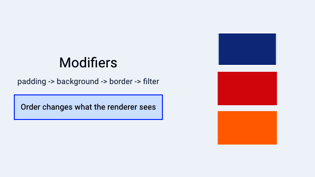

# Modifiers and ViewExt

> **In this chapter, you will:**
> - Understand how modifier chaining builds a nested type, and why order matters
> - Size, position, and align views with layout modifiers
> - Apply backgrounds, borders, shadows, transforms, and GPU filters
> - Add taps, gestures, hover, and drag-and-drop, and disable a whole subtree correctly

Modifiers are chainable methods that add styling, layout, and behavior to any view. Instead of a constructor with twenty parameters, you describe the view once and layer on the rest:

```rust,ignore
text!("Hello")
    .padding()
    .background(Color::blue())
    .on_tap(|| { /* ... */ })
```



*A Hydrolysis preview showing how modifier order changes rendered output. [Example source](https://github.com/water-rs/book/tree/main/examples/book-visuals).*

## How modifiers work

Every method on `ViewExt` consumes `self` and returns a new type that wraps it:

```rust,ignore
text!("Hello")                          // Text
    .padding()                          // Padding<Text>
    .background(Color::blue())          // BackgroundView<Padding<Text>, Color>
    .border(Color::srgb(0, 0, 0), 1.0)  // Metadata<Border>
```

The result is a nested type, not a runtime property bag, so mistakes surface at compile time and the compiler can see through the whole chain.

`ViewExt` is blanket-implemented for every view:

```rust,ignore
pub trait ViewExt: View + Sized { /* ... */ }

impl<V: View + Sized> ViewExt for V {}
```

It is in the prelude, so `use waterui::prelude::*;` is all you need.

## Layout modifiers

### padding

```rust,ignore
// 14.0 points on every side
text!("Hello").padding();

// Explicit insets: top, bottom, leading, trailing
text!("Hello").padding_with(EdgeInsets::new(10.0, 10.0, 20.0, 20.0));

// EdgeInsets: From<f32>, so a scalar means uniform padding
text!("Hello").padding_with(16.0);
```

### Size and constraints

```rust,ignore
Color::red().width(100.0);
Color::red().height(50.0);
Color::red().size(100.0, 50.0);

text!("Flexible")
    .min_width(80.0)
    .max_width(300.0)
    .min_height(40.0)
    .max_height(200.0);

text!("Bounded").min_size(80.0, 40.0).max_size(300.0, 200.0);
```

All of these return a `Frame`, which is itself chainable -- and `Frame`'s own methods accept any `IntoSignalF32`, so a reactive width really does re-run layout:

```rust,ignore
let column_width = Binding::f32(200.0);

text!("Hello")
    .width(200.0)                 // ViewExt -> Frame
    .min_width(column_width)      // Frame method, reactive
    .alignment(Alignment::Center)
```

### alignment

```rust,ignore
text!("Top Left").alignment(Alignment::TopLeading);
text!("Center").alignment(Alignment::Center);
text!("Bottom Right").alignment(Alignment::BottomTrailing);
```

### ignore_safe_area

Extend past the safe-area insets, for full-bleed backgrounds:

```rust,ignore
Color::red().ignore_safe_area(EdgeSet::ALL);
header_view.ignore_safe_area(EdgeSet::TOP);
```

## Visual modifiers

### background

```rust,ignore
text!("Hello").background(Color::red());
text!("Hello").background(Material::Regular);           // platform blur
text!("Hello").background(hstack((Color::red(), Color::blue()))); // any view
```

The content determines the layout size; the background stretches to fill it. Material rendering is best-effort: Apple platforms map it to native visual-effect views, other backends approximate or ignore it.

### foreground

```rust,ignore
vstack((
    text!("Hello"),
    text!("World"),
)).foreground(Color::red())
```

This injects a foreground override into the environment, so it reaches every descendant that does not set its own.

### opacity

Accepts any `IntoSignalF32` -- a constant or a signal:

```rust,ignore
text!("Faded").opacity(0.5);

let alpha = Binding::f32(1.0);
text!("Dynamic").opacity(alpha);
```

`opacity` maps to compositor-native operations (`CALayer.opacity`, `View.alpha`, a Vello layer) rather than an offscreen GPU pass.

### overlay

Draw content on top without affecting the base view's layout:

```rust,ignore
text!("Hello").overlay(Color::red().opacity(0.5))
```

Unlike a `ZStack`, an overlay never influences the size of what is underneath, which makes it the right tool for badges and status dots.

### shadow

`Shadow::new(color, offset, blur_radius)`:

```rust,ignore
use waterui::style::{Shadow, Vector};

text!("Shadowed").shadow(Shadow::new(
    Color::srgb(0, 0, 0).with_opacity(0.3),
    Vector::new(2.0, 2.0),
    4.0,
))
```

### border

```rust,ignore
text!("Bordered").border(Color::red(), 2.0);

let custom = Border::new(Color::blue(), 2.0)
    .corner_radius(12.0)
    .edges(EdgeSet::HORIZONTAL);

text!("Custom").border_with(custom);
```

### clip

The shape is normalized to the view's bounds, so `RoundedRectangle::new` takes a corner radius in `0.0..=0.5`, not points:

```rust,ignore
use waterui::shape::{Circle, RoundedRectangle};

avatar_view.clip(Circle);
card_view.clip(RoundedRectangle::new(0.1));
```

### floating

`floating()` promotes a view onto the elevated surface layer: themed container color, clip radius, and a pair of ambient and key shadows.

```rust,ignore
button("Compose").action(|| {}).floating()
```

The tokens come from a `FloatingStyle` in the environment, which `Theme::install` provides. Calling `.floating()` without one panics -- there is no silent fallback. Override the tokens for a subtree with `.floating_with(style)` or by installing your own `FloatingStyle`, which is a `Plugin` with a `Default` impl.

Presentation stays an attribute here: a floating button is still semantically a button, with the same identity and accessibility.

### visible

```rust,ignore
let show = Binding::bool(true);
text!("Now you see me").visible(show)
```

`visible` composes three things: opacity goes to `0.0`, hit testing turns off, and the accessibility state reports the view as hidden -- so a hidden view also disappears for screen readers.

## Transform modifiers

Transforms are purely visual. They change how a view is drawn without touching layout, which is what makes them cheap to animate.

```rust,ignore
// Scale around the center; both axes take IntoSignalF32
star_view.scale(1.5, 1.5);
text!("Stretched").scale(2.0, 1.0);

let s = Binding::f32(1.0);
heart_view.scale(s.clone(), s);

// Scale or rotate around an explicit anchor
star_view.scale_from(0.5, 0.5, Anchor::TOP_LEFT);
dial_view.rotation_from(90.0, Anchor::TOP_LEFT);

// Rotation in degrees, positive = clockwise
arrow_view.rotation(45.0);

// Translation
badge.offset(10.0, -5.0);
```

`Anchor` lives in `waterui::style`.

## Interaction modifiers

```rust,ignore
text!("Click me").on_tap(|| tracing::info!("Tapped!"));

text!("Double-tap me").on_tap_gesture_count(2, || { /* ... */ });

text!("Press and hold").on_long_press_gesture(500, || { /* ... */ });
```

`gesture` attaches any recognizer:

```rust,ignore
use waterui::gesture::TapGesture;

text!("Triple tap").gesture(TapGesture::repeat(3), || { /* ... */ })
```

`hittable` controls whether a view receives pointer events at all, without changing how it looks:

```rust,ignore
overlay_decoration.hittable(false);

let interactive = Binding::bool(true);
my_view.hittable(interactive);
```

### disabled

`disabled` is not a visual dimming shortcut. It installs a `Disabled` scope into the subtree's environment:

```rust,ignore
// Static
button("Submit").action(|| {}).disabled(true);

// Reactive, applied to a whole form
let is_submitting = Binding::bool(false);
vstack((
    field("Name", &name),
    button("Submit").action(|| {}),
)).disabled(is_submitting);
```

Three things follow from that. Controls inside the subtree render their **platform-correct disabled appearance** instead of a blanket 50% opacity. The subtree stops hit-testing and reports the disabled state to assistive technologies. And nested scopes **OR-combine**: a control stays disabled while any enclosing `.disabled(...)` is disabled, tracked reactively without rebuilding the subtree.

Controls fold the inherited scope into their own configuration through `Disabled::resolve`, so a per-control `.disabled(...)` and an ancestor scope both take effect. `Button`, `Toggle`, and `Slider` implement that today. `Stepper`, `TextField`, and `Picker` are not wired into the scope yet -- they still stop receiving events, but they do not render a disabled appearance.

### Drag and drop

```rust,ignore
use waterui::drag_drop::DragData;

text!("Drag me").draggable(DragData::text("Hello!"));

text!("Drop here").drop_destination(|data: DragData| {
    tracing::info!("Received: {data:?}");
});
```

## Stateful event handlers

Handlers are extractor-based, exactly like `use_env`. `ViewExt::state` injects a cloneable value into the subtree's environment, and the handler pulls it back out with `State<T>`:

```rust,ignore
use waterui::State;
use waterui::prelude::*;

let count = Binding::i32(0);
let is_hovered = Binding::bool(false);

text("Hover me")
    .padding()
    .state(&count)
    .state(&is_hovered)
    .on_hover_enter(
        |State(count): State<Binding<i32>>,
         State(hovered): State<Binding<bool>>| {
            *count.get_mut() += 1;
            hovered.set(true);
        },
    )
    .on_hover_exit(|State(hovered): State<Binding<bool>>| {
        hovered.set(false);
    })
```

One `.state(&value)` per injected value, one `State<T>` parameter per value you want back. A missing value is a clear runtime error, not a silent default. If a handler needs four or more pieces of state, bundle them into one `#[derive(Clone)]` struct and inject that instead.

## Feedback modifiers

```rust,ignore
use waterui::cursor::CursorStyle;

// Haptic tap at the default (medium) intensity
text!("Haptic tap").on_tap_haptic_default(|| { /* ... */ });

// Cursor style while hovering (desktop and trackpad platforms)
text!("Click me").cursor(CursorStyle::PointingHand);

// Numeric badge overlay, typically for unread counts
let unread = Binding::i32(5);
inbox_icon().badge(unread);
```

`on_tap_haptic` also takes an explicit `Intensity`, but that type comes from the `waterkit-haptic` crate rather than the `waterui` facade, so `on_tap_haptic_default` is the portable choice.

## Filter modifiers

Filters are GPU effects from `FilterViewExt`, which is in the prelude when the `gpu` feature is enabled -- it is on by default, and off in embedded builds.

```rust,ignore
photo_view.blur(10.0);
photo_view.brightness(0.2);     // negative darkens
photo_view.contrast(1.5);
photo_view.saturation(0.0);     // fully desaturated
photo_view.grayscale(1.0);
photo_view.hue_rotation(90.0);  // degrees
```

Every filter takes an `impl IntoSignalF32`, so a `Binding<f32>` animates the effect without rebuilding the view:

```rust,ignore
let blur_amount = Binding::f32(0.0);
background_content.blur(blur_amount)
```

Blurring the background as a modal appears is the canonical use.

## Lifecycle modifiers

```rust,ignore
text!("Hello").on_appear(|| tracing::info!("visible"));
text!("Hello").on_disappear(|| tracing::info!("removed"));
```

`body()` running does not mean the view is on screen -- a lazy container may resolve views ahead of time. Use `on_appear` for work that should start when the view is actually displayed.

`on_change` watches a signal and runs a handler on every change, managing the watcher's lifetime for you:

```rust,ignore
let query = Binding::container(Str::from(""));

field("Search", &query)
    .on_change(&query, |value: Str| {
        tracing::info!("Search changed to: {value}");
    })
```

The handler receives the source signal's `Output`. `on_change` subscribes before caching its first value, so a change that lands during subscription is delivered rather than swallowed.

`task` spawns an async task bound to the view's lifetime:

```rust,ignore
text!("Loading...").task(async {
    let data = fetch_data().await;
    // cancelled when the view is removed
})
```

## Other modifiers

```rust,ignore
// Type erasure
let view: AnyView = text!("Hello").anyview();

// Keep a guard alive for the view's lifetime
text!("Watching").retain(guard);

// Wrap in a navigation view with a title
content_view.title(text!("Settings"));

// Focus a field when the binding matches
let focus: Binding<Option<Field>> = Binding::container(None);
field("Name", &name).focused(&focus, Field::Name);

// Block screenshots of sensitive content
sensitive_content.secure();

// Identify a view for selection and navigation
text!("Item").tag(42);
```

`context_menu` attaches a menu shown on long press (mobile) or right click (desktop). Ordinary buttons are valid menu content:

```rust,ignore
text("Right-click me").context_menu((
    button("Copy").action(|| { /* ... */ }),
    button("Paste").action(|| { /* ... */ }),
))
```

Accessibility attributes are modifiers too:

```rust,ignore
use waterui::accessibility::AccessibilityRole;

icon_view.a11y_label("Favorite");
icon_view.a11y_role(AccessibilityRole::Button);
```

Always label icon-only controls. Screen readers have nothing else to announce.

## Modifier order

Each modifier wraps the previous result, so order changes the outcome:

```rust,ignore
// Background covers the padded area
text!("Hello")
    .padding()
    .background(Color::red());

// Padding sits outside the background
text!("Hello")
    .background(Color::red())
    .padding();
```

The same applies to transforms:

```rust,ignore
view.rotation(45.0).offset(100.0, 0.0);  // rotate in place, then translate
view.offset(100.0, 0.0).rotation(45.0);  // translate, then rotate about the original center
```

Rules of thumb: layout modifiers before visual ones; gestures after both, so the hit area matches what the user sees; lifecycle hooks anywhere, since they do not affect rendering.

## Modifier index

| Category | Modifiers |
|----------|-----------|
| **Layout** | `padding`, `padding_with`, `width`, `height`, `size`, `min_width`, `max_width`, `min_height`, `max_height`, `min_size`, `max_size`, `alignment`, `ignore_safe_area` |
| **Visual** | `background`, `foreground`, `opacity`, `overlay`, `shadow`, `border`, `border_with`, `clip`, `floating`, `floating_with`, `visible` |
| **Transform** | `scale`, `scale_from`, `rotation`, `rotation_from`, `offset` |
| **Interaction** | `on_tap`, `on_tap_gesture`, `on_tap_gesture_count`, `on_long_press_gesture`, `gesture`, `gesture_observer`, `hittable`, `disabled`, `draggable`, `drop_destination`, `state` |
| **Feedback** | `on_tap_haptic`, `on_tap_haptic_default`, `cursor`, `badge` |
| **Filter** (`gpu`) | `blur`, `brightness`, `contrast`, `saturation`, `grayscale`, `hue_rotation`, `invert` |
| **Lifecycle** | `on_appear`, `on_disappear`, `on_change`, `task` |
| **Event** | `on_hover_enter`, `on_hover_exit`, `event` |
| **Other** | `tag`, `anyview`, `retain`, `title`, `focused`, `secure`, `context_menu`, `a11y_label`, `a11y_role`, `a11y_hidden`, `with`, `install` |

Next: [Building UIs](../03-ui/01-text.md), which puts views, state, environment, and modifiers to work on text, layout, controls, forms, and navigation.
