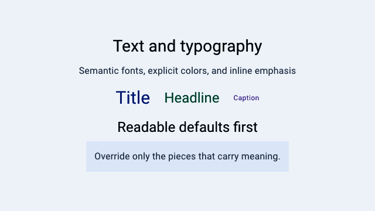

# Text and typography

> **In this chapter, you will:**
> - Display text with `text()` and `text!`, and know which one consults the translation catalog
> - Style text through theme font tokens, weights, colors, and decorations
> - Compose rich text with `StyledStr` and add syntax highlighting
> - Render Markdown three ways: inline, block, and streaming

The text API is two entry points. `text()` converts a value into a `Text`; the `text!` macro interpolates named bindings and looks the format string up in the translation catalog. Fonts, colors, and decorations are builder methods on the `Text` you get back.



*A Hydrolysis preview of WaterUI text rendered with semantic typography and colors. [Example source](https://github.com/water-rs/book/tree/main/examples/book-visuals).*

## What `text()` localizes

`text()` accepts anything implementing `IntoText`, and that conversion decides whether the content is translated:

| Input | Behavior |
|---|---|
| `&'static str` | Looked up in the translation catalog (`Text::localized`) |
| `String`, `Str` | Rendered verbatim, never translated (`Text::verbatim`) |
| `StyledStr` | Rendered verbatim, keeping its per-chunk styling |
| `Computed<T>` / `Binding<T>` where `T: IntoText` | Reactive; re-resolves when the signal changes *and* when the locale changes |

```rust,ignore
use waterui::prelude::*;

fn greeting(name: &Binding<String>) -> impl View {
    vstack((
        text("Hello, World!"), // catalog key
        text(name.clone()),    // reactive, verbatim
    ))
}
```

`Text` sizes itself to its content and never stretches, so it takes only the space it needs inside a stack. When a parent constrains its width, it wraps to multiple lines.

## Reactive text with `text!`

`text!` captures named placeholders from the surrounding scope and re-evaluates when the captured signals change:

```rust,ignore
use waterui::prelude::*;

fn counter_label(count: &Binding<i32>) -> impl View {
    text!("Count: {count}")
}
```

Only named placeholders are accepted. Name a binding directly (`{count}`) or alias an expression with `name = expr`:

```rust,ignore
use waterui::prelude::*;

fn welcome(get_name: impl Fn() -> String) -> impl View {
    text!("Hello, {name}", name = get_name())
}
```

> **Warning:** `text!` does **not** accept positional `{}` placeholders.
> `text!("Count: {}", count)` will not compile.

Format specs work as in `format!` — `text!("Value: {value:.2}")` rounds to two decimals and stays reactive. Reaching for `.get()` and `format!` instead reads the value once at construction time and freezes the output; the whole point of `text!` is that the framework records the dependency for you.

## Displaying and formatting values

`Text::display` renders any signal whose output implements `Display`:

```rust,ignore
use waterui::prelude::*;

fn show_price(price: &Binding<f64>) -> impl View {
    Text::display(price.clone())
}
```

For presentation that depends on the active locale — dates, currency, measurement units — implement the `Formatter<T>` trait and pass it to `Text::format`:

```rust,ignore
use waterui::prelude::*;
use waterui::text::Formatter;

fn formatted<T: Clone + 'static>(value: &Binding<T>, fmt: impl Formatter<T> + 'static) -> impl View {
    Text::format(value.clone(), fmt)
}
```

`Formatter` has one method, `fn format(&self, value: &T) -> Str`.

## Translation catalogs

Place TOML files under `i18n/` in the crate root. The keys are the exact format strings you passed to `text()` or `text!`:

```toml
# i18n/en.toml
"Count: {count}" = "Count: {count}"

# i18n/zh.toml
"Count: {count}" = "计数：{count}"
```

The active `Locale` in the environment selects the file. A missing catalog or a missing key is not an error — the format string itself is used as the fallback.

Plural placeholders are written `{#count}` and resolve against a TOML table keyed by the CLDR categories `zero`, `one`, `two`, `few`, `many`, and `other`. Only `other` is required. Two plural placeholders in the same key form a *dual plural*, whose table keys combine both categories (`one_other`, `other_other`, …). The full grammar lives in `waterui/macros/src/locale.rs`.

## Font tokens

Six semantic font tokens are available as builder methods on `Text`, and as values (`Body`, `Title`, `Headline`, `Subheadline`, `Caption`, `Footnote`) you can pass to `.font()`:

```rust,ignore
use waterui::prelude::*;

fn typography() -> impl View {
    vstack((
        text("Page Title").title(),
        text("Main heading").headline(),
        text("Section header").sub_headline(),
        text("Body content").body(),
        text("Small note").caption(),
        text("Legal text").footnote(),
    ))
}
```

Each token resolves through the environment, so a platform "Larger Text" accessibility setting cascades into your screen without per-call ceremony.

> **Important:** Font tokens carry no built-in sizes. The active theme installs
> them, and resolving a token that was never installed panics with
> `"<Token> font token is not installed in the environment"`. Backends and
> `Theme::install` do this for you; a bare `Environment::new()` does not. If
> you render text against a hand-built environment, install a theme first.

Install your own metrics through `FontSettings`, which takes a `ResolvedFont` (or a signal of one) per token:

```rust,ignore
use waterui::prelude::*;
use waterui::text::font::{FontWeight, ResolvedFont};

fn compact_fonts() -> FontSettings {
    FontSettings::new()
        .body(ResolvedFont::new(15.0, FontWeight::Normal))
        .title(ResolvedFont::new(22.0, FontWeight::SemiBold))
}
```

`ResolvedFont::with_typography_metrics(line_height, letter_spacing)` sets absolute line height and tracking; leaving `line_height` as `None` uses the font's own preferred metrics.

### Direct font overrides

For fixed layouts — posters, splash screens, hero headlines — build a `Font` and pass it to `.font()`. Direct overrides escape theme-driven scaling, which is exactly why they exist and exactly why product UI should prefer the tokens:

```rust,ignore
use waterui::prelude::*;
use waterui::text::font::{Font, FontWeight};

fn custom() -> impl View {
    text("Custom").font(
        Font::default()
            .size(18.0)
            .weight(FontWeight::Medium)
            .family("monospace")
            .line_height(24.0)
            .letter_spacing(0.5),
    )
}
```

`FontWeight` covers the nine standard weights from `Thin` (100) through `Black` (900), with `Normal` (400) as the default.

`.size()`, `.weight()`, `.italic()`, and `.font()` all accept signals as well as constants, so any of them can react:

```rust,ignore
use waterui::prelude::*;

fn highlight(emphasized: &Binding<bool>) -> impl View {
    vstack((
        text("Large bold text").size(28.0).bold(),
        text("May be italic").italic(emphasized.clone()),
    ))
}
```

## Color and alignment

`Text::color` and `Text::background_color` take `impl IntoSignal<Color>`, so pass a `Color` value — a palette constructor, a hex/sRGB value, or a signal of one:

```rust,ignore
use waterui::prelude::*;

fn status(highlight: &Binding<Color>) -> impl View {
    vstack((
        text("Error message").color(Color::red()),
        text("Success").color(Color::green()),
        text("Highlighted").background_color(Color::yellow()),
        text("Themed").color(highlight.clone()),
    ))
}
```

The palette constructors follow the Material color names: `red`, `pink`, `purple`, `deep_purple`, `indigo`, `blue`, `light_blue`, `cyan`, `teal`, `green`, `light_green`, `lime`, `yellow`, `amber`, `orange`, `deep_orange`, `brown`, `grey`, `blue_grey`. Each resolves from the environment when the theme overrides it and falls back to its built-in sRGB value otherwise.

Theme tokens are constant signals, so they can be passed to `.color()` directly — and they are what product UI should use, because they track light/dark and any installed palette:

```rust,ignore
use waterui::prelude::*;
use waterui::theme::color::{Accent, MutedForeground};

fn labelled(caption: &str) -> impl View {
    vstack((
        text("Continue").color(Accent),
        text(caption.to_string()).color(MutedForeground).caption(),
    ))
}
```

> **Note:** `.color()` sets the foreground for that one text view. The
> `.foreground()` modifier from `ViewExt` sets the inherited foreground for a
> whole subtree, so children pick it up through the cascade. `.foreground()`
> takes `impl Into<Color>` rather than a signal, which is why the bare palette
> markers (`Red`, `Grey`) work there but need `Color::red()` in `.color()`.

`.text_align()` controls paragraph alignment for multi-line text and also takes a signal:

```rust,ignore
use waterui::prelude::*;
use waterui::layout::HorizontalAlignment;

fn centred_paragraph(body: &Binding<String>) -> impl View {
    text(body.clone()).text_align(HorizontalAlignment::Center)
}
```

## Decorations

`.underline()` accepts any `IntoSignal<bool>`, so the decoration can toggle at runtime:

```rust,ignore
use waterui::prelude::*;

fn link_label(highlighted: &Binding<bool>) -> impl View {
    text("Click here").underline(highlighted.clone())
}
```

Strikethrough is a `StyledStr` attribute rather than a `Text` builder:

```rust,ignore
use waterui::prelude::*;
use waterui::text::styled::StyledStr;

fn deprecated() -> impl View {
    text(StyledStr::plain("Deprecated").strikethrough(true))
}
```

## Concatenating and composing

`Text` implements `Add` and `AddAssign`, and each side keeps its own styling:

```rust,ignore
use waterui::prelude::*;

fn name_row(name: &Binding<String>) -> impl View {
    text("Name: ").bold() + text(name.clone())
}
```

The right-hand side takes anything that implements `IntoText`, including reactive signals and catalog keys, so a concatenation stays reactive and localized.

For finer control, build a `StyledStr` chunk by chunk. Each chunk carries a `Style` holding font, foreground, background, italic, underline, and strikethrough:

```rust,ignore
use waterui::prelude::*;
use waterui::text::styled::{Style, StyledStr};

fn intro() -> impl View {
    let mut styled = StyledStr::empty();
    styled.push("Bold intro: ", Style::default().bold());
    styled.push("normal continuation", Style::default());
    text(styled)
}
```

## Markdown, three ways

The right tool depends on whether you need inline styling, a full document, or a document that is still arriving.

### Inline: `StyledStr::from_markdown`

Parses emphasis, strong, strikethrough, inline code, and headings into a single styled run. Block structure collapses into text with blank lines; there is no layout involved, so it fits anywhere a `Text` fits — a label, a table cell, a list row:

```rust,ignore
use waterui::prelude::*;
use waterui::text::styled::StyledStr;

fn release_note() -> impl View {
    text(StyledStr::from_markdown("**Bold** and *italic* with `code`"))
}
```

### Block: `RichText`

`RichText::from_markdown` parses a document into a tree of `RichTextElement` values — paragraphs, lists, quotes, images, links, code blocks, and tables — and lays them out as real views. Tables get proper per-column alignment and shared column origins across rows, so they render as aligned grids rather than ragged stacks:

```rust,ignore
use waterui::prelude::*;
use waterui::widget::RichText;

fn changelog(source: &str) -> impl View {
    RichText::from_markdown(source)
}
```

For Markdown that ships with your binary, `include_markdown!` reads the file at compile time and produces the same `RichText`:

```rust,ignore
use waterui::prelude::*;

fn about() -> impl View {
    include_markdown!("../docs/about.md")
}
```

### Streaming: `flow_markdown`

When Markdown arrives token by token — an LLM response, a log tail — `flow_markdown` renders it as a reactive list of blocks, patching only the block that changed instead of rebuilding the document. It takes any `IntoComputed<Str>` and lives behind the `flow-markdown` feature, which is on by default:

```rust,ignore
use waterui::prelude::*;

fn assistant_reply(source: &Binding<Str>) -> impl View {
    flow_markdown(source.clone())
        .preset(FlowAnimationPreset::AssistantDefault)
        .stream(FlowStreamMode::AppendOnly)
}
```

`FlowAnimationPreset` offers `AssistantDefault`, `Minimal`, and `None`. `.override_animation(kind, policy)` swaps the policy for one `FlowElementKind` — heading, list item, code block, table — where `FlowAnimationPolicy` is `None`, `Fade(Animation)`, or a `Typewriter` reveal. `.max_pending_bytes`, `.table_policy`, and `.token_fade_in` tune buffering and entry timing. The same builders exist on `FlowMarkdownConfig`, and `.configuration(signal)` swaps the whole configuration reactively.

## Syntax highlighting

`highlight_text` turns source code into a `StyledStr` using a `syntect`-backed highlighter:

```rust,ignore
use waterui::prelude::*;
use waterui::text::highlight::{DefaultHighlighter, Language, highlight_text};

fn code_view(source: &str) -> impl View {
    let mut highlighter = DefaultHighlighter::default();
    text(highlight_text(Language::Rust, source, &mut highlighter))
}
```

`Language` covers 39 languages including Rust, Swift, Kotlin, Python, TypeScript, and Zig, and implements `FromStr` (with aliases such as `c++`, `objc`, `shell`, `yml`) so a fenced-code-block info string maps straight onto it.

For a finished code block — highlighting, a language caption, and a copy button that reports through the window's snackbar — use the `code` widget instead:

```rust,ignore
use waterui::prelude::*;
use waterui::text::highlight::Language;
use waterui::widget::code;

fn snippet() -> impl View {
    code(Language::Rust, "fn main() {}")
}
```

Clipboard access is a no-op on `espidf` targets; everywhere else the copy button writes to the system clipboard.

## Quick reference

| Method / Function | Purpose |
|---|---|
| `text("...")` | Static text; `&'static str` is localized |
| `text!("Count: {n}")` | Reactive, localized text capturing `n` |
| `Text::display(sig)` | Render any `Signal<Output: Display>` |
| `Text::format(v, fmt)` | Locale-aware formatted text |
| `.title()` / `.headline()` / `.sub_headline()` / `.body()` / `.caption()` / `.footnote()` | Apply a theme font token |
| `.font(f)` | Apply a `Font` (accepts signals) |
| `.size(s)` / `.weight(w)` / `.bold()` | Direct font overrides (accept signals) |
| `.italic(sig)` / `.underline(sig)` | Toggle decorations reactively |
| `.color(c)` / `.background_color(c)` | Text foreground / background (accept signals) |
| `.text_align(a)` | Paragraph alignment for multi-line text |

Now that you can display and style text, it is time to arrange views on screen. The [next chapter](02-layout.md) covers stacks, frames, grids, and the rest of the layout system.
