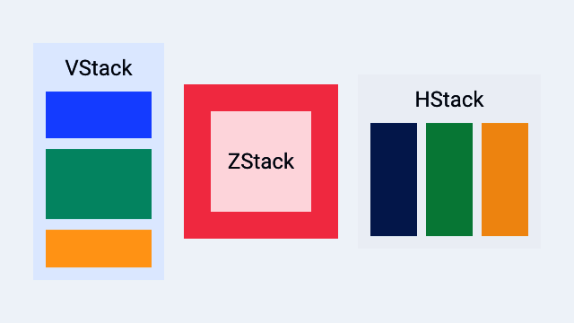

# Layout: stacks, frames, and grids

> **In this chapter, you will:**
> - Arrange views vertically, horizontally, and in layers using stacks
> - Control spacing, alignment, and sizing with frames and padding
> - Build grid-based layouts and scrollable content
> - Use absolute positioning and pin constraints for free-form layouts

Every app needs to place things on screen — a title at the top, a button at the bottom, a sidebar on the left. WaterUI uses a declarative layout system inspired by SwiftUI: you compose views using stacks, spacers, frames, and grids, and the framework resolves sizes and positions through a proposal-based layout protocol. All values are in **logical pixels** (points/dp) — the same unit as Figma and Sketch. Native backends convert to physical pixels automatically.



*A Hydrolysis preview of WaterUI stack layout primitives. [Example source](https://github.com/water-rs/book/tree/main/examples/book-visuals).*

## Stacks

Stacks are your primary tool for arranging views. Think of them as the rows and columns of your interface. WaterUI provides three kinds: `vstack` (vertical), `hstack` (horizontal), and `zstack` (overlay).

### `vstack` — vertical layout

`vstack` arranges children from top to bottom. It accepts a tuple of views:

```rust,ignore
use waterui::prelude::*;

fn profile_card() -> impl View {
    vstack((
        text("Alice").title(),
        text("Software Engineer"),
        text("San Francisco"),
    ))
}
```

Default spacing between children is **10pt** and alignment is **center**.

#### Custom spacing and alignment

Use the struct constructor for full control:

```rust,ignore
use waterui::prelude::*;

fn left_aligned() -> impl View {
    VStack::new(HorizontalAlignment::Leading, 16.0, (
        text("Left-aligned"),
        text("Also left-aligned"),
    ))
}
```

Or chain the builder methods on `vstack`:

```rust,ignore
use waterui::prelude::*;

fn trailing_8pt() -> impl View {
    vstack((
        text("Item 1"),
        text("Item 2"),
    ))
    .alignment(HorizontalAlignment::Trailing)
    .spacing(8.0)
}
```

#### Horizontal alignment options

```rust,ignore
pub enum HorizontalAlignment {
    Leading,  // left in LTR locales
    Center,   // default
    Trailing, // right in LTR locales
}
```

### `hstack` — horizontal layout

`hstack` arranges children left to right. This is what you reach for when building toolbars, rows of buttons, or any side-by-side arrangement:

```rust,ignore
use waterui::prelude::*;

fn toolbar() -> impl View {
    hstack((
        text("WaterUI"),
        spacer(),
        button("Settings").action(|| {}),
    ))
}
```

Default spacing is **10pt** and alignment is **center** (vertical).

#### Custom spacing and alignment

```rust,ignore
use waterui::prelude::*;

fn top_aligned() -> impl View {
    HStack::new(VerticalAlignment::Top, 20.0, (
        text("Top-aligned"),
        text("Also top"),
    ))
}
```

#### Vertical alignment options

```rust,ignore
pub enum VerticalAlignment {
    Top,
    Center,  // default
    Bottom,
    FirstBaseline,
    LastBaseline,
}
```

### `zstack` — overlay layout

When you need to layer views on top of each other — a badge on an avatar, text over an image — reach for `zstack`. The last child in the tuple renders on top, and the stack sizes itself to fit the largest child:

```rust,ignore
use waterui::prelude::*;

fn badge() -> impl View {
    zstack((
        Blue,
        text("Overlay").color(Yellow),
    ))
}
```

#### `zstack` alignment

Control where children are positioned within the stack:

```rust,ignore
use waterui::prelude::*;

fn corner_badge(image: impl View, dot: impl View) -> impl View {
    ZStack::new(Alignment::TopTrailing, (image, dot))
}
```

The `Alignment` enum has nine positions:

```rust,ignore
pub enum Alignment {
    TopLeading, Top, TopTrailing,
    Leading, Center, Trailing,    // Center is the default
    BottomLeading, Bottom, BottomTrailing,
}
```

## Spacer

`Spacer` is a flexible gap that expands to push views apart. It adapts to its parent container: in an `HStack` it expands horizontally, in a `VStack` it expands vertically. This is one of the most useful layout tools you have.

```rust,ignore
use waterui::prelude::*;

fn pushed_to_the_edge() -> impl View {
    hstack((
        text("Title"),
        spacer(),
        button("Done").action(|| {}),
    ))
}
```

### Minimum length

Use `spacer_min` to set a minimum length the spacer never shrinks below:

```rust,ignore
use waterui::prelude::*;

fn at_least_20pt() -> impl View {
    hstack((text("A"), spacer_min(20.0), text("B")))
}
```

## Divider

The `Divider` widget draws a thin line for visual separation between sections:

```rust,ignore
use waterui::prelude::*;

fn sectioned() -> impl View {
    vstack((
        text("Section 1"),
        Divider,
        text("Section 2"),
    ))
}
```

## Padding

Add breathing room around a view with the `Padding` wrapper, or its `ViewExt` shortcuts. `padding()` applies a default 14pt inset; use `padding_with(EdgeInsets)` for exact control:

```rust,ignore
use waterui::prelude::*;

fn padded() -> impl View {
    vstack((
        // Default 14pt on every side.
        text("Default").padding(),

        // Equal padding on all sides.
        text("Padded").padding_with(EdgeInsets::all(16.0)),

        // Symmetric vertical and horizontal.
        text("Symmetric").padding_with(EdgeInsets::symmetric(8.0, 16.0)),

        // Explicit edges.
        text("Custom").padding_with(EdgeInsets::new(10.0, 20.0, 15.0, 25.0)),
    ))
}
```

`EdgeInsets` provides three constructors. Note the explicit-edge order:

| Constructor                              | Description                              |
|------------------------------------------|------------------------------------------|
| `EdgeInsets::all(v)`                     | Equal inset on every edge                |
| `EdgeInsets::symmetric(vertical, horiz)` | Vertical and horizontal insets            |
| `EdgeInsets::new(top, bottom, leading, trailing)` | Explicit edges                  |

## Frame

When you need a view to be a specific size, or at least a minimum width, wrap it in `Frame`. It supports minimum, ideal, and maximum dimensions:

```rust,ignore
use waterui::prelude::*;
use waterui::layout::frame::Frame;

fn fixed() -> impl View {
    Frame::new(text("Fixed"))
        .width(200.0)
        .height(100.0)
}

fn bounded() -> impl View {
    Frame::new(text("Bounded"))
        .max_width(300.0)
        .max_height(200.0)
}
```

### Frame alignment

Control how the child is positioned within the frame:

```rust,ignore
use waterui::prelude::*;
use waterui::layout::frame::Frame;

fn bottom_right() -> impl View {
    Frame::new(text("Bottom-right"))
        .width(300.0)
        .height(200.0)
        .alignment(Alignment::BottomTrailing)
}
```

### Frame methods

| Method             | Description                |
|--------------------|----------------------------|
| `.width(f32)`      | Set the ideal width        |
| `.height(f32)`     | Set the ideal height       |
| `.min_width(f32)`  | Set the minimum width      |
| `.max_width(f32)`  | Set the maximum width      |
| `.min_height(f32)` | Set the minimum height     |
| `.max_height(f32)` | Set the maximum height     |
| `.alignment(a)`    | Align the child in frame   |

> **Tip:** Use `Frame` only when you need explicit size constraints. Most views have sensible natural sizes, and stacks distribute space for you.

## Scrolling

When content might exceed the available space, wrap it in a scroll view. This is essential for long lists and tall forms:

```rust,ignore
use waterui::prelude::*;

fn long_list() -> impl View {
    scroll(
        vstack((
            text("Item 1"),
            text("Item 2"),
            text("Item 3"),
        )),
    )
}
```

Three convenience constructors map to `ScrollView`:

| Function               | Direction       |
|------------------------|-----------------|
| `scroll(content)`      | Vertical only   |
| `scroll_horizontal(c)` | Horizontal only |
| `scroll_both(c)`       | Both directions |

## Grid

For content that naturally falls into rows and columns — a settings panel with labels and values, or an image gallery — use `Grid`. You specify the number of columns, and the grid distributes children into rows automatically:

```rust,ignore
use waterui::prelude::*;

fn settings_grid() -> impl View {
    grid(2, [
        row((text("Name"), text("Alice"))),
        row((text("Age"), text("30"))),
        row((text("City"), text("SF"))),
    ])
}
```

### Grid customisation

```rust,ignore
use waterui::prelude::*;
use waterui::layout::grid::{Grid, GridRow};

fn three_col(rows: Vec<GridRow>) -> impl View {
    Grid::new(3, rows)
        .spacing(16.0)
        .alignment(Alignment::Leading)
}
```

Default spacing is **8pt** in both directions, and default alignment is **Center**. The grid sizes columns equally based on the available width; row heights are determined by the tallest item in each row.

## Overlay

An `Overlay` layers content on top of a base view without changing the base's layout sizing. Use it for badges, highlights, and decorations:

```rust,ignore
use waterui::prelude::*;

fn avatar_with_badge(avatar: impl View, dot: impl View) -> impl View {
    overlay(avatar, dot).alignment(Alignment::TopTrailing)
}
```

Unlike `zstack`, the overlay's size is determined entirely by the base child. The overlay content is positioned within those bounds according to the alignment.

> **Note:** If you need both children to contribute to the overall size, use
> `zstack` instead. `Overlay` is for decorations that should not affect layout.

## Background

`background()` renders a view behind another view. The content child determines the size, and the background fills those bounds:

```rust,ignore
use waterui::prelude::*;

fn highlighted() -> impl View {
    background(text("Foreground content"), Blue)
}
```

## Absolute positioning

For the rare cases where stacks and grids are not enough — floating action buttons, custom popovers, canvas-like UIs — use `absolute` with the `PositionExt` extensions:

```rust,ignore
use waterui::prelude::*;

fn floating_ui(fab: impl View) -> impl View {
    absolute((
        Color::grey(),
        text("Center").position_in(UnitPoint::CENTER),
        fab.position_in_offset(
            UnitPoint::BOTTOM_TRAILING,
            UnitPoint::BOTTOM_TRAILING,
            -16.0,
            -16.0,
        ),
    ))
}
```

### Positioning methods

The `PositionExt` trait provides these methods on any `View`:

| Method                                     | Description                          |
|--------------------------------------------|--------------------------------------|
| `.position(x, y)`                          | Center at absolute coordinates       |
| `.position_anchor(anchor, x, y)`           | Anchor point at absolute coordinates |
| `.position_in(unit)`                       | Center at fractional parent position |
| `.position_in_anchor(anchor, pos)`         | Anchor at fractional parent position |
| `.position_in_offset(anchor, pos, dx, dy)` | Fractional position plus offset      |
| `.pin(constraints)`                        | Edge-based pinning                   |

### `UnitPoint` constants

`UnitPoint` uses normalised coordinates (0.0 to 1.0):

```rust,ignore
UnitPoint::TOP_LEADING     // (0.0, 0.0)
UnitPoint::TOP             // (0.5, 0.0)
UnitPoint::TOP_TRAILING    // (1.0, 0.0)
UnitPoint::LEADING         // (0.0, 0.5)
UnitPoint::CENTER          // (0.5, 0.5)
UnitPoint::TRAILING        // (1.0, 0.5)
UnitPoint::BOTTOM_LEADING  // (0.0, 1.0)
UnitPoint::BOTTOM          // (0.5, 1.0)
UnitPoint::BOTTOM_TRAILING // (1.0, 1.0)
```

### Pin constraints

Pin-based positioning uses edge distances to compute position and size. This is useful when you want a child to stretch between edges or sit at a fixed offset from a corner:

```rust,ignore
use waterui::prelude::*;
use waterui::layout::PinConstraints;

fn fill_with_inset(child: impl View) -> impl View {
    child.pin(PinConstraints::all(12.0))
}

fn corner_badge(badge: impl View) -> impl View {
    badge.pin(
        PinConstraints::new()
            .trailing(12.0)
            .bottom(12.0)
            .width(28.0)
            .height(28.0),
    )
}
```

When both `leading` and `trailing` are set, the width is computed automatically. The same applies to `top` and `bottom`. Explicit `.width()` and `.height()` override the computed dimensions.

## `StretchAxis`

Every view has an associated `StretchAxis` that tells parent layouts whether it wants to expand along one or both axes. Understanding this concept helps you predict how views behave inside stacks:

```rust,ignore
pub enum StretchAxis {
    None,       // content-sized (e.g. Text, Button)
    Horizontal, // expands width (e.g. TextField, Slider, VStack)
    Vertical,   // expands height
    Both,       // fills available space (e.g. ScrollView, Absolute)
    MainAxis,   // expands along parent stack's main axis (Spacer)
    CrossAxis,  // expands along parent stack's cross axis
}
```

Stacks use this information to distribute surplus space. For example, `Spacer` reports `MainAxis`, so in an `HStack` it expands horizontally and in a `VStack` it expands vertically. A `TextField` reports `Horizontal`, so it fills available width but keeps its intrinsic height.

> **Tip:** If a view is not expanding as you expect, check its stretch axis.
> A `Text` view never stretches; a `TextField` stretches horizontally; a
> `ScrollView` stretches in both directions.

## Dynamic stacks via `for_each`

Stacks support dynamic children through `for_each`. Instead of a fixed tuple, you provide a reactive collection and a generator that returns one view per element:

```rust,ignore
use waterui::prelude::*;
use waterui::reactive::collection::List as ReactiveList;

#[derive(Clone)]
struct TodoItem { id: i32, title: String }

impl Identifiable for TodoItem {
    type Id = i32;
    fn id(&self) -> i32 { self.id }
}

fn todo_list(items: ReactiveList<TodoItem>) -> impl View {
    VStack::for_each(items, |item| text(item.title))
        .spacing(8.0)
        .alignment(HorizontalAlignment::Leading)
}
```

This integrates with the `LazyContainer` system for efficient rendering of large collections. See the [Lists and collections](05-lists.md) chapter for the full story.

## Layout tips

1. **Start with stacks.** Most layouts can be expressed as nested `vstack` and
   `hstack` calls. Use `spacer()` to distribute remaining space.
2. **Use `Frame` only when needed.** Text and controls have natural sizes;
   apply explicit frames only for fixed-size regions or constraints.
3. **Prefer `Alignment` over manual positioning.** Stack alignment handles
   most needs. Reserve `absolute` for truly free-form layouts.
4. **Logical pixels everywhere.** Backends handle screen density for you.
5. **Inspect `StretchAxis` when something refuses to fit.** It tells you
   whether a view will fight for or yield space.

With layout under your belt, you are ready to make your interfaces interactive. In the [next chapter](03-controls.md), you will learn about buttons, toggles, sliders, and other controls that let users take action.
