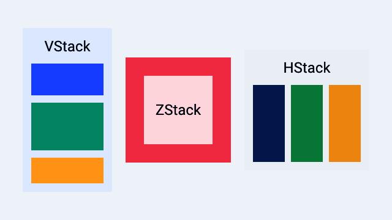

# Layout: stacks, frames, and grids

> **In this chapter, you will:**
> - Arrange views vertically, horizontally, and in layers using stacks
> - Control spacing, alignment, and sizing with frames and padding
> - Drive spacing and frame dimensions from reactive signals
> - Build grids, scroll regions with programmatic control, and free-form absolute layouts

WaterUI resolves layout through a proposal protocol: a parent proposes a size to each child, the child reports the size it wants, and the parent places it. You compose that behaviour from stacks, spacers, frames, and grids. All values are **logical pixels** (points/dp) — the same unit as Figma and Sketch. Native backends convert to physical pixels.



*A Hydrolysis preview of WaterUI stack layout primitives. [Example source](https://github.com/water-rs/book/tree/main/examples/book-visuals).*

## Stacks

Three stacks cover most interfaces: `vstack` (top to bottom), `hstack` (leading to trailing), and `zstack` (layered back to front).

### `vstack` — vertical layout

`vstack` accepts a tuple of views and lays them out in tuple order:

```rust,ignore
use waterui::prelude::*;

fn profile_card() -> impl View {
    vstack((
        text("Alice").title(),
        text("Software Engineer"),
        text("San Francisco"),
    ))
}
```

Default spacing is **10pt**; default horizontal alignment is **centre**. Set both with the struct constructor, or chain builder methods onto `vstack`:

```rust,ignore
use waterui::prelude::*;

fn left_aligned() -> impl View {
    VStack::new(HorizontalAlignment::Leading, 16.0, (
        text("Left-aligned"),
        text("Also left-aligned"),
    ))
}

fn trailing_8pt() -> impl View {
    vstack((text("Item 1"), text("Item 2")))
        .alignment(HorizontalAlignment::Trailing)
        .spacing(8.0)
}
```

`HorizontalAlignment` provides three guides — `Leading`, `Center` (the default), and `Trailing`. Leading is the left edge in left-to-right locales and the right edge in right-to-left ones.

### `hstack` — horizontal layout

```rust,ignore
use waterui::prelude::*;

fn toolbar() -> impl View {
    hstack((
        text("WaterUI"),
        spacer(),
        button("Settings").action(|| {}),
    ))
}
```

Same defaults, applied to the other axis: 10pt spacing, vertically centred.

```rust,ignore
use waterui::prelude::*;

fn top_aligned() -> impl View {
    HStack::new(VerticalAlignment::Top, 20.0, (
        text("Top-aligned"),
        text("Also top"),
    ))
}
```

`VerticalAlignment` provides `Top`, `Center` (the default), `Bottom`, `FirstBaseline`, and `LastBaseline`. The baseline guides line up the text baselines of children set in different sizes, rather than their boxes.

#### When a row does not fit

If the children of an `hstack` are wider than the space available, the stack does not crush whichever child it reaches first. It solves for a single width cap shared by every child — the largest cap where the clamped widths still fit — so children already narrower than the cap keep their intrinsic width, and equal-width children (a calendar's day columns, a segmented row of buttons) shrink by equal amounts. Clamped children are then re-measured at the cap, so wrapping text reports the height it actually needs. Compression never squeezes a child below 20pt.

### `zstack` — overlay layout

`zstack` layers children on top of each other. The last child in the tuple renders on top, and the stack sizes itself to fit its largest child:

```rust,ignore
use waterui::prelude::*;

fn badge() -> impl View {
    zstack((
        Blue,
        text("Overlay").color(Color::yellow()),
    ))
}
```

Pass an `Alignment` to control where children sit inside the stack:

```rust,ignore
use waterui::prelude::*;

fn corner_badge(image: impl View, dot: impl View) -> impl View {
    ZStack::new(Alignment::TopTrailing, (image, dot))
}
```

`Alignment` pairs a horizontal guide with a vertical one. Nine constants cover the grid of edges and centres — `TopLeading`, `Top`, `TopTrailing`, `Leading`, `Center` (the default), `Trailing`, `BottomLeading`, `Bottom`, `BottomTrailing` — and `Alignment::new(horizontal, vertical)` builds any other pairing, including the baseline guides.

## Reactive spacing and sizing

Stack spacing, grid spacing, every `Frame` dimension, and every `PinConstraints` edge accept either a plain number or a signal. Passing a signal keeps the value live: when it changes, only that container's layout runs again — the subtree is not rebuilt and no state inside it is lost.

```rust,ignore
use waterui::prelude::*;

fn adjustable_row() -> impl View {
    let gap = Binding::container(8.0_f32);
    let widen = gap.clone();

    vstack((
        button("Loosen").action(move || widen.add_assign(4.0)),
        hstack((text("Alice"), text("Bob"), text("Carol"))).spacing(gap),
    ))
}
```

Every numeric type converts through the same `IntoSignalF32` conversion, so `.spacing(8)`, `.spacing(8.0)`, `.spacing(a_computed)`, and `.spacing(a_binding)` are all accepted.

## Spacer

`Spacer` is a flexible gap that expands to push views apart. It adapts to its parent: inside an `hstack` it expands horizontally, inside a `vstack` vertically.

```rust,ignore
use waterui::prelude::*;

fn pushed_to_the_edge() -> impl View {
    hstack((
        text("Title"),
        spacer(),
        button("Done").action(|| {}),
    ))
}
```

`spacer_min(20.0)` behaves the same but never shrinks below 20pt when space runs short.

## Divider

`Divider` draws a hairline between sections, oriented by the stack it sits in — horizontal inside a `vstack`, vertical inside an `hstack`:

```rust,ignore
use waterui::prelude::*;

fn sectioned() -> impl View {
    vstack((
        text("Section 1"),
        Divider,
        text("Section 2"),
    ))
}
```

## Padding

`.padding()` applies a 14pt inset on every side; `.padding_with(EdgeInsets)` takes exact values:

```rust,ignore
use waterui::prelude::*;

fn padded() -> impl View {
    vstack((
        text("Default").padding(),
        text("Padded").padding_with(EdgeInsets::all(16.0)),
        text("Symmetric").padding_with(EdgeInsets::symmetric(8.0, 16.0)),
        text("Custom").padding_with(EdgeInsets::new(10.0, 20.0, 15.0, 25.0)),
    ))
}
```

| Constructor                                       | Description                    |
|---------------------------------------------------|--------------------------------|
| `EdgeInsets::all(v)`                              | Equal inset on every edge      |
| `EdgeInsets::symmetric(vertical, horizontal)`     | Vertical and horizontal insets |
| `EdgeInsets::new(top, bottom, leading, trailing)` | Explicit edges, in that order  |

## Frame

`Frame` overrides the proposal a child receives, clamping it to the constraints you set:

```rust,ignore
use waterui::prelude::*;
use waterui::layout::frame::Frame;

fn fixed() -> impl View {
    Frame::new(text("Fixed"))
        .width(200.0)
        .height(100.0)
}

fn bounded() -> impl View {
    Frame::new(text("Bounded"))
        .max_width(300.0)
        .max_height(200.0)
        .alignment(Alignment::BottomTrailing)
}
```

| Method                              | Description                                              |
|-------------------------------------|----------------------------------------------------------|
| `.width(w)`                         | Fixed width — sets the minimum, ideal, and maximum at once |
| `.height(h)`                        | Fixed height, the same way                               |
| `.min_width(w)` / `.max_width(w)`   | Lower / upper bound on width only                        |
| `.min_height(h)` / `.max_height(h)` | Lower / upper bound on height only                       |
| `.alignment(a)`                     | Where the child sits inside the resolved frame           |

Each dimension takes a number or a signal, so a frame can grow and shrink from a `Binding` without a rebuild.

> **Tip:** Reach for `Frame` only when you need an explicit constraint. Most
> views have a sensible natural size, and stacks already distribute the surplus.

## Scrolling

Wrap content that can outgrow its space in a scroll view:

```rust,ignore
use waterui::prelude::*;

fn long_list() -> impl View {
    scroll(vstack((
        text("Item 1"),
        text("Item 2"),
        text("Item 3"),
    )))
}
```

| Function                 | Direction       | Path                              |
|--------------------------|-----------------|-----------------------------------|
| `scroll(content)`        | Vertical only   | in the prelude                    |
| `scroll_horizontal(c)`   | Horizontal only | `waterui::layout::scroll`         |
| `scroll_both(c)`         | Both directions | `waterui::layout::scroll`         |

### Scrolling programmatically

A `ScrollController<Point>` lets code move the scroll position — a "back to top" button, jumping to a search result, restoring an offset after a refresh:

```rust,ignore
use waterui::prelude::*;

fn jump_to_top(rows: impl View) -> impl View {
    let scroller = ScrollController::new(Point::zero());
    let jump = scroller.clone();

    vstack((
        button("Back to top").action(move || jump.scroll_to(Point::zero())),
        scroll(rows).scroll_controller(&scroller),
    ))
}
```

`ScrollController::new` takes the initial target. `scroll_to` stores a new target and bumps a request generation, so asking for an offset the view is nominally already at still scrolls once the user has dragged away from it. `target()` and `generation()` hand both values back as read-only signals if you want to derive state from them.

## Grid

`Grid` distributes children into a fixed number of columns, one `row` at a time. The grid functions live in `waterui::layout::grid`, so import them explicitly — the prelude's `row` is the list row from the [Lists](05-lists.md) chapter:

```rust,ignore
use waterui::prelude::*;
use waterui::layout::grid::{grid, row};

fn settings_grid() -> impl View {
    grid(2, [
        row((text("Name"), text("Alice"))),
        row((text("Age"), text("30"))),
        row((text("City"), text("SF"))),
    ])
}
```

Columns are sized equally from the available width; each row is as tall as its tallest item. Default spacing is **8pt** in both directions and default alignment is **centre**:

```rust,ignore
use waterui::prelude::*;
use waterui::layout::grid::{Grid, GridRow};

fn three_col(rows: Vec<GridRow>) -> impl View {
    Grid::new(3, rows)
        .spacing(16.0)
        .alignment(Alignment::Leading)
}
```

`Grid::new` panics if you ask for zero columns.

## Overlay and background

`overlay` layers content on top of a base view, and `background` puts it behind. In both cases the base child alone determines the size, so decorations never disturb the surrounding layout:

```rust,ignore
use waterui::prelude::*;

fn avatar_with_badge(avatar: impl View, dot: impl View) -> impl View {
    overlay(avatar, dot).alignment(Alignment::TopTrailing)
}

fn highlighted() -> impl View {
    background(text("Foreground content"), Blue)
}
```

Use `zstack` instead when both children should contribute to the overall size.

## Absolute positioning

For layouts that stacks and grids cannot express — floating action buttons, custom popovers, canvas-like surfaces — put children in an `absolute` container and position them with the `PositionExt` methods:

```rust,ignore
use waterui::prelude::*;

fn floating_ui(fab: impl View) -> impl View {
    absolute((
        Color::grey(),
        text("Center").position_in(UnitPoint::CENTER),
        fab.position_in_offset(
            UnitPoint::BOTTOM_TRAILING,
            UnitPoint::BOTTOM_TRAILING,
            -16.0,
            -16.0,
        ),
    ))
}
```

| Method                                     | Description                          |
|--------------------------------------------|--------------------------------------|
| `.position(x, y)`                          | Centre at absolute coordinates       |
| `.position_anchor(anchor, x, y)`           | Anchor point at absolute coordinates |
| `.position_in(unit)`                       | Centre at fractional parent position |
| `.position_in_anchor(anchor, pos)`         | Anchor at fractional parent position |
| `.position_in_offset(anchor, pos, dx, dy)` | Fractional position plus offset      |
| `.pin(constraints)`                        | Edge-based pinning                   |

`UnitPoint` uses normalised parent coordinates, where `(0.0, 0.0)` is the top-leading corner and `(1.0, 1.0)` the bottom-trailing one. The nine constants are `TOP_LEADING`, `TOP`, `TOP_TRAILING`, `LEADING`, `CENTER`, `TRAILING`, `BOTTOM_LEADING`, `BOTTOM`, and `BOTTOM_TRAILING`; `UnitPoint::new(x, y)` covers everything else, including values outside `0.0..=1.0`, which position outside the parent's bounds.

### Pin constraints

Pinning positions a child by its distance from the parent's edges:

```rust,ignore
use waterui::prelude::*;

fn fill_with_inset(child: impl View) -> impl View {
    child.pin(PinConstraints::all(12.0))
}

fn corner_badge(badge: impl View) -> impl View {
    badge.pin(
        PinConstraints::new()
            .trailing(12.0)
            .bottom(12.0)
            .width(28.0)
            .height(28.0),
    )
}
```

Setting both `leading` and `trailing` computes the width; setting both `top` and `bottom` computes the height. Explicit `.width()` and `.height()` override the computed dimension. Like frame dimensions, every constraint accepts a signal.

## `StretchAxis`

Every view reports a `StretchAxis` telling its parent whether it wants surplus space:

| Variant      | Meaning                                        | Examples                     |
|--------------|------------------------------------------------|------------------------------|
| `None`       | Content-sized                                   | `Text`, `Button`, `zstack`, `hstack` |
| `Horizontal` | Fills the width, keeps its intrinsic height     | `TextField`, `Slider`, `Toggle`, `vstack` |
| `Vertical`   | Fills the height, keeps its intrinsic width     | —                            |
| `Both`       | Fills the space it is given                     | `ScrollView`, `absolute`, colours |
| `MainAxis`   | Fills along the parent stack's main axis        | `Spacer`                     |
| `CrossAxis`  | Fills along the parent stack's cross axis       | —                            |

Stacks use this to decide who absorbs leftover space. `Spacer` reports `MainAxis`, which is why the same `spacer()` pushes horizontally in an `hstack` and vertically in a `vstack`.

> **Tip:** When a view refuses to fill or refuses to shrink, check its stretch
> axis first — it usually explains the result on its own.

## Dynamic children with `for_each`

A stack whose children come from data uses `for_each` instead of a tuple. You give it a reactive collection and a generator returning one view per element, and membership changes diff by identity rather than rebuilding the stack:

```rust,ignore
use waterui::prelude::*;
use waterui::Identifiable;
use waterui::reactive::collection::List as ReactiveList;

#[derive(Clone)]
struct TodoItem { id: i32, title: String }

impl Identifiable for TodoItem {
    type Id = i32;
    fn id(&self) -> i32 { self.id }
}

fn todo_list(items: ReactiveList<TodoItem>) -> impl View {
    VStack::for_each(items, |item| text(item.title))
        .spacing(8.0)
        .alignment(HorizontalAlignment::Leading)
}
```

Wrap that in `collection_transition` and items animate instead of popping: an item fades and grows in when it appears, fades and collapses out when it disappears.

```rust,ignore
use waterui::prelude::*;
use waterui::animation::Animation;
use core::time::Duration;

fn animated_list(rows: impl View) -> impl View {
    collection_transition(rows, Animation::ease_out(Duration::from_millis(200)))
}
```

The transition is scoped through the environment, so every reactive collection inside the wrapped subtree picks it up. Backends without support for it render the collection normally, just without the animation.

Stacks are the lightweight case. For platform-styled, sectioned, editable collections, see [Lists and collections](05-lists.md).

Next: [buttons and controls](03-controls.md), where these layouts get something to arrange.
