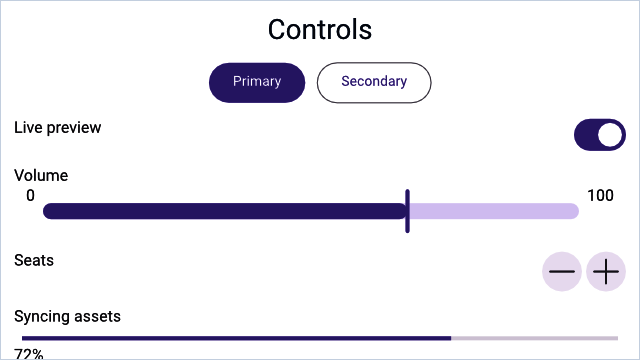

# Buttons and controls

> **In this chapter, you will:**
> - Wire button actions to reactive state with `.action()` and the `State<T>` extractor
> - Use `Toggle`, `Slider`, `Stepper`, and `TextField` for primary user input
> - Apply button styles to convey hierarchy (primary vs. secondary actions)
> - Build dropdown menus from labels and nested submenus

Imagine you are building a settings screen. You need toggles for on/off preferences, a slider for brightness, a text field for a username, and buttons to save or cancel. WaterUI provides a comprehensive set of interactive controls for exactly these scenarios. Each control follows a consistent pattern: you create it with a constructor or convenience function, configure it with builder methods, and wire it to reactive state through bindings.



*A Hydrolysis preview of WaterUI controls rendered from real bindings. [Example source](https://github.com/water-rs/book/tree/main/examples/book-visuals).*

## Button

Buttons are the most common interactive element. WaterUI buttons support multiple action patterns, custom labels, and visual styles.

### Simple action

The simplest button takes a label and a closure with no arguments:

```rust,ignore
use waterui::prelude::*;

fn dismiss() -> impl View {
    button("Dismiss").action(|| {
        // Handle click.
    })
}
```

### Reactive state via `.state()` and `State<T>`

Most real buttons need to mutate some reactive state — for example, increment a counter. The pattern is two-sided: pass the binding into the action through `State<T>` extractors, then attach the binding to the button's environment with `.state()`:

```rust,ignore
use waterui::prelude::*;

fn increment(counter: &Binding<i32>) -> impl View {
    button("Increment")
        .action(|State(count): State<Binding<i32>>| {
            count.set(count.get() + 1);
        })
        .state(counter)
}
```

Chain several `.state()` calls when an action needs more than one binding. They line up positionally with the `State<T>` parameters in the action closure:

```rust,ignore
use waterui::prelude::*;

fn reset(x: &Binding<i32>, y: &Binding<i32>) -> impl View {
    button("Reset")
        .action(|State(x): State<Binding<i32>>, State(y): State<Binding<i32>>| {
            x.set(0);
            y.set(0);
        })
        .state(x)
        .state(y)
}
```

> **Note:** `.state()` is a `ViewExt` method that injects the value into the
> button's local environment. Inside the action, the `State<T>` extractor
> pulls it back out by type and position. This avoids manual `clone()` dances
> at every call site and keeps the binding free of accidental capture.

### Environment extraction

Any value already present in the environment can be extracted directly — no `State` wrapper needed. For example, the navigation controller is injected by `NavigationStack`:

```rust,ignore
use waterui::prelude::*;
use waterui::navigation::NavigationController;

fn back_button() -> impl View {
    button("Go Back").action(|nav: NavigationController| nav.pop())
}
```

You can mix `State<T>` parameters with environment extractors in the same action; the extraction order follows the parameter order.

### Async actions

Use `action_async` when the handler needs to await something. The future is spawned on the local executor, so it can `await` network calls or file I/O:

```rust,ignore
use waterui::prelude::*;

async fn fetch_from_server() -> String { unimplemented!() }

fn fetch_button(result: &Binding<String>) -> impl View {
    button("Fetch Data")
        .action_async(|State(result): State<Binding<String>>| async move {
            let data = fetch_from_server().await;
            result.set(data);
        })
        .state(result)
}
```

### Button styles

`ButtonStyle` controls visual emphasis. Choose the right style to communicate the importance of an action:

| Style                | Description                                |
|----------------------|--------------------------------------------|
| `Automatic`          | Platform default (default)                 |
| `Plain`              | No background or border                    |
| `Link`               | Hyperlink appearance                       |
| `Borderless`         | No visible border, hover/press effects     |
| `Bordered`           | Subtle border, for secondary actions       |
| `BorderedProminent`  | Filled background, for primary actions     |

Apply with `.style()` or convenience methods:

```rust,ignore
use waterui::prelude::*;

fn cta_row() -> impl View {
    hstack((
        button("Primary").bordered_prominent().action(|| {}),
        button("Secondary").bordered().action(|| {}),
        button("Subtle").plain().action(|| {}),
        button("Learn More").link().action(|| {}),
    ))
}
```

> **Tip:** Use `bordered_prominent` for the main call-to-action on a screen,
> and `bordered` or `plain` for secondary actions. This creates a clear
> visual hierarchy.

### Custom labels

`button(...)` accepts any value that converts into a semantic `Label`, including raw strings. For richer content — an icon plus text, for instance — build a `Label`:

```rust,ignore
use waterui::prelude::*;
use waterui::icon::system_icon;

fn add_button() -> impl View {
    button(label("Add Item").icon(system_icon::plus())).action(|| {})
}
```

Buttons inside a `Menu` must use a semantic label or set `accessibility_label`, otherwise the menu cannot announce them to assistive technology.

## Toggle

`Toggle` is a boolean switch backed by a `Binding<bool>`. It is the natural choice for any on/off setting — Wi-Fi, dark mode, or notification preferences:

```rust,ignore
use waterui::prelude::*;

fn settings(is_enabled: &Binding<bool>, dark_mode: &Binding<bool>) -> impl View {
    vstack((
        // With a label.
        toggle("Wi-Fi", is_enabled),
        // Without a label.
        Toggle::new(dark_mode),
    ))
}
```

### Toggle styles

```rust,ignore
pub enum ToggleStyle {
    Automatic, // platform default
    Switch,    // sliding pill
    Checkbox,  // square with checkmark
}
```

Apply with `.style()`:

```rust,ignore
use waterui::prelude::*;

fn dark_mode_switch(dark: &Binding<bool>) -> impl View {
    Toggle::new(dark)
        .label("Dark Mode")
        .style(ToggleStyle::Switch)
}
```

### Layout behavior

With a label, `Toggle` expands horizontally to fill available space, placing the label on the leading edge and the switch on the trailing edge. Without a label, it is content-sized.

## Slider

`Slider` lets users select a value from a continuous range by dragging a thumb. The constructor takes the binding directly; the range defaults to `0.0..=1.0` and is overridden with `.range(...)`:

```rust,ignore
use waterui::prelude::*;

fn volume_slider(volume: &Binding<f64>) -> impl View {
    slider(volume).range(0.0..=100.0)
}
```

### Labels

```rust,ignore
use waterui::prelude::*;

fn brightness_slider(brightness: &Binding<f64>) -> impl View {
    slider(brightness)
        .label("Brightness")
        .min_value_label("Dark")
        .max_value_label("Bright")
}
```

### Layout behavior

Slider expands horizontally to fill available space but has a fixed height. In an `hstack`, it takes up all remaining width after other views are sized:

```rust,ignore
use waterui::prelude::*;

fn volume_row(volume: &Binding<f64>) -> impl View {
    hstack((
        text("Volume"),
        slider(volume).range(0.0..=100.0),
    ))
}
```

## Stepper

`Stepper` provides +/- buttons for incrementing or decrementing an `i32` value. Use it for precise, discrete adjustments — picking a quantity, setting a timer:

```rust,ignore
use waterui::prelude::*;

fn quantity_stepper(quantity: &Binding<i32>) -> impl View {
    stepper(quantity)
}
```

### Configuration

```rust,ignore
use waterui::prelude::*;

fn item_stepper(count: &Binding<i32>) -> impl View {
    stepper(count)
        .label("Items")
        .range(1..=10)
        .step(1)
}
```

By default, the stepper displays the current value as its label. Use `.label(...)` to replace it with custom content, or `.value_formatter(...)` to customise how the value is rendered:

```rust,ignore
use waterui::prelude::*;

fn temperature_stepper(temperature: &Binding<i32>) -> impl View {
    stepper(temperature)
        .value_formatter(|v| format!("{v}°C"))
        .range(-20..=50)
        .step(5)
}
```

### Layout behavior

With a label, `Stepper` expands horizontally. The label sits on the leading edge and the +/- buttons on the trailing edge, with flexible space between.

## TextField

`TextField` is a single-line text input field backed by a `Binding<Str>`. You will use it for usernames, search queries, email addresses, and any short text input:

```rust,ignore
use waterui::prelude::*;

fn username_field(username: &Binding<Str>) -> impl View {
    vstack((
        // With a label.
        field("Username", username),
        // Without a label, with a placeholder prompt.
        TextField::new(username).prompt("Enter your name"),
    ))
}
```

### Styled text binding

For rich text editing, bind to a `StyledStr` directly:

```rust,ignore
use waterui::prelude::*;
use waterui::text::styled::StyledStr;

fn rich_field(value: &Binding<StyledStr>) -> impl View {
    TextField::styled(value)
}
```

### Multi-line input

`TextField` defaults to a single line. Set a higher line limit, or disable it entirely, for paragraph-style entry:

```rust,ignore
use waterui::prelude::*;

fn notes(notes: &Binding<Str>) -> impl View {
    TextField::new(notes).line_limit(5)
}

fn unbounded(notes: &Binding<Str>) -> impl View {
    TextField::new(notes).disable_line_limit()
}
```

### Custom selection menu

`.selection_menu(...)` adds custom actions to the text selection context menu. It accepts any `MenuView` — most commonly a tuple of buttons or `Menu` instances:

```rust,ignore
use waterui::prelude::*;

fn field_with_menu(value: &Binding<Str>) -> impl View {
    TextField::new(value).selection_menu((
        button("Custom Action").action(|| {}),
    ))
}
```

### Layout behavior

`TextField` expands horizontally to fill available space but has a fixed height. This makes it work naturally in forms and `hstack` layouts.

## Menu

`Menu` displays a popup of commands when its label is tapped. The items argument is any `MenuView` — most commonly a tuple of `Button`, nested `Menu`, or `Divider`:

```rust,ignore
use waterui::prelude::*;

fn options_menu(selected: &Binding<String>) -> impl View {
    Menu::new(
        "Options",
        (
            button("Copy").action(|| {}),
            button("Paste")
                .action(|State(s): State<Binding<String>>| s.set("Pasted".into()))
                .state(selected),
            Divider,
            Menu::new(
                "More",
                (button("Reset").action(|| {}),),
            ),
        ),
    )
}
```

The first argument is the menu's semantic label (any `IntoLabel`). Buttons inside a menu convert automatically into `MenuItem::Command`s.

## Control summary

Here is a quick reference of the controls covered in this chapter and how they behave in layout:

| Control     | Binding type        | Stretch     | Purpose                        |
|-------------|---------------------|-------------|--------------------------------|
| `Button`    | Action closure      | None        | Trigger actions                |
| `Toggle`    | `Binding<bool>`     | Horizontal  | On/off switch                  |
| `Slider`    | `Binding<f64>`      | Horizontal  | Continuous range selection     |
| `Stepper`   | `Binding<i32>`      | Horizontal  | Discrete value adjustment      |
| `TextField` | `Binding<Str>` / `Binding<StyledStr>` | Horizontal | Single-line text input |
| `Menu`      | Action closures     | None        | Popup of commands              |

These controls are the building blocks, but what if you need to collect several pieces of data at once? In the [next chapter](04-forms.md), you will learn how WaterUI's form system can automatically generate an entire editing UI from a Rust struct.
