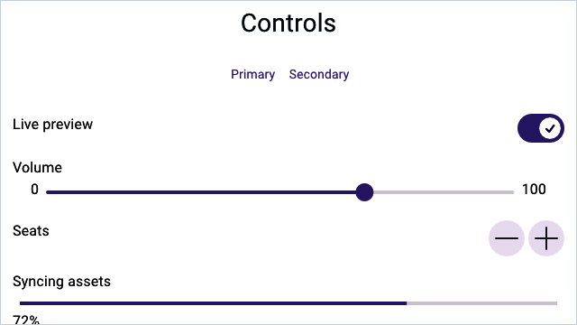

# Buttons and controls

> **In this chapter, you will:**
> - Give every control a semantic `Label`, and hide it visually when the design calls for it
> - Wire button actions to reactive state with `.action()` and the `State<T>` extractor
> - Use `Toggle`, `Slider`, `Stepper`, and `TextField` for primary user input
> - Build menus from commands, dividers, and nested submenus
> - Disable a single control or an entire subtree from a signal

Every WaterUI control has the same shape: a constructor that demands a semantic label, builder methods for configuration, and either a reactive binding carrying values in and out or an action closure fired on activation.



*A Hydrolysis preview of WaterUI controls rendered from real bindings. [Example source](https://github.com/water-rs/book/tree/main/examples/book-visuals).*

## Labels come first

A control's label is not decoration. Screen readers, voice control, and command palettes all read it to announce and activate the control, so `Label` sits in the constructor signature rather than in a builder method you might forget.

Anything that converts into semantic text is a label — `&str`, `String`, `Str`, `Text`, `StyledStr`, and any `Binding` or `Computed` of those. That is the `IntoLabel` trait, and the convenience constructors accept it directly:

```rust,ignore
use waterui::prelude::*;

fn save_button() -> impl View {
    button("Save").action(|| {})
}
```

For anything richer, build the label explicitly. The `label(...)` free function creates a semantic text label you can decorate with an icon:

```rust,ignore
use waterui::prelude::*;
use waterui::icon::system_icon;

fn add_button() -> impl View {
    button(label("Add item").icon(system_icon::plus())).action(|| {})
}
```

`Label::new(spoken_text, content)` is the general constructor: it takes arbitrary visual content plus the separate text that assistive technology should announce. Reach for it only when the two genuinely differ.

```rust,ignore
use waterui::prelude::*;
use waterui::icon::system_icon;

fn account_button() -> impl View {
    button(Label::new(
        "Verified account",
        hstack((text("Account"), system_icon::checkmark())),
    ))
    .action(|| {})
}
```

The two label kinds are not interchangeable. `.icon()`, `.system_icon()`, `.leading()`, `.trailing()`, `.spacing()`, and `.font()` describe how a *semantic* label arranges its text and icon, so they **panic** on a `Label::new` label. Style arbitrary content inside the view you pass to `Label::new` instead.

> **Platform note:** `system_icon` renders SF Symbols on Apple platforms and is
> intentionally unsupported on Android, Linux, and Web. For portable icons, pass
> an icon-pack view to `.icon(...)` from a crate such as `waterui-icons-lucide`
> or `waterui-icons-material-icon`.

### Hiding a label without losing it

`.hide_label()` collapses the visible chrome to zero size while the semantic text stays in the accessibility tree. Use it for icon-only toolbars and for controls whose meaning is obvious from an adjacent icon:

```rust,ignore
use waterui::prelude::*;
use waterui::component::slider;
use waterui::icon::system_icon;

fn rating_row(rating: &Binding<f64>) -> impl View {
    hstack((
        system_icon::star(),
        slider("Rating", rating).hide_label(),
    ))
}
```

`LabelDisplayMode` covers the other presentations — `TitleAndIcon`, `TitleOnly`, `IconOnly`, `Hidden` — either per control with `.label_style(...)` or across a whole subtree as an installed plugin:

```rust,ignore
use waterui::prelude::*;
use waterui::icon::system_icon;

fn toolbar() -> impl View {
    hstack((
        button(label("Search").icon(system_icon::search())).action(|| {}),
        button(label("Settings").icon(system_icon::settings())).action(|| {}),
    ))
    .install(LabelDisplayMode::IconOnly)
}
```

### Two constructors per control

Each control exposes a general constructor and an ergonomic one. `Button::new`, `Slider::new`, and `Stepper::new` take a fully built `Label`; the free functions `button(...)`, `slider(...)`, and `stepper(...)` take any `IntoLabel` and do the conversion for you. Prefer the free functions unless you already hold a `Label`.

## Button

### Simple action

```rust,ignore
use waterui::prelude::*;

fn dismiss() -> impl View {
    button("Dismiss").action(|| {
        // Handle click.
    })
}
```

### Reactive state via `.state()` and `State<T>`

An action closure receives its arguments through extraction, not capture. Inject the binding into the button's environment with `.state()`, then pull it back out inside the action with the `State<T>` extractor:

```rust,ignore
use waterui::prelude::*;

fn increment(counter: &Binding<i32>) -> impl View {
    button("Increment")
        .action(|State(count): State<Binding<i32>>| {
            *count.get_mut() += 1;
        })
        .state(counter)
}
```

`get_mut()` returns a guard that writes back on drop, so read-modify-write needs one statement instead of a `get`/`set` pair.

Chain `.state()` once per value the action needs. Each `State<T>` parameter is matched by its type:

```rust,ignore
use waterui::prelude::*;

fn discard_button(draft: &Binding<Str>, is_dirty: &Binding<bool>) -> impl View {
    button("Discard")
        .action(|State(draft): State<Binding<Str>>, State(dirty): State<Binding<bool>>| {
            draft.set(Str::default());
            dirty.set(false);
        })
        .state(draft)
        .state(is_dirty)
}
```

> **Note:** `.state()` is a `ViewExt` method, so it wraps the button in a plain
> view. Call it after `.action()` and after any button-specific builder.

### Environment extraction

Any value already in the environment can be extracted directly, with no `State` wrapper. The navigation controller injected by `NavigationStack` is the common case:

```rust,ignore
use waterui::prelude::*;
use waterui::navigation::NavigationController;

fn back_button() -> impl View {
    button("Go back").action(|nav: NavigationController| nav.pop())
}
```

Environment extractors and `State<T>` parameters mix freely in one closure.

### Async actions

`action_async` spawns the returned future on the local executor, so the handler can await network or file I/O:

```rust,ignore
use waterui::prelude::*;

async fn fetch_from_server() -> Str { unimplemented!() }

fn fetch_button(result: &Binding<Str>) -> impl View {
    button("Fetch data")
        .action_async(|State(result): State<Binding<Str>>| async move {
            result.set(fetch_from_server().await);
        })
        .state(result)
}
```

### Button styles

`ButtonStyle` sets visual emphasis, and the platform decides how each style is drawn.

| Style               | Use for                                    |
|---------------------|--------------------------------------------|
| `Automatic`         | Platform default (the default)             |
| `Plain`             | Low-emphasis actions, toolbar buttons      |
| `Link`              | Text-based links and URL navigation        |
| `Borderless`        | No border, but hover and press feedback    |
| `Bordered`          | Secondary actions                          |
| `BorderedProminent` | The one primary action on a screen         |

Apply a style with `.style(...)` or one of the convenience methods:

```rust,ignore
use waterui::prelude::*;

fn cta_row() -> impl View {
    hstack((
        button("Continue").bordered_prominent().action(|| {}),
        button("Cancel").bordered().action(|| {}),
        button("Learn more").link().action(|| {}),
    ))
}
```

## Toggle

`Toggle` is a boolean switch backed by a `Binding<bool>`. `Toggle::new` takes only the binding and starts with an empty label, so attach one with `.label(...)` — or use `toggle(...)`, which does both:

```rust,ignore
use waterui::prelude::*;

fn settings(wifi: &Binding<bool>, dark_mode: &Binding<bool>) -> impl View {
    vstack((
        toggle("Wi-Fi", wifi),
        Toggle::new(dark_mode).label("Dark mode").switch(),
    ))
}
```

`ToggleStyle` chooses the presentation: `Automatic` (platform default), `Switch` (sliding pill), or `Checkbox`. `.switch()` and `.checkbox()` are shorthands for `.style(...)`.

## Slider

`Slider` selects a value from a continuous range. The default range is `0.0..=1.0`; `.range(...)` overrides it. The free function is not in the prelude, so import it directly:

```rust,ignore
use waterui::prelude::*;
use waterui::component::slider;

fn volume_slider(volume: &Binding<f64>) -> impl View {
    slider("Volume", volume).range(0.0..=100.0)
}
```

`.min_value_label(...)` and `.max_value_label(...)` add captions at the ends of the track:

```rust,ignore
use waterui::prelude::*;
use waterui::component::slider;

fn brightness_slider(brightness: &Binding<f64>) -> impl View {
    slider("Brightness", brightness)
        .min_value_label("Dark")
        .max_value_label("Bright")
}
```

## Stepper

`Stepper` drives an `i32` with +/- buttons — quantities, seat counts, small numeric adjustments:

```rust,ignore
use waterui::prelude::*;

fn item_stepper(count: &Binding<i32>) -> impl View {
    stepper("Items", count).range(1..=10).step(1)
}
```

A stepper shows its label and nothing else until you add `.value_formatter(...)`, which renders the formatted current value next to the buttons. The formatter never affects the semantic label:

```rust,ignore
use waterui::prelude::*;

fn temperature_stepper(temperature: &Binding<i32>) -> impl View {
    stepper("Temperature", temperature)
        .value_formatter(|v| format!("{v}°C"))
        .range(-20..=50)
        .step(5)
}
```

`.range(...)` accepts any `RangeBounds<i32>`, so `1..=10`, `1..11`, and `1..` all work.

## TextField

`TextField` is a text input backed by a `Binding<Str>`. `field(...)` attaches the label; `.prompt(...)` sets the placeholder shown while the field is empty:

```rust,ignore
use waterui::prelude::*;

fn username_field(username: &Binding<Str>) -> impl View {
    field("Username", username).prompt("Enter your name")
}
```

For rich text editing, bind a `StyledStr` directly. `TextField::new` maps a plain `Binding<Str>` internally and panics if a backend writes styled text back into it, so use `TextField::styled` whenever styling is possible:

```rust,ignore
use waterui::prelude::*;
use waterui::text::styled::StyledStr;

fn rich_field(value: &Binding<StyledStr>) -> impl View {
    TextField::styled(value).label("Notes")
}
```

`.selection_menu(...)` adds custom entries to the native text-selection menu. It accepts any `MenuView` — usually a tuple of buttons:

```rust,ignore
use waterui::prelude::*;

fn field_with_menu(value: &Binding<Str>) -> impl View {
    field("Snippet", value).selection_menu((
        button("Uppercase").action(|| {}),
    ))
}
```

`.line_limit(n)` caps the field at `n` lines and `.disable_line_limit()` removes
the cap entirely; the default is a single line. A capped field refuses an edit
that would push it past the limit rather than truncating what is already there,
and a multi-line field reports the multi-line text-input role to assistive
technology. `.keyboard(...)` picks the on-screen keyboard variant; platforms
without a software keyboard ignore the hint.

## Menu

`Menu` shows a popup of commands when its label is activated. The content is any `MenuView`: buttons, `Command` values, `Divider`, and nested `Menu`s, most often written as a tuple.

```rust,ignore
use waterui::prelude::*;

fn options_menu(pinned: &Binding<bool>) -> impl View {
    Menu::new(
        "Options",
        (
            button("Copy").action(|| {}),
            Command::builder("Paste")
                .action(|| {})
                .shortcut(Shortcut::new("v").command()),
            Command::builder("Pin to top")
                .action(|State(pinned): State<Binding<bool>>| {
                    let mut pinned = pinned.get_mut();
                    *pinned = !*pinned;
                })
                .state(pinned)
                .selected(pinned.clone()),
            Divider,
            Menu::new("More", (button("Reset").action(|| {}),)),
        ),
    )
}
```

A plain `Button` converts into a menu command automatically, which is why the first entry works. `Command` is the direct form, and it carries metadata a button cannot: `.shortcut(...)` for a key equivalent, and `.selected(signal)` for a checked item. `Command::state(&value)` injects state for the command's action, mirroring `.state()` on views.

Native menus draw each entry from its label's semantic text, and only a `SystemIcon` carries through. A custom icon view still renders in the self-drawn popup menus but is dropped by the native ones.

## Disabling controls

Disabled state is a property of the surrounding context, not of an individual
control. `.disabled(...)` from `ViewExt` works on *any* view — there is no
per-control `disabled` builder to learn, and no control can forget to honour it:

```rust,ignore
use waterui::prelude::*;

fn save_button(is_saving: &Binding<bool>) -> impl View {
    button("Save").action(|| {}).disabled(is_saving.clone())
}
```

The modifier installs a `Disabled` scope in the environment, stops the subtree
from hit-testing, and reports the disabled state to assistive technology. Every
control reads the state in force at its own position, the same way it reads a
theme color. Nested scopes OR-combine: a control is disabled while *any*
enclosing scope is `true`.

```rust,ignore
use waterui::prelude::*;
use waterui::component::slider;

fn audio_panel(locked: &Binding<bool>, muted: &Binding<bool>, volume: &Binding<f64>) -> impl View {
    vstack((
        toggle("Mute", muted),
        slider("Volume", volume),
    ))
    .disabled(locked.clone())
}
```

Flipping `locked` re-enables the panel without rebuilding it — the combined signal is tracked reactively.

> A menu `Command` is the one place the state travels as data rather than as
> context: a menu is a list of command records handed to the platform's menu
> API, not a rendered subtree, so there is no leaf environment to read from.
> `Command::disabled(...)` still combines with an enclosing scope when the
> command resolves.

## Reference

| Control     | Constructor                                       | Value                                | Stretch axis |
|-------------|---------------------------------------------------|--------------------------------------|--------------|
| `Button`    | `button(label)` / `Button::new(Label)`            | action closure                       | None       |
| `Toggle`    | `toggle(label, &b)` / `Toggle::new(&b)`           | `Binding<bool>`                      | Horizontal |
| `Slider`    | `slider(label, &b)` / `Slider::new(Label, &b)`    | `Binding<f64>`                       | Horizontal |
| `Stepper`   | `stepper(label, &b)` / `Stepper::new(Label, &b)`  | `Binding<i32>`                       | Horizontal |
| `TextField` | `field(label, &b)` / `TextField::styled(&b)`      | `Binding<Str>` / `Binding<StyledStr>`| Horizontal |
| `Menu`      | `Menu::new(label, items)`                         | action closures                      | None       |

A control that stretches horizontally places its label on the leading edge and its interactive part on the trailing edge, with flexible space between. `Button` and `Menu` size themselves to their label.

Selection controls — `Picker`, `DatePicker`, `ColorPicker`, `SecureField` — live in the form crate. The [next chapter](04-forms.md) covers them, along with the `#[form]` derive that generates an entire editing UI from a Rust struct.
