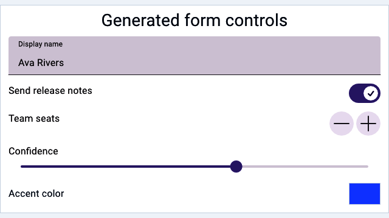

# Forms and data entry

> **In this chapter, you will:**
> - Generate a whole form UI from a Rust struct with `#[form]`
> - Know exactly which Rust types map to which control
> - Reach for pickers, calendars, and secure fields when the mapping is not enough
> - Compose validators and understand what the validation surface does *not* yet cover
> - Build a registration form end to end

WaterUI generates form controls from your data structures. Derive one attribute and a struct becomes an editable form; every field gets a control chosen by its type, a label derived from its name, and a binding wired straight back into the struct.



*A Hydrolysis preview of stable WaterUI data-entry controls used by forms. [Example source](https://github.com/water-rs/book/tree/main/examples/book-visuals).*

## The `FormBuilder` trait

`FormBuilder` maps a type to a view that edits a `Binding` of that type:

```rust,ignore
pub trait FormBuilder: Sized {
    type View: View;

    fn view<L: IntoLabel>(
        binding: &Binding<Self>,
        label: L,
        placeholder: Str,
    ) -> Self::View;

    fn binding() -> Binding<Self>
    where
        Self: Default + Clone,
    {
        Binding::default()
    }
}
```

The derive macro implements it for your struct by projecting the struct binding into per-field bindings and calling `FormBuilder::view` on each field type.

## The `#[form]` attribute

`#[form]` derives `Default`, `Clone`, `Debug`, `FormBuilder`, and `Project` in one step. `Project` is what supplies the per-field bindings, so `FormBuilder` cannot be derived without it:

```rust,ignore
use waterui::prelude::*;

#[form]
pub struct UserProfile {
    /// Display name
    pub name: String,
    /// Account active status
    pub active: bool,
    /// User's current level
    pub level: i32,
}
```

Render it with `form()`:

```rust,ignore
use waterui::prelude::*;

# #[form] pub struct UserProfile { pub name: String }
fn profile_editor() -> impl View {
    let profile = UserProfile::binding();
    form(&profile)
}
```

`UserProfile::binding()` starts from `Default`. To pre-fill, build the binding yourself:

```rust,ignore
use waterui::prelude::*;

# #[form] pub struct UserProfile { pub name: String }
fn edit_profile(initial: UserProfile) -> impl View {
    let profile = Binding::container(initial);
    form(&profile)
}
```

## Type-to-control mapping

`FormBuilder` is implemented for exactly these types:

| Rust type | Control | Notes |
|---|---|---|
| `String` | `TextField` | Doc comment becomes the prompt |
| `Str` | `TextField` | WaterUI's interned string type |
| `bool` | `Toggle` | |
| `i32` | `Stepper` | Range `i32::MIN..=i32::MAX` |
| `f64` | `Slider` | Range `0.0..=1.0` |
| `f32` | `Slider` | Mapped through `f64`, same range |
| `Color` | `ColorPicker` | Platform-native color selector |

Any other field type — `u32`, `i64`, `Option<T>`, an enum, a nested struct — has no `FormBuilder` impl and will not compile inside a derived form. Write a manual implementation for those, or narrow the field to one of the types above.

The macro converts each field name from `snake_case` to `"Title Case"` for the label, and joins the field's doc comment into the `placeholder` argument. Only `TextField` currently uses the placeholder; the other controls ignore it.

## Manual implementations

When you need a custom layout, a field type outside the table, or a control the mapping cannot express, implement `FormBuilder` yourself. `Project` still does the heavy lifting:

```rust,ignore
use waterui::prelude::*;
use waterui::component::TextField;
use waterui::form::secure::{Secure, SecureField, secure};
use waterui::layout::stack::VStack;

#[derive(Clone, Project)]
struct LoginForm {
    username: String,
    password: Secure,
}

impl FormBuilder for LoginForm {
    type View = VStack<((TextField, SecureField),)>;

    fn view<L: IntoLabel>(binding: &Binding<Self>, label: L, placeholder: Str) -> Self::View {
        let projected = binding.project();
        vstack((
            <String as FormBuilder>::view(&projected.username, label, placeholder),
            secure("Password", &projected.password),
        ))
    }
}
```

`vstack(contents)` returns `VStack<(C,)>`, which is why the associated type wraps the field tuple one level deeper than you might expect.

## Controls beyond the mapping

These compose into derived forms as well as hand-built ones. Every one of them takes a label at construction, because assistive technology needs something to announce; use `.hide_label()` when the label should not be visible.

### Picker

Each item is a `text(label).tag(value)` pair — the label is shown, the tag is written into the binding. The value type must be `Ord + Clone`:

```rust,ignore
use waterui::prelude::*;
use waterui::form::{Picker, PickerStyle};

#[derive(Clone, Copy, PartialEq, Eq, PartialOrd, Ord)]
enum Plan { Free, Pro, Team }

fn plan_picker(selection: &Binding<Plan>) -> impl View {
    let items = vec![
        text("Free").tag(Plan::Free),
        text("Pro").tag(Plan::Pro),
        text("Team").tag(Plan::Team),
    ];
    Picker::new(items, selection).style(PickerStyle::Menu)
}
```

`Picker` takes `impl IntoComputed<Vec<PickerItem<T>>>`, so a reactive item list is a `Computed<Vec<_>>` rather than an array. Item labels re-resolve when the locale changes.

| Style | Appearance |
|---|---|
| `Automatic` | Platform default |
| `Menu` | Dropdown menu button |
| `Radio` | Vertical radio group |
| `Segmented` | Horizontal mutually exclusive segments |

`.segmented()` is shorthand for `.style(PickerStyle::Segmented)`.

### Date picker

`DatePicker::new(label, binding)` dispatches on the binding's type — `jiff::civil::Date`, `Time`, or `DateTime` — and picks a matching default layout. It stores a full `DateTime` internally so hidden components survive a round trip:

```rust,ignore
use waterui::prelude::*;
use waterui::form::picker::date::{DatePicker, DatePickerType};
use jiff::civil::Date;

fn birthday_picker(date: &Binding<Date>) -> impl View {
    DatePicker::new("Birthday", date).ty(DatePickerType::Date)
}
```

`DatePickerType` is `Date`, `HourAndMinute`, `HourMinuteAndSecond`, `DateHourAndMinute` (the default), or `DateHourMinuteAndSecond`. `.range(start..=end)` clamps the binding into the allowed span.

For a month grid instead of a spinner, `Calendar::new(label, &date, &visible_month)` renders a selectable calendar; `.decorated(dates)` marks days with a passive dot, and the caller owns the visible month so navigation state stays outside the view. `MultiDatePicker` covers multi-selection over a `BTreeSet<Date>`.

### Color picker

```rust,ignore
use waterui::prelude::*;
use waterui::form::picker::color::ColorPicker;

fn accent_picker(accent: &Binding<Color>) -> impl View {
    ColorPicker::new("Accent Color", accent).with_alpha()
}
```

`.with_alpha()` enables the alpha channel and `.with_hdr()` enables HDR selection.

### File picker

`waterui::form::picker::file::FilePicker` binds a `Vec<Url>`. `FilePicker::open(label, &binding)` references files in place; `FilePicker::import(label, &binding)` copies them into your app's storage. `.max_count(n)` caps the selection.

### Secure field

`SecureField` masks its input and stores it in a `Secure`, which zeroes its buffer on drop and redacts itself in `Debug` output:

```rust,ignore
use waterui::prelude::*;
use waterui::form::secure::{Secure, secure};

fn password_field(password: &Binding<Secure>) -> impl View {
    secure("Password", password)
}
```

`Secure::expose()` returns the raw `&str` and `Secure::hash()` produces a bcrypt hash at the default cost.

> **Warning:** Never persist or transmit the exposed string. Hash it first.

## A registration form

```rust,ignore
use waterui::prelude::*;

#[form]
pub struct Registration {
    pub username: String,
    pub email: String,
    pub age: i32,
    pub newsletter: bool,
}

fn registration_form() -> impl View {
    let form_data = Registration::binding();

    vstack((
        text("Create Account").title(),
        form(&form_data),
        button("Register")
            .bordered_prominent()
            .action(|State(data): State<Binding<Registration>>| {
                let registration = data.get();
                waterui::log::info!(
                    username = %registration.username,
                    "registration submitted"
                );
            })
            .state(&form_data),
    ))
}
```

Reading `data.get()` inside the action handler is fine — handlers run in response to an event, not during body evaluation. Calling `.get()` in a view body is what breaks reactivity.

## Reading form data

Project the binding to reach individual fields, and pass the projected bindings — not their current values — into views so they stay live:

```rust,ignore
use waterui::prelude::*;

# #[form] pub struct Registration { pub username: String }
fn show_summary() -> impl View {
    let form_data = Registration::binding();
    let projected = form_data.project();

    vstack((
        text(projected.username.clone()),
        text!("Name: {username}", username = projected.username.clone()),
    ))
}
```

## Validation

The `Validator<T>` trait has one method, `validate(&self, value: T) -> Result<(), Self::Err>`, plus `.and()` and `.or()` combinators. Three implementations ship with the crate:

| Validator | Validates |
|---|---|
| `Range<T>` | `start..end`, exclusive end, for `T: Display + Debug + Ord + Clone` |
| `Regex` | Any `AsRef<str>` matches the pattern |
| `Required` | `Option<T>` is `Some` |

```rust,ignore
use waterui::prelude::*;
use waterui::form::valid::Validator;
use regex::Regex;

fn check() {
    let age = 18i32..100;
    assert!(age.validate(42).is_ok());

    let email = Regex::new(r"^[^@]+@[^@]+\.[^@]+$")
        .expect("email validator regex must compile");
    assert!(email.validate("reader@waterui.dev").is_ok());
    assert!(email.validate("not-an-address").is_err());
}
```

`a.and(b)` short-circuits on the first failure; `a.or(b)` succeeds if either passes and reports both errors otherwise.

### Wiring a validator to a control

`ValidatableView::new(view, validator)` filters the view's binding so invalid values are never committed, and renders the error message underneath. It requires the view to implement `Validatable`, which exposes the binding to be filtered:

```rust,ignore
pub trait Validatable: View + Sized {
    type Value;
    fn validable(&mut self) -> &mut Binding<Self::Value>;
}
```

> **Not yet available:** no built-in control implements `Validatable` at the
> pinned commit, so `ValidatableView` only works with a wrapper you implement
> yourself. Until that lands, validate on submit — run the validators against
> the projected bindings inside the action handler and surface the result
> through a snackbar or an error label.

## Where to go next

Forms collect structured data. Displaying collections back to the user is the [next chapter](05-lists.md), which covers lazy lists, sections, and reactive collections.
