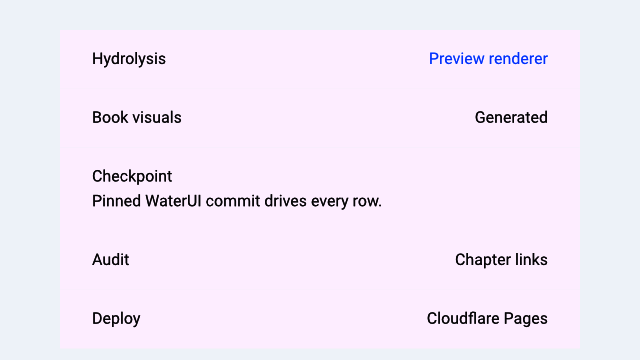

# Lists and collections

> **In this chapter, you will:**
> - Display dynamic collections with `List::for_each` and the `Identifiable` trait
> - Use `waterui::reactive::collection::List` for reactive, fine-grained collection updates
> - Group rows with the new `ListSection` semantic marker
> - Build a complete contacts list with add and remove operations

Every app needs a way to show lists of data — a chat thread, a to-do list, a feed of posts, a directory of contacts. Unlike a fixed set of views you write by hand, these collections grow and shrink at runtime as data changes. WaterUI provides `List<V>` as the native list surface, `for_each` to map collections to views, and the new `ListSection` marker to group rows under semantic headers.



*A Hydrolysis preview of sectioned WaterUI lists. [Example source](https://github.com/water-rs/book/tree/main/examples/book-visuals).*

## A first dynamic list

`List::for_each` is the bridge between a data collection and the rows on screen. You give it a collection and a generator that returns one `ListItem` per element:

```rust,ignore
use waterui::prelude::*;
use waterui::Identifiable;
use waterui::component::list::{List, ListItem};

#[derive(Clone)]
struct TodoItem {
    id: i32,
    title: String,
    done: bool,
}

impl Identifiable for TodoItem {
    type Id = i32;
    fn id(&self) -> i32 { self.id }
}

fn todo_list(items: Vec<TodoItem>) -> impl View {
    List::for_each(items, |item| {
        ListItem::new(hstack((
            text(item.title),
            spacer(),
            if item.done { text("Done") } else { text("Pending") },
        )))
    })
}
```

`List` is a native, scrolling, platform-styled surface. On iOS it renders as an inset-grouped `UITableView`; on macOS as an `NSTableView` with group rows; on Material backends as a list with section dividers.

### The `Identifiable` trait

Every item in a `for_each` generator must implement `Identifiable`. The trait provides a stable identity for each element so the framework can efficiently diff, insert, and remove rows when the collection changes:

```rust,ignore
# use core::hash::Hash;
pub trait Identifiable {
    type Id: Hash + Ord + Clone;
    fn id(&self) -> Self::Id;
}
```

Common `Id` types are integers, UUIDs, and string keys.

> **Warning:** The identity must be **stable** — the same data item should
> always return the same id. Changing an item's id forces the framework to
> treat it as a removal followed by an insertion, which is more expensive
> than an in-place update.

## Reactive collections with `waterui::reactive::collection::List`

A plain `Vec` works for static data, but lists usually change at runtime. The
`List<T>` type from `waterui::reactive::collection` is a reactive collection:
every mutation emits a fine-grained change notification that the UI observes:

```rust,ignore
use waterui::reactive::collection::List as ReactiveList;
# #[derive(Clone)] struct TodoItem { id: i32, title: String, done: bool }

fn seed() {
    let items: ReactiveList<TodoItem> = ReactiveList::new();

    items.push(TodoItem { id: 1, title: "Buy milk".into(), done: false });
    items.push(TodoItem { id: 2, title: "Write docs".into(), done: false });

    let _ = items.pop();
    items.insert(0, TodoItem { id: 3, title: "Urgent".into(), done: false });
}
```

> **Note:** Both the rendering surface and the data backend are called
> `List`. To keep them apart in code, alias one of them — this chapter
> uses `ReactiveList` for the data type and the bare `List` for the view.

Initialise from a `Vec`:

```rust,ignore
# use waterui::reactive::collection::List as ReactiveList;
# #[derive(Clone)] struct TodoItem { id: i32, title: String, done: bool }
fn from_seed(item1: TodoItem, item2: TodoItem) {
    let _ = ReactiveList::from(vec![item1, item2]);
}
```

## Sectioned lists

The pinned waterui adds a `ListSection` semantic marker so a single `List` can express multiple logical groups. Mark the first row of a section with `.section(ListSection::new("Header"))` and subsequent items belong to that section until another marker is encountered:

```rust,ignore
use waterui::prelude::*;
use waterui::Identifiable;
use waterui::component::list::{List, ListItem, ListSection};

#[derive(Clone)]
struct ContactRow {
    id: i32,
    name: String,
    section: Option<&'static str>,
}

impl Identifiable for ContactRow {
    type Id = i32;
    fn id(&self) -> i32 { self.id }
}

fn directory(contacts: Vec<ContactRow>) -> impl View {
    List::for_each(contacts, |contact| {
        let mut row = ListItem::new(text(contact.name.clone()));
        if let Some(section) = contact.section {
            row = row.section(ListSection::new(section));
        }
        row
    })
}
```

`ListSection` carries an optional header label and footer. Use `ListSection::unlabeled()` for a visual divider with no header, and `.footer(...)` to append a caption-style note below the section. The visual treatment is delegated to the platform — iOS renders inset-grouped sections, macOS uses `NSTableView` group rows, and Material backends translate the marker into section dividers.

> **Tip:** Reach for `ListSection` whenever a list contains more than one
> kind of row. Grouping rows by topic is exactly the use case the upstream
> dev branch added the marker for.

## Editing: delete and reorder

`List` exposes `editing(...)`, `on_delete(...)`, and `on_move(...)` builders. The handlers pull `ListDelete` (a row index) and `ListMove` (from/to indices) from the environment so you can dispatch on them just like any other extractor:

```rust,ignore
use waterui::prelude::*;
use waterui::Identifiable;
use waterui::component::list::{List, ListDelete, ListItem, ListMove};
use waterui::reactive::collection::List as ReactiveList;

# #[derive(Clone)] struct Contact { id: i32 }
# impl Identifiable for Contact { type Id = i32; fn id(&self) -> i32 { self.id } }
fn editable(items: ReactiveList<Contact>) -> impl View {
    let editing = Binding::bool(false);
    List::for_each(items.clone(), |item| ListItem::new(text(item.id.to_string())))
        .editing(editing.clone())
        .on_delete(
            move |State(items): State<ReactiveList<Contact>>, ListDelete(index): ListDelete| {
                items.remove(index);
            },
        )
        .on_move(
            move |State(items): State<ReactiveList<Contact>>, ListMove(movement): ListMove| {
                let _ = (items, movement);
                // perform reorder on the reactive list
            },
        )
        .state(&items)
}
```

Per-row controls — `ListItem::deletable(false)`, for instance — refine the behavior on a row-by-row basis.

## Static lists from iterators

When the data is genuinely static, you can collect any iterator of views into a `VStack`:

```rust,ignore
use waterui::prelude::*;

fn fruit_list() -> impl View {
    let names = ["Apple", "Banana", "Cherry"];
    let stack: VStack<_> = names.into_iter().map(text).collect();
    stack
}
```

This produces a `VStack` with default 10pt spacing. There is no virtualization here — every item is laid out at once — so prefer `List::for_each` plus a reactive collection for anything that might grow.

## Building a complete list

Here is a contacts screen with a reactive list, a typed `Contact` model, and an add button:

```rust,ignore
use waterui::prelude::*;
use waterui::Identifiable;
use waterui::component::list::{List, ListItem};
use waterui::reactive::collection::List as ReactiveList;

#[derive(Clone)]
struct Contact { id: i32, name: String }

impl Identifiable for Contact {
    type Id = i32;
    fn id(&self) -> i32 { self.id }
}

fn contacts_screen() -> impl View {
    let contacts: ReactiveList<Contact> = ReactiveList::from(vec![
        Contact { id: 1, name: "Alice".into() },
        Contact { id: 2, name: "Bob".into() },
    ]);
    let next_id = Binding::i32(3);

    vstack((
        text("Contacts").title(),

        // Add button: capture both bindings via State<T>.
        button("Add Contact")
            .action(
                |State(contacts): State<ReactiveList<Contact>>,
                 State(next_id): State<Binding<i32>>| {
                    let id = next_id.get();
                    contacts.push(Contact { id, name: format!("Contact {id}") });
                    next_id.set(id + 1);
                },
            )
            .state(&contacts)
            .state(&next_id),

        // The list itself.
        List::for_each(contacts, |contact| ListItem::new(text(contact.name))),
    ))
}
```

> **Tip:** Try extending this example by adding a delete button next to each
> contact. You can either use the `on_delete` handler shown above, or attach
> a per-row button that captures the contact's id and removes it manually.

## Performance considerations

1. **Use `waterui::reactive::collection::List<T>` for mutable collections.** It emits fine-grained
   change notifications. A plain `Vec` is suitable only for static data.
2. **Keep `Identifiable::id()` stable.** Changing an item's id forces a
   removal + insertion instead of an in-place update.
3. **Wrap with a `List` for backend virtualization.** `List::for_each`
   produces a native list surface that can lazily realise rows.
4. **Avoid expensive closures in the generator.** It is invoked for each
   visible row. Push expensive computation into async tasks or cached
   `Computed` values.
5. **Group with `ListSection`, not extra stacks.** A single `List` with
   sections gives the platform full control over chrome and scroll
   performance; nested stacks defeat virtualization.

You can now display any dynamic data set. But what if you need to show *different* views depending on a condition — a loading spinner while data loads, or a login prompt when the user is not authenticated? That is the topic of the [next chapter](06-conditional.md).
