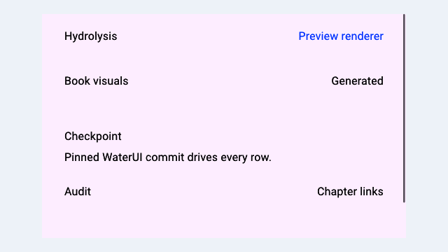

# Lists and collections

> **In this chapter, you will:**
> - Render dynamic collections lazily with `List::for_each` and `#[derive(Identifiable)]`
> - Compose static, heterogeneous, sectioned lists with `List::content` and `Section`
> - Drive fine-grained updates with `waterui::reactive::collection::List`
> - Jump to any row programmatically with a `ScrollController<usize>`
> - Animate items in and out with `collection_transition`

A collection grows and shrinks at runtime, so it cannot be written as a fixed tuple of views. WaterUI splits the job in two: `List::for_each` renders an identity-keyed collection lazily, and `List::content` composes a known set of rows with section chrome. Both produce the platform's native list surface — an inset-grouped `UITableView` on iOS, an `NSTableView` with group rows on macOS, a Material list on Android.



*A Hydrolysis preview of sectioned WaterUI lists. [Example source](https://github.com/water-rs/book/tree/main/examples/book-visuals).*

## A first dynamic list

`List::for_each` takes a collection and a generator returning one `ListItem` per element:

```rust,ignore
use waterui::prelude::*;
use waterui::Identifiable;
use waterui::component::list::{List, ListItem};

#[derive(Clone, Identifiable)]
struct TodoItem {
    #[id]
    id: i32,
    title: String,
    done: bool,
}

fn todo_list(items: [TodoItem; 3]) -> impl View {
    List::for_each(items, |item| {
        ListItem::new(hstack((
            text(item.title),
            spacer(),
            if item.done { text("Done") } else { text("Pending") },
        )))
    })
}
```

The list renders **lazily**: only rows inside the viewport are materialized, and that stays true after a programmatic jump into the middle of a hundred-thousand-row collection. The generator runs once per row that actually becomes visible, so keep it cheap — push expensive work into a `Computed` or an async task.

> **Prefer arrays for fixed collections.** A known set of items is `[a, b, c]`;
> pass it straight into any API that accepts `Collection` or `IntoIterator`.
> Reach for `vec!` only when the length is decided at runtime, when the
> collection needs mutation, or when the API specifically requires a `Vec`.

## Identity

`for_each` requires `C::Item: Identifiable` so the framework can diff membership by id instead of rebuilding every row:

```rust,ignore
# use core::hash::Hash;
pub trait Identifiable {
    type Id: Hash + Ord + Clone;
    fn id(&self) -> Self::Id;
}
```

The derive marks exactly one field with `#[id]`:

```rust,ignore
use waterui::Identifiable;

#[derive(Clone, Identifiable)]
struct Contact {
    #[id]
    id: u64,
    name: &'static str,
}

#[derive(Clone, Identifiable)]
struct Article<Key> {
    #[id]
    slug: Key,
    title: &'static str,
}

#[derive(Clone, Copy, Identifiable)]
struct ContactId(#[id] u64);
```

Structs only — enums and unions are rejected. Exactly one field must carry `#[id]`; zero or two is a compile error, and so is putting `#[id]` on the type. The generated `id()` clones the field, so its type must be `Hash + Ord + Clone`; the derive adds that bound for you.

> **Warning:** Identity must be **stable**. Changing an item's id makes the
> framework treat it as a removal followed by an insertion, discarding that
> row's view state instead of updating it in place.

## Reactive collections

A plain array or `Vec` describes data that never changes. For data that does, use `waterui::reactive::collection::List`: every mutation emits a fine-grained change notification, and the rendered rows patch by id rather than rebuilding.

```rust,ignore
use waterui::reactive::collection::List as ReactiveList;
# #[derive(Clone)] struct TodoItem { id: i32, title: String, done: bool }

fn seed() {
    let items: ReactiveList<TodoItem> = ReactiveList::new();

    items.push(TodoItem { id: 1, title: "Buy milk".into(), done: false });
    items.insert(0, TodoItem { id: 2, title: "Urgent".into(), done: false });
    items.remove(0);

    // One diffed update instead of N individual mutations.
    items.replace(vec![
        TodoItem { id: 3, title: "Write docs".into(), done: false },
    ]);
}
```

`replace(Vec<T>)` swaps the whole contents in a single diffed update and returns the old contents; `snapshot()` reads the current contents as a `Vec` without subscribing. `sort()`, `pop()`, `clear()`, and `iter()` behave as you would expect.

> **Note:** The rendering surface and the data structure are both called
> `List`. This chapter aliases the data type as `ReactiveList` and keeps the
> bare `List` for the view.

Never watch a signal that holds a `Vec` and rebuild a stack from it. `watch` replaces the entire watched subtree and discards its state on every change; a reactive collection plus `for_each` patches only the rows that actually moved.

## Sectioned and heterogeneous lists

`List::for_each` is homogeneous and section-free by design — that is what makes viewport-only rendering possible. When rows carry section headers, or when the rows are a fixed heterogeneous set, use `List::content` with `Section`:

```rust,ignore
use waterui::prelude::*;
use waterui::component::list::{List, Section, detail_row, row};

fn settings(status: &Binding<Str>, endpoint: &Binding<Str>) -> impl View {
    List::content((
        Section::new("Connection").content((
            row("Status", status.clone()),
            row("Endpoint", endpoint.clone()),
        )),
        Section::new("Activity")
            .footer("Updated every poll")
            .content((
                row("Polls", "128"),
                detail_row("Last error", "connection reset by peer"),
            )),
    ))
}
```

`ListContent` is a closed trait: it accepts `ListItem`, `Row`, `Section<C>`, tuples up to 15 elements, arrays, `Vec<T>`, `Option<T>`, and closures returning a `ListItem`. Nothing else can leak into a list row by accident.

`row(label, value)` builds a single-line `label ……… value` row; `detail_row(label, value)` stacks the value under the label at full width. `Row` exposes `.detail()`, `.inline()`, `.value_color(token)`, and `.deletable(false)`. Labels go through `IntoLabel` and values through `IntoText`, so both participate in localization and the accessibility tree.

`Section::new(header)` labels a group, `Section::unlabeled()` produces group chrome with no header, and `.footer(text)` appends a caption below it. A section that produces no items is dropped silently.

Under the hood a section is a marker on the first `ListItem` of the group (`ListItem::section(ListSection)`); backends translate it into `UITableView` section headers, `NSTableView` group rows, or Material dividers without any extra FFI surface.

## Editing: delete and reorder

`editing`, `on_delete`, and `on_move` turn a list into an editable one. The handlers receive `ListDelete` and `ListMove` as extractor parameters, alongside any `State<T>` you attach:

```rust,ignore
use waterui::prelude::*;
use waterui::Identifiable;
use waterui::component::list::{List, ListDelete, ListItem, ListMove};
use waterui::reactive::collection::List as ReactiveList;

# #[derive(Clone, Identifiable)] struct Contact { #[id] id: i32 }
fn editable(items: ReactiveList<Contact>) -> impl View {
    let editing = Binding::bool(false);

    List::for_each(items.clone(), |item| ListItem::new(text(item.id.to_string())))
        .editing(editing.clone())
        .on_delete(|State(items): State<ReactiveList<Contact>>, ListDelete(index): ListDelete| {
            items.remove(index);
        })
        .on_move(|State(items): State<ReactiveList<Contact>>, ListMove(movement): ListMove| {
            let item = items.remove(movement.from());
            items.insert(movement.to(), item);
        })
        .state(&items)
}
```

`Move` exposes `.from()` and `.to()`. Per-row refinement goes on the item: `ListItem::new(view).deletable(false)` opts a single row out of swipe-to-delete.

## Programmatic scrolling

A `ScrollController<usize>` targets **item indices** and pairs with `List`; a `ScrollController<Point>` targets **coordinates** and pairs with `ScrollView`. Both are plain values you own and can hold anywhere:

```rust,ignore
use waterui::prelude::*;
use waterui::component::list::{List, ListItem};
use waterui::component::scroll::ScrollController;

# use waterui::Identifiable;
# #[derive(Clone, Identifiable)] struct Entry { #[id] id: usize }
fn jump_list(entries: waterui::reactive::collection::List<Entry>) -> impl View {
    let scroll_to = ScrollController::<usize>::new(0);

    vstack((
        button("Jump to 50,000").action({
            let scroll_to = scroll_to.clone();
            move || scroll_to.scroll_to(50_000)
        }),
        List::for_each(entries, |entry| ListItem::new(text!("Row {id}", id = entry.id)))
            .scroll_controller(&scroll_to),
    ))
}
```

Because `for_each` is lazy, a jump of fifty thousand rows materializes only the rows that land in the viewport. The controller tracks a monotonically increasing generation alongside the target, so requesting the same index twice still scrolls after the user has moved away.

For coordinate scrolling, hand a `ScrollController<Point>` to `scroll(...)`:

```rust,ignore
use waterui::prelude::*;
use waterui::component::scroll::ScrollController;

fn scrolled_content(body: impl View) -> impl View {
    let viewport = ScrollController::<Point>::new(Point::zero());
    scroll(body).scroll_controller(&viewport)
}
```

## Animating membership changes

`collection_transition(content, animation)` scopes a request into the environment: every reactive collection inside `content` fades and grows items in as they appear, and fades and collapses them out as they leave. Backends without support ignore it and render the collection normally.

```rust,ignore
use waterui::prelude::*;
use waterui::animation::Animation;
use waterui::component::list::{List, ListItem};
use core::time::Duration;

# use waterui::Identifiable;
# #[derive(Clone, Identifiable)] struct Contact { #[id] id: i32, name: String }
fn animated(contacts: waterui::reactive::collection::List<Contact>) -> impl View {
    collection_transition(
        List::for_each(contacts, |c| ListItem::new(text(c.name))),
        Animation::ease_in(Duration::from_millis(200)),
    )
}
```

## Lazy stacks without list chrome

`List` gives you platform list chrome. When you want a lazy scrolling stack with none of it, `Lazy` wraps a `LazyContainer` in a scroll view:

```rust,ignore
use waterui::prelude::*;
use waterui::component::lazy::Lazy;

# use waterui::Identifiable;
# #[derive(Clone, Identifiable)] struct Photo { #[id] id: u64, caption: String }
fn gallery(photos: [Photo; 4]) -> impl View {
    Lazy::for_each(photos, |photo| text(photo.caption))
}
```

`Lazy::vstack`, `Lazy::hstack`, and the spaced variants `Lazy::vstack_spaced` / `Lazy::hstack_spaced` take any `Views` implementation directly.

For a genuinely static, small set of views, collecting an iterator into a stack is enough — but there is no virtualization, so every item is laid out at once:

```rust,ignore
use waterui::prelude::*;

fn fruit_list() -> impl View {
    let stack: VStack<_> = ["Apple", "Banana", "Cherry"].into_iter().map(text).collect();
    stack
}
```

## Building a complete list

```rust,ignore
use waterui::prelude::*;
use waterui::Identifiable;
use waterui::component::list::{List, ListItem};
use waterui::reactive::collection::List as ReactiveList;

#[derive(Clone, Identifiable)]
struct Contact {
    #[id]
    id: i32,
    name: String,
}

fn contacts_screen() -> impl View {
    let contacts = ReactiveList::from(vec![
        Contact { id: 1, name: "Alice".into() },
        Contact { id: 2, name: "Bob".into() },
    ]);
    let next_id = Binding::i32(3);

    vstack((
        text("Contacts").title(),
        button("Add Contact")
            .action(
                |State(contacts): State<ReactiveList<Contact>>,
                 State(next_id): State<Binding<i32>>| {
                    let id = next_id.get();
                    contacts.push(Contact { id, name: format!("Contact {id}") });
                    *next_id.get_mut() += 1;
                },
            )
            .state(&contacts)
            .state(&next_id),
        List::for_each(contacts, |contact| ListItem::new(text(contact.name))),
    ))
}
```

> **Exercise:** add deletion. Attach `.on_delete(...)` as shown above, then
> compare it with a per-row button that captures the contact's id — the first
> gets platform swipe gestures for free, the second works in a plain
> `Lazy::for_each` stack too.

## Choosing between the surfaces

| You have | Use |
|---|---|
| An identity-keyed collection that changes at runtime | `List::for_each` over a `ReactiveList` |
| A fixed set of rows with headers, footers, or mixed shapes | `List::content` with `Section` / `row` |
| A large collection with no list chrome | `Lazy::for_each` |
| A handful of views that never change | `vstack` / `collect()` |

Lists show data. Showing *different* views depending on a condition — a spinner while data loads, a login prompt when the user is signed out — is the [next chapter](06-conditional.md).
