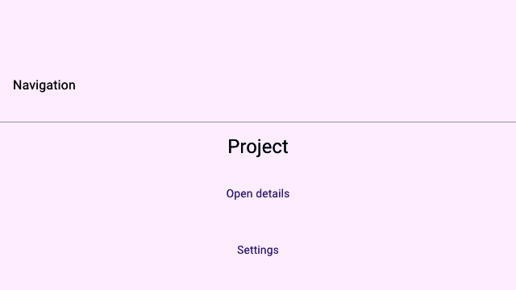

# Navigation

> **In this chapter, you will:**
> - Push screens with `NavigationStack`, `NavigationView`, and `NavigationLink`
> - Model your screens as route data with `NavigationPath` and `.destination(...)`
> - Drive the stack from any handler with `Navigator` and observe destination lifecycle
> - Attach semantic chrome — titles, toolbar placements, search — and pick a transition
> - Lay out top-level structure with `Tabs` and `NavigationSplitView`

WaterUI keeps navigation state in Rust and projects it into the platform's own container: `UINavigationController` on Apple platforms, fragments and Material chrome on Android, retained GPU pages in Hydrolysis. Your route list is the source of truth. Every change reaches the backend as one atomic transaction describing a retained prefix, a number of removals, and the destinations to insert — so the native stack cannot drift out of sync with your state.



*A Hydrolysis preview of WaterUI navigation chrome and links. [Example source](https://github.com/water-rs/book/tree/main/examples/book-visuals).*

## The smallest stack

```rust,ignore
use waterui::prelude::*;

fn app() -> impl View {
    NavigationStack::new(NavigationView::new(
        "Library",
        NavigationLink::new("Open settings", || {
            NavigationView::new("Settings", text("Preferences"))
        }),
    ))
}
```

`NavigationStack::new` accepts a `NavigationView`, not an arbitrary view, because the root is a destination with its own bar. `NavigationLink::new` pairs a label with a builder closure that returns the destination; the closure runs only when the link is activated, so screens the user never opens cost nothing.

> **Note:** `NavigationLink` needs a surrounding navigation context. A debug
> assertion fires if you place one outside a `NavigationStack`.

## Navigation views and titles

Any view becomes a destination through `.title(...)`, which is `NavigationView::new(title, content)` with the content first:

```rust,ignore
use waterui::prelude::*;

fn detail(name: &'static str) -> NavigationView {
    vstack((text(name), text("Some detail content")))
        .title("Detail")
        .navigation_subtitle("Updated just now")
        .inline_title()
}
```

The title display mode controls how the bar renders that title:

| Method / mode                                     | Behavior                                           |
|---------------------------------------------------|----------------------------------------------------|
| `NavigationTitleDisplayMode::Automatic` (default) | System decides — large on root, inline when pushed |
| `.inline_title()`                                 | Always a small inline title                        |
| `.large_title()`                                  | Large title that collapses on scroll               |

Set it explicitly with `.navigation_title_display_mode(mode)` when you hold the enum value in a variable. Following platform convention — large on root screens, inline on pushed detail screens — is what the automatic mode already does, so reach for the overrides only when your design departs from it.

> **Watch out:** `Text` has its own inherent `.title()` with no arguments — that
> is the typography preset from the [text chapter](01-text.md), not a
> navigation title. On a bare `Text`, use `NavigationView::new("Title", text(…))`
> instead of `text(…).title("Title")`.

## Routes as data

Builder-closure links are fine for a one-off drill-down. Anything that needs deep links, "back to root", or restoring where the user was should model destinations as *values* and let a `NavigationPath<Route>` hold them:

```rust,ignore
use waterui::prelude::*;

#[derive(Clone, PartialEq, Eq)]
enum Route {
    Article(u64),
    Settings,
}

fn app() -> impl View {
    let path = NavigationPath::<Route>::new();

    NavigationStack::with_path(
        path,
        NavigationView::new(
            "Library",
            vstack((
                NavigationLink::value("Read article 42", Route::Article(42)),
                NavigationLink::value("Open settings", Route::Settings),
            )),
        ),
    )
    .destination(|route| match route {
        Route::Article(id) => NavigationView::new("Article", text!("Article {id}")),
        Route::Settings => NavigationView::new("Settings", text("Preferences")),
    })
}
```

A route type must be `Clone + PartialEq + 'static`. `PartialEq` is what lets the stack compute the longest retained prefix between the old and new path, so pushing one route rebuilds one screen instead of the whole stack. The `destination` closure is total over your enum, so the compiler tells you when a new variant has no screen.

`NavigationLink::value` reads the surrounding `Navigator` out of the environment and pushes the value when tapped — no closure, no manual wiring.

`NavigationPath` is itself a shared reactive value. Clone it to hand the same path to another part of your app; do not wrap it in a `Binding`. To start deeper than the root, build it from a `Vec`:

```rust,ignore
use waterui::prelude::*;

# #[derive(Clone, PartialEq, Eq)] enum Route { Article(u64), Settings }
fn resumed_stack() -> NavigationPath<Route> {
    NavigationPath::from(vec![Route::Settings, Route::Article(7)])
}
```

## Driving the path

Mutate the path directly, or extract a `Navigator<Route>` inside any handler:

```rust,ignore
use waterui::prelude::*;

# #[derive(Clone, PartialEq, Eq)] enum Route { Article(u64), Settings }
fn controls() -> impl View {
    vstack((
        button("Settings").action(|navigator: Navigator<Route>| {
            navigator.push(Route::Settings);
        }),
        button("Back").action(|navigator: Navigator<Route>| {
            let _ = navigator.pop();
        }),
        button("Home").action(|navigator: Navigator<Route>| navigator.pop_to_root()),
        button("Jump").action(|navigator: Navigator<Route>| {
            navigator.replace([Route::Settings, Route::Article(7)]);
        }),
    ))
}
```

`pop` returns `Option<Route>` — the route that was removed, or `None` at the root — and it is `#[must_use]`, so discard it explicitly when you only want the side effect. `replace` is not a loop of pushes and pops: it diffs against the current path and emits a single transaction, which means one animation instead of a stutter of them.

The same operations exist on the path itself (`push`, `pop`, `pop_n`, `truncate`, `clear`, `replace`) for code that holds the path but is not inside a view handler.

## Native back gestures

The iOS back swipe, the macOS back button, and Android's predictive back all originate in the platform, not in your Rust code. The backend routes them through the navigation controller, which mutates your `NavigationPath` before or after the native transition — so after any native back, the path still describes what is on screen. There is no second, hidden copy of the stack to reconcile.

That gives you a place to intervene. A destination can refuse to be popped, and can observe the attempt either way:

```rust,ignore
use waterui::prelude::*;

fn checkout(has_unsaved_changes: Computed<bool>) -> NavigationView {
    let can_leave = has_unsaved_changes.map(|dirty| !dirty);

    NavigationView::new("Checkout", text("Review your order"))
        .navigation_pop_enabled(can_leave)
        .on_navigation_pop_attempted(|| tracing::debug!("user tried to leave checkout"))
}
```

## Destination lifecycle

Four hooks fire on a `NavigationView`, and the distinction between the last two matters:

| Hook                            | Fires when                                                       |
|---------------------------------|------------------------------------------------------------------|
| `.on_navigation_appear(h)`      | The destination becomes the active screen                        |
| `.on_navigation_disappear(h)`   | It stops being active — including when something is pushed above |
| `.on_navigation_pop_attempted(h)` | A user or system pop is requested, even if it is then denied    |
| `.on_navigation_pop(h)`         | A pop actually completed and removed this destination            |

Use `disappear` to pause work such as a video or a poll, and `pop` for teardown that must not run when the screen is merely covered:

```rust,ignore
use waterui::prelude::*;

fn editor() -> NavigationView {
    NavigationView::new("Editor", text("Draft"))
        .on_navigation_appear(|| tracing::debug!("editor active"))
        .on_navigation_disappear(|| tracing::debug!("editor covered or left"))
        .on_navigation_pop(|| tracing::debug!("editor closed for good"))
}
```

## Toolbars, bar chrome, and search

Toolbar content is declared by *semantic placement* rather than by position. You say what an item means; the backend decides where it goes. `Cancellation` resolves to the leading edge of the bar and `Confirmation` to the trailing edge on both Apple and Android, while `BottomBar` and `Status` move to a bottom toolbar — none of which you write twice:

```rust,ignore
use waterui::prelude::*;

fn compose(save: fn(), cancel: fn()) -> NavigationView {
    NavigationView::new("New message", text("Message body"))
        .navigation_toolbar(NavigationToolbar::new(vec![
            NavigationToolbarItem::action(
                NavigationToolbarPlacement::Cancellation,
                "Cancel",
                cancel,
            ),
            NavigationToolbarItem::action(
                NavigationToolbarPlacement::Confirmation,
                "Save",
                save,
            ),
        ]))
}
```

The available placements are `Principal`, `PrimaryAction`, `SecondaryAction`, `Confirmation`, `Cancellation`, `BottomBar`, `Status`, `TopBarLeading`, and `TopBarTrailing`. `NavigationToolbarItem::action(placement, label, handler)` builds a button for you; `NavigationToolbarItem::new(placement, view)` takes arbitrary content.

Three more bar modifiers, each taking a signal so the bar updates without rebuilding the screen:

```rust,ignore
use waterui::prelude::*;
use waterui::reactive::binding;

fn browser(immersive: Computed<bool>) -> NavigationView {
    let query: Binding<Str> = binding("");

    NavigationView::new("Browse", text("Results"))
        .searchable(&query, "Search the library")
        .navigation_bar_visibility(immersive.map(|immersive| !immersive))
        .navigation_bar_color(Color::new(theme_color::Surface))
}
```

`navigation_bar_visibility` takes *visible*, not hidden. Leave `navigation_bar_color` off unless you deliberately want to override the platform material — without it, each backend already uses the surrounding `Surface` theme token and its native treatment.

## Transitions

A stack's transition is set once, on the stack:

```rust,ignore
use waterui::prelude::*;

# #[derive(Clone, PartialEq, Eq)] enum Route { Settings }
fn faded(path: NavigationPath<Route>, root: NavigationView) -> impl View {
    NavigationStack::with_path(path, root)
        .destination(|_| NavigationView::new("Settings", text("Preferences")))
        .transition(navigation_transition::fade())
}
```

`navigation_transition` provides `automatic()` (the default platform push/pop), `fade()`, `none()`, and `zoom(id)`. A zoom is a matched-geometry transition, so it needs both ends tagged with the same `Id`:

```rust,ignore
use waterui::prelude::*;
use waterui::id::Mapping;

# #[derive(Clone, PartialEq, Eq)] enum Route { Photo }
fn gallery(path: NavigationPath<Route>) -> impl View {
    let ids = Mapping::new();
    let hero = ids.register("hero");

    NavigationStack::with_path(
        path,
        NavigationLink::value("Open photo", Route::Photo)
            .navigation_transition_source(hero)
            .title("Gallery"),
    )
    .destination(move |_| {
        NavigationView::new(
            "Photo",
            text("Full size").navigation_transition_destination(hero),
        )
    })
    .transition(navigation_transition::zoom(hero))
}
```

`NavigationTransition` is a trait, not a closed enum: implement `frame(progress, direction)` to define your own motion. Be aware of the asymmetry, though — a custom transition has no native projection, so Apple and Android apply the stack change without animation and log it as unsupported. Retained renderers such as Hydrolysis run your `frame` directly.

## Tabs

Tabs carry stable identifiers so the backend can keep each tab's root alive across switches, and each tab's content builder returns a `NavigationView` — giving every tab an independent stack.

```rust,ignore
use waterui::prelude::*;
use waterui::id::Mapping;
use waterui::navigation::tab::{Tab, Tabs, tab_style};

fn root(unread: Computed<i32>) -> impl View {
    let ids = Mapping::new();
    let inbox = ids.register("inbox");
    let settings = ids.register("settings");
    let selection = Binding::container(inbox);

    Tabs::new(
        selection,
        vec![
            Tab::new(inbox, "Inbox", || {
                NavigationView::new("Inbox", text("No messages"))
            })
            .badge(unread),
            Tab::new(settings, "Settings", || {
                NavigationView::new("Settings", text("Preferences"))
            }),
        ],
    )
    .style(tab_style::automatic())
}
```

`selection` is a `Binding<Id>`: read it to know which tab is active, write it to switch tabs from anywhere. `.badge(signal)` and `.enabled(signal)` both take signals, so a count or a lock state updates in place.

Presentation is an attribute, not a different type. `tab_style::automatic()` lets the platform and window size pick between a tab bar, a sidebar, and a navigation rail; `tab_style::tab_bar()` and `tab_style::sidebar()` request one explicitly.

## Split view

`NavigationSplitView` is the two- or three-column layout behind mail clients and settings apps. You own the selection binding; the split view builds the detail column from whatever is selected.

```rust,ignore
use waterui::prelude::*;

fn mailbox(
    selection: Binding<Option<u64>>,
    visibility: Binding<NavigationSplitColumnVisibility>,
) -> impl View {
    let sidebar_selection = selection.clone();

    NavigationSplitView::new(
        &selection,
        move || {
            button("Select message 7")
                .action(|State(selection): State<Binding<Option<u64>>>| {
                    selection.set(Some(7));
                })
                .state(&sidebar_selection)
        },
        |id| NavigationView::new("Message", text!("Message {id}")),
    )
    .placeholder(|| text("Select a message"))
    .sidebar_width(ColumnWidth::new(240.0, 320.0, 480.0))
    .column_visibility(visibility)
    .style(split_style::prominent_detail())
}
```

`ColumnWidth::new(min, ideal, max)` gives the platform real resize constraints instead of one fixed number, and panics if they are not ordered `0 < min <= ideal <= max`. `column_visibility` takes a *signal* over `Automatic`, `All`, `DoubleColumn`, or `DetailOnly`, so a "hide the sidebar" button is a write to a binding rather than a rebuild. For a three-pane layout with independent sidebar and content selections, use `NavigationSplitView::three_column(sidebar_selection, content_selection, sidebar, content, detail)`.

On compact windows the native containers collapse to stack-style navigation on their own; you do not branch on screen size.

## Deep links and restoration

`NavigationRouter` turns an incoming URL into a complete path in one atomic replacement:

```rust,ignore
use waterui::prelude::*;
use waterui::Url;

# #[derive(Clone, PartialEq, Eq)] enum Route { Article(u64), Settings }
fn open_deep_link(path: &NavigationPath<Route>, url: &Url) -> bool {
    let router = NavigationRouter::new(path.clone())
        .route(|url| (url.path() == "/settings").then_some(vec![Route::Settings]));

    router.open(url)
}
```

`open` returns `false` when no resolver claims the URL, and panics if two resolvers claim the same one — ambiguous routing is a bug, not something to resolve by precedence.

Path *restoration* is a separate concern from URL routing. Enable the `navigation-restoration` feature on `waterui` (or `serde` on `waterui-navigation` directly) and a typed `NavigationPath<Route>` serializes through ordinary serde, so you can persist where the user was and restore it on next launch.

## Where to go next

Navigation completes the UI toolkit: text, layout, controls, forms, lists, conditional rendering, and now movement between screens. [Part IV: Rich Content](../04-rich/01-media.md) picks up media, maps, and web views — the components you drop *inside* the screens you just learned to connect.
