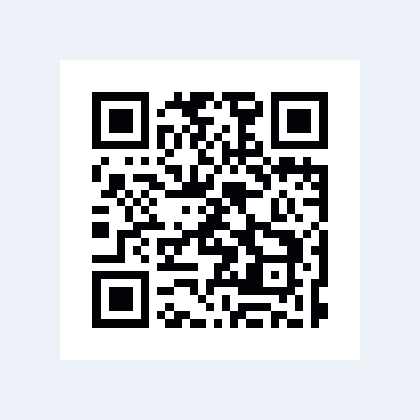

# Barcodes and QR Codes

> **In this chapter, you will:**
> - Generate QR codes and Code 128 barcodes from any string
> - Customize colors with solid fills, gradients, and GPU content
> - Understand how the GPU-based rendering pipeline keeps codes crisp at any size
> - Build a shareable QR code component for your app

Need to let users share a link by scanning their phone, or display a product barcode in a retail app? The `waterui-barcode` crate renders barcodes and QR codes entirely on the GPU. Module data is encoded on the CPU, packed into a bit buffer, and rasterized by a fragment shader -- producing crisp output at any resolution with no CPU rasterization overhead.

> **Feature flag:** Barcodes live behind the `barcode` feature on `waterui`. Enable it in `Cargo.toml` (`waterui = { version = "...", features = ["barcode"] }`) before importing `waterui::barcode`.

## Quick Start

```rust,ignore
use waterui::barcode::Barcode;

// QR code
fn my_qr() -> impl View {
    Barcode::qr("https://waterui.dev")
}

// 1D barcode
fn my_barcode() -> impl View {
    Barcode::code128("HELLO-WATERUI")
}
```

Both `Barcode::qr` and `Barcode::code128` return a `Barcode` struct that
implements `View` and can be placed directly in your view hierarchy.



*A QR code rendered from the pinned WaterUI barcode component.*

---

## Supported Symbologies

| Symbology | Constructor | Dimensions | Description |
|---|---|---|---|
| QR Code | `Barcode::qr(content)` | 2D | Square matrix, widely used for URLs, text, and data |
| Code 128 | `Barcode::code128(content)` | 1D | High-density linear barcode for alphanumeric data |

The `BarcodeSymbology` enum represents these:

```rust,ignore
pub enum BarcodeSymbology {
    Qr,
    Code128,
}
```

`Barcode::new(content)` is an alias for `Barcode::qr(content)`.

---

## Customizing Colors

The default black-and-white look works fine, but you can match your app's branding with custom colors.

### Dark Module Color

By default, dark modules are black. Change them with `dark_color`. `Srgb::new`
takes three linear-light channels in `0.0..=1.0`:

```rust,ignore
use waterui::barcode::Barcode;
use waterui::graphics::color::Srgb;

fn blue_qr() -> impl View {
    Barcode::qr("https://waterui.dev")
        .dark_color(Srgb::new(0.0, 0.3, 0.8))
}
```

### Light Module / Background Color

Change the background (light modules and quiet zone):

```rust,ignore
fn dark_mode_qr() -> impl View {
    Barcode::qr("https://waterui.dev")
        .dark_color(Srgb::WHITE)
        .light_color(Srgb::new(0.1, 0.1, 0.1))
}
```

### Gradient Fill

Apply a linear gradient to the dark modules for a more eye-catching look:

```rust,ignore
use waterui::barcode::Barcode;
use waterui::graphics::color::Srgb;

fn gradient_qr() -> impl View {
    Barcode::qr("https://waterui.dev")
        .linear_gradient(
            Srgb::new(0.0, 0.5, 1.0), // start color (blue)
            Srgb::new(1.0, 0.0, 0.5), // end color (pink)
            [0.0, 0.0],               // start point (top-left)
            [1.0, 1.0],               // end point (bottom-right)
        )
}
```

Gradient coordinates are normalized to the barcode's bounding square:
- `[0.0, 0.0]` is the top-left corner
- `[1.0, 1.0]` is the bottom-right corner

---

## GPU-Content Fill

For advanced effects -- imagine a QR code filled with an animated gradient, or modules that shimmer with a particle effect -- use `fill_gpu`. Any type implementing `GpuView` can serve as the fill source:

```rust,ignore
use waterui::barcode::Barcode;

fn artistic_qr(animated_renderer: impl GpuView) -> impl View {
    Barcode::qr("https://waterui.dev")
        .fill_gpu(animated_renderer)
        .light_color(Srgb::WHITE)
}
```

This creates a `BarcodeGpuFill<V>` view that:

1. Renders the fill content to an offscreen texture.
2. Applies a barcode mask effect where dark modules sample from the fill
   texture and light modules use the configured light color.

The mask is applied via the `BarcodeMaskEffect` shader, which runs the same
packed-matrix lookup as the standard renderer but composites the fill texture
instead of a flat color.

---

## The `BarcodeFill` Enum

Under the hood, the fill style for solid colors and gradients is represented
as `BarcodeFill`:

```rust,ignore
pub enum BarcodeFill {
    Solid(Srgb),
    LinearGradient {
        start_color: Srgb,
        end_color: Srgb,
        start_point: [f32; 2],
        end_point: [f32; 2],
    },
}
```

You do not need to construct this directly -- `dark_color` and
`linear_gradient` produce the appropriate variant for you.

---

## How It Works

Understanding the rendering pipeline helps you appreciate why QR codes stay perfectly sharp at any zoom level.

### Matrix Generation

When a `Barcode` view renders, it first generates the module matrix:

- **QR codes** use the `fast_qr` crate. The QR matrix dimension depends on
  the content length and error correction level.
- **Code 128** uses the `barcoders` crate. The 1D bar pattern is repeated on
  every row to produce a square matrix compatible with the same GPU shader.

### Bit Packing

The matrix is packed into a `Vec<u32>` where each `u32` holds 32 modules as
individual bits:

- Bit value `1` = dark module
- Bit value `0` = light module

For a 25x25 QR code, the total is 625 modules requiring 20 u32 words. This
compact representation is uploaded as a GPU storage buffer.

### Fragment Shader Rasterization

The shader (`qr_render.wgsl`) receives:
- A uniform buffer with the matrix dimension, quiet zone size, output
  resolution, and color/gradient parameters
- A read-only storage buffer with the packed matrix bits

For each fragment, the shader:
1. Maps the pixel position to a module coordinate (accounting for quiet zone)
2. Looks up the corresponding bit in the packed buffer
3. Outputs the dark or light color (or gradient-interpolated color)

This approach renders at any resolution without aliasing artifacts because the
module lookup is resolution-independent.

### Quiet Zones

Each symbology includes an appropriate quiet zone (margin):

| Symbology | Quiet Zone (modules) |
|---|---|
| QR Code | 4 |
| Code 128 | 10 |

The quiet zone is rendered in the light color and is included automatically.

---

## API Reference Summary

### `Barcode`

| Method | Description |
|---|---|
| `Barcode::new(content)` | Create a QR code (alias for `qr`) |
| `Barcode::qr(content)` | Create a QR code |
| `Barcode::code128(content)` | Create a Code 128 barcode |
| `.dark_color(color)` | Set solid dark module color |
| `.light_color(color)` | Set light module / background color |
| `.linear_gradient(start, end, from, to)` | Apply gradient to dark modules |
| `.fill_gpu(gpu_view)` | Fill dark modules with GPU-rendered content |

### `BarcodeGpuFill<V>`

| Method | Description |
|---|---|
| `.light_color(color)` | Set light module / background color |

### `BarcodeRenderer`

For direct GPU pipeline integration:

| Method | Description |
|---|---|
| `BarcodeRenderer::new(source)` | Create with default black/white colors |
| `BarcodeRenderer::new_with_colors(source, dark, light)` | Create with custom solid colors |
| `BarcodeRenderer::new_with_fill(source, fill, light)` | Create with a `BarcodeFill` |

The renderer implements `GpuRenderer`, so it can be used with `GpuSurface`
and the rest of the graphics pipeline.

### `BarcodeSource`

| Method | Description |
|---|---|
| `BarcodeSource::qr(content)` | Create a QR source |
| `BarcodeSource::code128(content)` | Create a Code 128 source |
| `.set_size(pixels)` | Set the output size (default: 256) |
| `.size()` | Get the current output size |
| `.symbology()` | Get the symbology type |
| `.quiet_zone()` | Get the quiet zone width in modules |
| `.matrix()` | Get or generate the packed `BarcodeMatrix` |

---

## Complete Example

A settings page with a shareable QR code:

```rust,ignore
use waterui::prelude::*;
use waterui::barcode::Barcode;
use waterui::graphics::color::Srgb;

fn share_page() -> impl View {
    let url = "https://book.waterui.dev";

    vstack((
        text("Scan to join"),
        Barcode::qr(url)
            .dark_color(Srgb::new(0.15, 0.15, 0.15))
            .light_color(Srgb::WHITE),
        text(url),
        Spacer::flexible(),
    ))
}
```

A branded QR code with a gradient:

```rust,ignore
use waterui::prelude::*;
use waterui::barcode::Barcode;
use waterui::graphics::color::Srgb;

fn branded_qr() -> impl View {
    Barcode::qr("https://waterui.dev")
        .linear_gradient(
            Srgb::new(0.0, 0.4, 0.9), // brand blue
            Srgb::new(0.0, 0.8, 0.6), // brand green
            [0.0, 0.0],
            [1.0, 1.0],
        )
        .light_color(Srgb::new(0.98, 0.98, 0.98))
}
```

---

## Platform Considerations

The barcode component is fully cross-platform because it renders entirely
through WaterUI's GPU pipeline (wgpu). There is no dependency on platform-
specific barcode libraries.

| Feature | All Platforms |
|---|---|
| QR code generation | `fast_qr` crate (pure Rust) |
| Code 128 generation | `barcoders` crate (pure Rust) |
| Rendering | Fragment shader via wgpu |
| Gradient fills | GPU shader |
| GPU content fill | `BarcodeMaskEffect` post-processing shader |
| Scanning / camera decode | Not yet available (planned) |

> **Note:** Barcode *scanning* (using the device camera to decode barcodes) is
> not currently part of this crate. It is planned for a future release as part
> of the WaterKit camera integration.

---

## What's Next

That wraps up the Rich Content section. You have learned how to display media, embed maps, render web content, and generate barcodes -- all from Rust. In the next section, [Graphics](../05-graphics/01-canvas.md), you will dive into the GPU and start drawing custom shapes, shaders, and visual effects.
