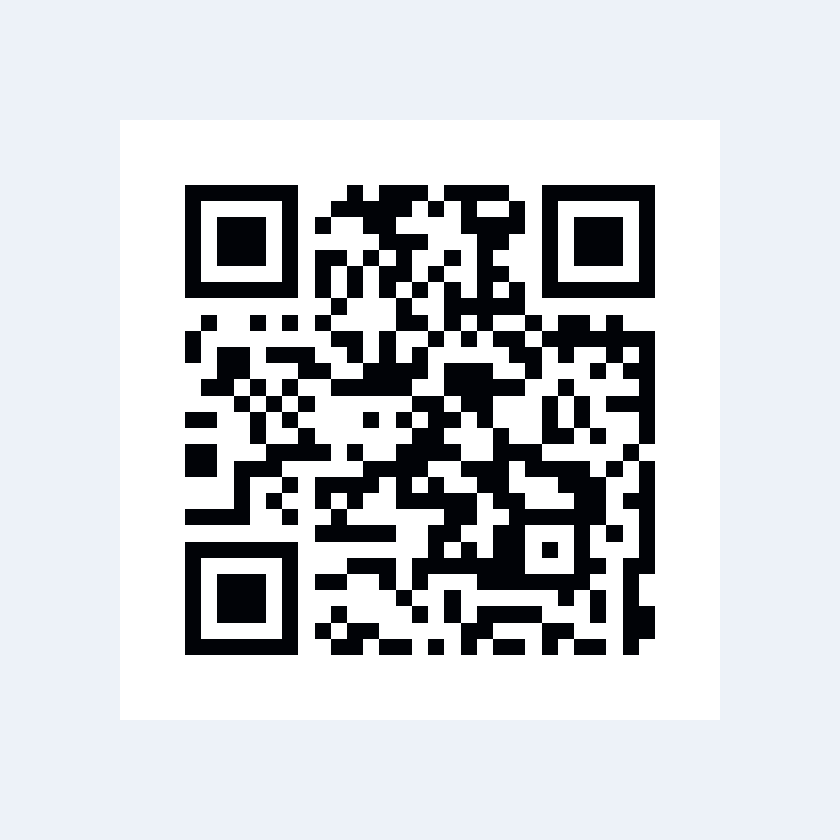
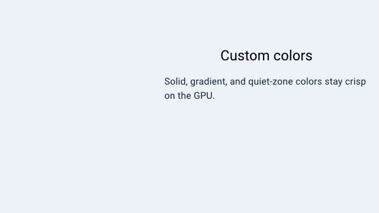

# Barcodes and QR codes

> **In this chapter, you will:**
> - Render QR codes and Code 128 barcodes from any string
> - Tint modules with solid colors, gradients, and live reactive colors
> - Fill a code with arbitrary GPU content through `fill_gpu`
> - Size a code so that scanners can actually read it

`waterui-barcode` encodes module data on the CPU once, packs it into a bit
buffer, and rasterizes it in a fragment shader. There is no CPU rasterization
path — every barcode is drawn on the GPU, so a code stays sharp at any size.

> **Feature flag:** barcodes require the `barcode` feature on `waterui`
> (`waterui = { version = "...", features = ["barcode"] }`). The crate is then
> re-exported as `waterui::barcode`.



*A QR code rendered from the pinned WaterUI barcode component. [Example source](https://github.com/water-rs/book/tree/main/examples/book-visuals).*

## Quick start

```rust,ignore
use waterui::prelude::*;
use waterui::barcode::Barcode;

fn share_link() -> impl View {
    Barcode::qr("https://book.waterui.dev").size(280.0, 280.0)
}

fn product_label() -> impl View {
    Barcode::code128("WATERUI-BOOK").size(250.0, 92.0)
}
```

`Barcode::qr` and `Barcode::code128` both return a `Barcode`, which implements
`View`. The free functions `qr_code(content)` and `code128(content)` are
equivalent ergonomic entry points.

### Give the code a size

A `Barcode` renders through a GPU surface, and GPU surfaces stretch to fill
whatever size their parent proposes. Inside a stack that offers no bounded
height, that means the code can collapse. Pin it with `.size(width, height)`,
and keep QR codes square — a stretched QR matrix is much harder for a scanner
to lock onto.

## Supported symbologies

| Symbology | Constructor | Shape | Typical use |
|---|---|---|---|
| QR Code | `Barcode::qr(content)` | 2D matrix | URLs, tokens, arbitrary text |
| Code 128 | `Barcode::code128(content)` | 1D bars | Alphanumeric product and asset codes |

`BarcodeSymbology` (`Qr` / `Code128`) is `#[non_exhaustive]`, so any `match`
you write against it needs a wildcard arm to survive future symbologies.

Encoding runs when the view builds its body. Content the encoder rejects — a
payload too large for a QR symbol, or characters outside Code 128's charset —
panics with the encoder's error instead of quietly rendering an empty code.
Validate untrusted input before handing it to `Barcode`.

## Coloring modules



*A Hydrolysis preview of custom barcode colors and gradient fills. [Example source](https://github.com/water-rs/book/tree/main/examples/book-visuals).*

Dark modules default to black, light modules and the quiet zone to white.
`dark_color` and `light_color` override them:

```rust,ignore
use waterui::prelude::*;
use waterui::barcode::Barcode;

fn branded_qr() -> impl View {
    Barcode::qr("https://book.waterui.dev")
        .dark_color(Color::srgb(12, 26, 45))
        .light_color(Color::srgb(246, 250, 255))
        .size(280.0, 280.0)
}
```

Keep the contrast high. Scanners threshold the image, so a dark-on-dark palette
that looks tasteful on screen may not decode at all.

### Gradient fill

`linear_gradient` replaces the solid dark fill with a two-stop gradient:

```rust,ignore
use waterui::prelude::*;
use waterui::barcode::Barcode;

fn gradient_qr() -> impl View {
    Barcode::qr("https://book.waterui.dev")
        .linear_gradient(
            Color::srgb(0, 108, 255),   // start color
            Color::srgb(255, 62, 122),  // end color
            [0.0, 0.0],                 // start point: top-left
            [1.0, 1.0],                 // end point: bottom-right
        )
        .size(280.0, 280.0)
}
```

The two endpoints are `UnitPoint`s normalized to the barcode square, so
`[0.0, 0.0]` is the top-left corner and `[1.0, 1.0]` the bottom-right. The
named constants work too: `UnitPoint::TOP_LEADING`, `UnitPoint::CENTER`,
`UnitPoint::BOTTOM_TRAILING`, and friends.

### Reactive colors

Every color argument takes `impl IntoComputed<Color>`, not a frozen `Color`.
Pass a `Binding` or a `Computed` and the renderer re-tints in place — no view
reconstruction, no re-encoding of the matrix:

```rust,ignore
use waterui::prelude::*;
use waterui::barcode::Barcode;

fn invertible_qr() -> impl View {
    let inverted = Binding::bool(false);

    vstack((
        Barcode::qr("https://book.waterui.dev")
            .dark_color(inverted.map(|inverted| {
                if inverted { Color::srgb(255, 255, 255) } else { Color::srgb(12, 26, 45) }
            }))
            .light_color(inverted.map(|inverted| {
                if inverted { Color::srgb(12, 26, 45) } else { Color::srgb(255, 255, 255) }
            }))
            .size(280.0, 280.0),
        toggle("Invert for dark mode", &inverted),
    ))
    .spacing(16.0)
}
```

`SignalExt::map` borrows the binding, so the same `inverted` still drives the
`toggle`. Flipping it uploads two new colors to the shader's uniform buffer and
requests a redraw; the packed matrix buffer is untouched.

### `BarcodeFill`

Solid and gradient fills are both values of the `BarcodeFill` enum, built with
`BarcodeFill::solid(color)` and `BarcodeFill::linear_gradient(start, end,
from, to)`. `dark_color` and `linear_gradient` construct it for you — you only
need it when driving `BarcodeRenderer` directly.

## Filling a code with GPU content

`fill_gpu` swaps the flat fill for any `GpuView`: an animated shader, a
particle system, a rendered scene.

```rust,ignore
use waterui::prelude::*;
use waterui::barcode::Barcode;
use waterui::graphics::GpuView;

fn artistic_qr(animated: impl GpuView) -> impl View {
    Barcode::qr("https://book.waterui.dev")
        .fill_gpu(animated)
        .light_color(Color::srgb(255, 255, 255))
        .size(280.0, 280.0)
}
```

This returns a `BarcodeGpuFill<V>`, which renders in two passes: the fill view
draws into an offscreen texture, then `BarcodeMaskEffect` composites it —
sampling the fill texture where a module is dark and painting the light color
everywhere else. `light_color` is the only modifier left on `BarcodeGpuFill`,
since the dark modules now come from your GPU view.

## How it works

### Matrix generation

QR matrices come from `fast_qr`; the matrix side length depends on payload
length and error-correction level. Code 128 comes from `barcoders`, and its 1D
bar pattern is repeated on every row so both symbologies feed the same square
shader path. Both run once, when the `BarcodeSource` is constructed.

### Bit packing

The matrix is packed into a `Vec<u32>` with one bit per module — `1` dark, `0`
light. A 25×25 QR code is 625 modules, so 20 words. That buffer is uploaded
once as a read-only GPU storage buffer.

### Fragment shader

`qr_render.wgsl` binds the packed matrix plus a uniform block holding the
matrix dimension, quiet-zone width, output resolution, and color or gradient
parameters. Per fragment it maps the pixel to a module coordinate, reads that
one bit, and emits the dark color, the gradient sample, or the light color.
Because the lookup is resolution-independent, scaling the view resizes modules
rather than resampling pixels.

### Quiet zones

| Symbology | Quiet zone (modules) |
|---|---|
| QR Code | 4 |
| Code 128 | 10 |

The quiet zone is drawn in the light color and added automatically — you do not
need to pad the view yourself.

## API reference

### `Barcode`

| Method | Description |
|---|---|
| `Barcode::qr(content)` | QR code from any `impl Into<Str>` |
| `Barcode::code128(content)` | Code 128 barcode |
| `.dark_color(color)` | Solid dark-module fill, reactive |
| `.light_color(color)` | Light-module and quiet-zone color, reactive |
| `.linear_gradient(start, end, from, to)` | Gradient across dark modules, reactive colors |
| `.fill_gpu(gpu_view)` | Fill dark modules with GPU content, returns `BarcodeGpuFill<V>` |

Free functions `qr_code(content)` and `code128(content)` mirror the two
constructors.

### `BarcodeGpuFill<V>`

| Method | Description |
|---|---|
| `.light_color(color)` | Light-module and quiet-zone color, reactive |

### `BarcodeRenderer`

For direct GPU pipeline work. It implements `GpuView`, so wrap it in
`GpuSurface::new` to place it in a view tree — which is exactly what `Barcode`
does internally.

| Method | Description |
|---|---|
| `BarcodeRenderer::new(source)` | Black modules on white, from a `BarcodeSource` |
| `.with_fill(fill)` | Override with a `BarcodeFill` |
| `.with_light_color(color)` | Override the light color, reactive |

### `BarcodeSource`

| Method | Description |
|---|---|
| `BarcodeSource::qr(content)` | Encode a QR matrix now |
| `BarcodeSource::code128(content)` | Encode a Code 128 matrix now |
| `.symbology()` | The `BarcodeSymbology` this source carries |
| `.quiet_zone()` | Quiet-zone width in modules |
| `.set_size(pixels)` / `.size()` | Pixel size used when the source is rasterized offscreen (default 256) |

The encoded matrix itself is internal: get pixels through `Barcode` or
`BarcodeRenderer` rather than reaching for the buffer.

## Complete example

```rust,ignore
use waterui::prelude::*;
use waterui::barcode::Barcode;

fn share_page() -> impl View {
    let url = "https://book.waterui.dev";

    vstack((
        text("Scan to join"),
        Barcode::qr(url)
            .dark_color(Color::srgb(38, 38, 38))
            .light_color(Color::srgb(255, 255, 255))
            .size(280.0, 280.0),
        text(url),
        spacer(),
    ))
    .spacing(12.0)
}
```

## Scanning is not included

This crate generates codes; it does not read them. Decoding a barcode from the
camera is not part of `waterui-barcode` at the pinned commit, and nothing in
the current API exposes a scanner. If you need scanning today, drive the
platform camera API yourself through your backend.

## What's next

Next comes [Graphics](../05-graphics/01-canvas.md), where you write the shaders
and canvas drawing code that a barcode fill like `fill_gpu` consumes.
