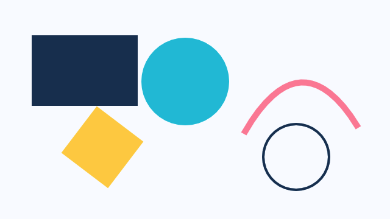

# Canvas Drawing

> **In this chapter, you will:**
> - Draw shapes, paths, text, and images on a GPU-accelerated 2D canvas
> - Use gradients, transforms, clipping, and shadows
> - Drive redraws from reactive signals
> - Build a custom visualization like an animated clock

`Canvas` is WaterUI's 2D vector graphics view, powered by [Vello](https://github.com/linebender/vello). If you have used the HTML5 Canvas API, the drawing interface will feel familiar -- but every command runs on the GPU through wgpu.

> **Checkpoint status:** in the pinned WaterUI commit, `waterui-canvas` exists
> at `components/visual/canvas` as a workspace crate but is not re-exported by
> the top-level `waterui` facade. The examples in this chapter describe that
> crate-level API and are marked `rust,ignore` until the facade exposes a
> public `waterui::canvas` module.

## Overview

`Canvas` is a callback-based drawing surface. You provide a closure that receives a `DrawingContext`, and WaterUI invokes it whenever the scene needs to repaint. Internally, the canvas drives a Vello scene that is built into a `GpuSurface`, so your drawing commands compile into GPU-friendly scene data.



*A WaterUI Canvas preview showing vector drawing primitives.*

```rust,ignore
use waterui::prelude::*;
use waterui_canvas::{Canvas, DrawingContext};
use waterui::layout::{Rect, Size};
use waterui::graphics::color::Srgb;

fn my_canvas() -> impl View {
    Canvas::new(|ctx: &mut DrawingContext| {
        ctx.set_fill_style(Srgb::new(0.2, 0.5, 1.0));
        let rect = Rect::from_size(Size::new(200.0, 100.0));
        ctx.fill_rect(rect);
    })
}
```

`Canvas` stretches to fill its parent in both axes by default. Use `.size(w, h)` (from `ViewExt`) to give it a fixed footprint.

## Drawing Context

The `DrawingContext` is the primary interface for all drawing operations. It provides access to the canvas dimensions and a rich set of drawing methods.

```rust,ignore
Canvas::new(|ctx: &mut DrawingContext| {
    // Canvas dimensions are available as fields
    let width = ctx.width;
    let height = ctx.height;
    let center = ctx.center(); // Convenience method
    let size = ctx.size();     // Returns Size { width, height }
})
```

## Drawing Shapes

Let's start with the basics. Every shape begins with setting a fill or stroke style, then calling the corresponding draw method.

### Rectangles

The most common primitive. Fill, stroke, or clear rectangles with a single call.

```rust,ignore
Canvas::new(|ctx: &mut DrawingContext| {
    let rect = Rect::new(Point::new(10.0, 10.0), Size::new(200.0, 100.0));

    // Solid fill
    ctx.set_fill_style(Srgb::new(0.2, 0.6, 1.0));
    ctx.fill_rect(rect);

    // Outlined stroke
    ctx.set_stroke_style(Srgb::new(1.0, 0.0, 0.0));
    ctx.set_line_width(3.0);
    ctx.stroke_rect(rect);

    // Clear a region to transparent
    ctx.clear_rect(Rect::new(Point::new(50.0, 30.0), Size::new(40.0, 40.0)));
})
```

### Circles

```rust,ignore
Canvas::new(|ctx: &mut DrawingContext| {
    ctx.set_fill_style(Srgb::new_u8(242, 140, 168));
    ctx.fill_circle(Point::new(100.0, 100.0), 50.0);

    ctx.set_stroke_style(Srgb::new(0.0, 0.0, 0.0));
    ctx.set_line_width(2.0);
    ctx.stroke_circle(Point::new(100.0, 100.0), 50.0);
})
```

### Lines

```rust,ignore
Canvas::new(|ctx: &mut DrawingContext| {
    ctx.set_stroke_style(Srgb::new(1.0, 1.0, 1.0));
    ctx.set_line_width(2.0);
    ctx.stroke_line(
        Point::new(10.0, 10.0),
        Point::new(200.0, 150.0),
    );
})
```

## Path API

For complex shapes, use the `Path` builder. It follows the HTML5 Canvas path API closely, so you can construct anything from triangles to intricate curves.

```rust,ignore
Canvas::new(|ctx: &mut DrawingContext| {
    let mut path = ctx.begin_path();

    // Triangle
    path.move_to(Point::new(100.0, 10.0));
    path.line_to(Point::new(190.0, 170.0));
    path.line_to(Point::new(10.0, 170.0));
    path.close();

    ctx.set_fill_style(Srgb::new(0.0, 0.8, 0.4));
    ctx.fill_path(&path);
})
```

### Bezier Curves

```rust,ignore
Canvas::new(|ctx: &mut DrawingContext| {
    let mut path = ctx.begin_path();
    path.move_to(Point::new(10.0, 100.0));

    // Quadratic curve
    path.quadratic_to(
        Point::new(100.0, 10.0),   // control point
        Point::new(200.0, 100.0),  // end point
    );

    // Cubic curve
    path.bezier_to(
        Point::new(250.0, 10.0),   // control point 1
        Point::new(350.0, 190.0),  // control point 2
        Point::new(400.0, 100.0),  // end point
    );

    ctx.set_stroke_style(Srgb::new(1.0, 0.5, 0.0));
    ctx.set_line_width(3.0);
    ctx.stroke_path(&path);
})
```

### Arcs and Ellipses

```rust,ignore
Canvas::new(|ctx: &mut DrawingContext| {
    let mut path = ctx.begin_path();

    // Circular arc: center, radius, start_angle, end_angle, anticlockwise
    path.arc(
        Point::new(100.0, 100.0),
        50.0,
        0.0,
        std::f32::consts::PI,
        false,
    );

    // Elliptical arc: center, radii, rotation, start, end, anticlockwise
    path.ellipse(
        Point::new(250.0, 100.0),
        Size::new(80.0, 40.0), // radii
        0.3,                    // rotation in radians
        0.0,                    // start angle
        std::f32::consts::TAU,  // end angle (full ellipse)
        false,
    );

    ctx.set_stroke_style(Srgb::new(0.8, 0.2, 0.8));
    ctx.set_line_width(2.0);
    ctx.stroke_path(&path);
})
```

## Gradients

Canvas supports three types of gradients for richer fills: linear, radial, and conic. Each is created through a builder returned by the drawing context.

### Linear Gradient

```rust,ignore
Canvas::new(|ctx: &mut DrawingContext| {
    let mut gradient = ctx.create_linear_gradient(0.0, 0.0, 200.0, 200.0);
    gradient.add_color_stop(0.0, Srgb::new(1.0, 0.0, 0.0));
    gradient.add_color_stop(0.5, Srgb::new(0.0, 1.0, 0.0));
    gradient.add_color_stop(1.0, Srgb::new(0.0, 0.0, 1.0));

    ctx.set_fill_style(gradient);
    ctx.fill_rect(Rect::from_size(Size::new(200.0, 200.0)));
})
```

### Radial Gradient

The radial gradient interpolates between two circles defined by center and radius.

```rust,ignore
Canvas::new(|ctx: &mut DrawingContext| {
    let mut gradient = ctx.create_radial_gradient(
        100.0, 100.0, 10.0,  // inner circle: center (100,100), radius 10
        100.0, 100.0, 80.0,  // outer circle: center (100,100), radius 80
    );
    gradient.add_color_stop(0.0, Srgb::new(1.0, 1.0, 1.0));
    gradient.add_color_stop(1.0, Srgb::new(0.0, 0.0, 0.4));

    ctx.set_fill_style(gradient);
    ctx.fill_circle(Point::new(100.0, 100.0), 80.0);
})
```

### Conic (Sweep) Gradient

```rust,ignore
Canvas::new(|ctx: &mut DrawingContext| {
    let mut gradient = ctx.create_conic_gradient(
        0.0,    // start angle in radians
        100.0,  // center x
        100.0,  // center y
    );
    gradient.add_color_stop(0.0, Srgb::new(1.0, 0.0, 0.0));
    gradient.add_color_stop(0.33, Srgb::new(0.0, 1.0, 0.0));
    gradient.add_color_stop(0.66, Srgb::new(0.0, 0.0, 1.0));
    gradient.add_color_stop(1.0, Srgb::new(1.0, 0.0, 0.0));

    ctx.set_fill_style(gradient);
    ctx.fill_circle(Point::new(100.0, 100.0), 80.0);
})
```

## Image Rendering

Load images from raw pixels or encoded bytes (PNG, JPEG, AVIF) and draw them on the canvas. This is useful for sprite sheets, photo manipulation, or compositing images with custom overlays.

### Loading Images

```rust,ignore
use waterui_canvas::CanvasImage;

// From encoded bytes (PNG, JPEG, AVIF)
let image = CanvasImage::from_bytes(include_bytes!("assets/photo.png"))
    .expect("failed to decode image");

// From raw RGBA pixels
let image = CanvasImage::from_rgba_pixels(width, height, &pixel_data)
    .expect("invalid pixel data");

// Query dimensions
let w = image.width();
let h = image.height();
let size = image.size(); // Returns Size
```

### Drawing Images

```rust,ignore
Canvas::new(move |ctx: &mut DrawingContext| {
    // Draw at natural size
    ctx.draw_image(&image, Point::new(10.0, 10.0));

    // Draw scaled to a destination rectangle
    let dest = Rect::new(Point::ZERO, Size::new(300.0, 200.0));
    ctx.draw_image_scaled(&image, dest);

    // Draw a sub-region (sprite sheet support)
    let src = Rect::new(Point::ZERO, Size::new(32.0, 32.0));
    let dest = Rect::new(Point::new(50.0, 50.0), Size::new(64.0, 64.0));
    ctx.draw_image_sub(&image, src, dest);
})
```

## Transforms

Canvas maintains a transform stack. Transforms affect all subsequent drawing operations until restored. This is how you create rotated labels, zoomed views, or any kind of coordinate space manipulation.

```rust,ignore
Canvas::new(|ctx: &mut DrawingContext| {
    ctx.save();

    // Translate to center
    ctx.translate(ctx.width / 2.0, ctx.height / 2.0);
    // Rotate 45 degrees
    ctx.rotate(std::f32::consts::FRAC_PI_4);
    // Scale up
    ctx.scale(2.0, 2.0);

    ctx.set_fill_style(Srgb::new(0.4, 0.8, 0.2));
    let rect = Rect::new(Point::new(-25.0, -25.0), Size::new(50.0, 50.0));
    ctx.fill_rect(rect);

    ctx.restore(); // Back to original transform
})
```

### Transform Methods

| Method | Description |
|--------|-------------|
| `translate(x, y)` | Shift the origin by (x, y) |
| `rotate(radians)` | Rotate clockwise by the given angle |
| `scale(x, y)` | Scale drawing by (x, y) factors |
| `transform(a, b, c, d, e, f)` | Apply an arbitrary affine matrix |
| `set_transform(a, b, c, d, e, f)` | Replace the current transform |
| `reset_transform()` | Reset to the identity matrix |

## Stroke Properties

Fine-grained control over how strokes are rendered.

```rust,ignore
Canvas::new(|ctx: &mut DrawingContext| {
    ctx.set_stroke_style(Srgb::new(1.0, 1.0, 1.0));

    // Line width
    ctx.set_line_width(4.0);

    // Line cap: how endpoints are drawn
    ctx.set_line_cap(LineCap::Round); // Butt, Round, or Square

    // Line join: how corners are drawn
    ctx.set_line_join(LineJoin::Round); // Miter, Round, or Bevel
    ctx.set_miter_limit(10.0);

    // Dashed lines
    ctx.set_line_dash(vec![10.0, 5.0, 2.0, 5.0]);
    ctx.set_line_dash_offset(3.0);

    ctx.stroke_rect(Rect::from_size(Size::new(200.0, 100.0)));
})
```

## Clipping and Layers

Push clip or alpha layers to constrain or blend drawing operations. Clipping is especially useful for creating shaped windows into your content.

```rust,ignore
Canvas::new(|ctx: &mut DrawingContext| {
    // Clip to a rectangle
    let clip = Rect::new(Point::new(20.0, 20.0), Size::new(160.0, 160.0));
    ctx.push_clip_rect(clip);

    // Everything drawn here is clipped to the rectangle
    ctx.set_fill_style(Srgb::new(1.0, 0.0, 0.0));
    ctx.fill_circle(Point::new(100.0, 100.0), 120.0);

    ctx.pop_layer();

    // Alpha layer (transparency)
    ctx.push_alpha_rect(0.5, Rect::from_size(ctx.size()));
    ctx.set_fill_style(Srgb::new(0.0, 0.0, 1.0));
    ctx.fill_rect(Rect::from_size(ctx.size()));
    ctx.pop_layer();
})
```

You can also clip to arbitrary paths using `push_clip_path` and apply alpha with `push_alpha_path`.

## Fill Rules

Control how complex self-intersecting paths determine their interior.

```rust,ignore
use waterui_canvas::FillRule;

Canvas::new(|ctx: &mut DrawingContext| {
    // NonZero (default): a point is inside if a ray crosses a non-zero
    // net number of path segments
    ctx.set_fill_rule(FillRule::NonZero);

    // EvenOdd: a point is inside if a ray crosses an odd number of segments
    ctx.set_fill_rule(FillRule::EvenOdd);
})
```

## Shadows

Add shadows to shapes and paths for depth and visual hierarchy.

```rust,ignore
Canvas::new(|ctx: &mut DrawingContext| {
    ctx.set_shadow_color(Srgb::new(0.0, 0.0, 0.0));
    ctx.set_shadow_blur(10.0);
    ctx.set_shadow_offset(4.0, 4.0);

    ctx.set_fill_style(Srgb::new(1.0, 1.0, 1.0));
    ctx.fill_rect(Rect::new(Point::new(50.0, 50.0), Size::new(100.0, 100.0)));
})
```

## Global Alpha

Set a global opacity that affects all drawing operations.

```rust,ignore
Canvas::new(|ctx: &mut DrawingContext| {
    ctx.set_global_alpha(0.5); // 50% transparent

    ctx.set_fill_style(Srgb::new(1.0, 0.0, 0.0));
    ctx.fill_rect(Rect::from_size(Size::new(200.0, 200.0)));

    ctx.set_global_alpha(1.0); // Reset to fully opaque
})
```

## Text Rendering

`DrawingContext` lays out text with [Parley](https://github.com/linebender/parley) and rasterizes glyphs through Vello. Use `set_font` to choose a typeface, then `fill_text` or `stroke_text` to draw. For body content with localization, prefer the `text!`/`Text` view -- canvas text is best for charts, annotations, and freeform graphics.

```rust,ignore
use waterui_canvas::{FontSpec, FontWeight, TextMetrics};

Canvas::new(|ctx: &mut DrawingContext| {
    ctx.set_font(FontSpec::new("Arial", 24.0).with_weight(FontWeight::Bold));

    let metrics: TextMetrics = ctx.measure_text("Hello World");
    // metrics.width, metrics.height

    ctx.set_fill_style(Srgb::new(1.0, 1.0, 1.0));
    ctx.fill_text("Hello World", Point::new(50.0, 50.0));
    ctx.stroke_text("Hello World", Point::new(50.0, 100.0));
})
```

To wrap text within a rectangle, call `draw_text_in_rect`, which width-constrains the layout and clips overflow.

## Reactive Redraws

`Canvas` redraws on its own whenever a signal you read inside the closure changes. The simplest path is `Canvas::with_signal`, which threads the current value into your draw callback and tracks it for you:

```rust,ignore
use waterui::prelude::*;
use waterui_canvas::{Canvas, DrawingContext};
use waterui::layout::Point;
use waterui::graphics::color::Srgb;

fn pulsing_dot(angle: Binding<f32>) -> impl View {
    Canvas::with_signal(angle, |ctx: &mut DrawingContext, angle| {
        let cx = ctx.width / 2.0;
        let cy = ctx.height / 2.0;
        let r = 20.0 + 10.0 * angle.sin();
        ctx.set_fill_style(Srgb::new(0.4, 0.8, 1.0));
        ctx.fill_circle(Point::new(cx, cy), r);
    })
}
```

Inside `Canvas::new`, every drawing setter that takes `impl IntoSignalF32` or `impl IntoSignal<T>` registers the signal automatically. Pass bindings directly -- never call `.get()` to feed them in.

If you have to drive an animation that does not depend on a signal, call `ctx.request_next_frame()` to schedule one more redraw after the current one.

## Performance considerations

- **GPU-accelerated**: every command lands in Vello and renders on the GPU.
- **Scene rebuilds**: the closure runs whenever a tracked signal changes (or the surface resizes). Keep the work proportional to that change.
- **Intermediate texture**: Vello renders into `Rgba8Unorm`, then a blit copies to the final surface (which may be HDR `Rgba16Float`).
- **State stack**: `save()`/`restore()` is cheap (clone-based). Wrap transform-heavy sections instead of resetting state by hand.
- **Image caching**: build `CanvasImage` once and reuse the handle. Decoding inside the draw closure stalls the render thread.

## Complete Example: Animated Clock

Here is a clock face that draws hour markers radiating from the center. Because `Canvas` redraws every frame, the hands could easily be animated with time-based logic.

```rust,ignore
fn clock_canvas() -> impl View {
    Canvas::new(|ctx: &mut DrawingContext| {
        let cx = ctx.width / 2.0;
        let cy = ctx.height / 2.0;
        let radius = cx.min(cy) - 20.0;

        // Clock face
        ctx.set_fill_style(Srgb::new(0.1, 0.1, 0.15));
        ctx.fill_circle(Point::new(cx, cy), radius);
        ctx.set_stroke_style(Srgb::new(0.8, 0.8, 0.8));
        ctx.set_line_width(2.0);
        ctx.stroke_circle(Point::new(cx, cy), radius);

        // Hour markers
        for i in 0..12 {
            let angle = (i as f32) * std::f32::consts::TAU / 12.0 - std::f32::consts::FRAC_PI_2;
            let inner = radius * 0.85;
            let outer = radius * 0.95;
            ctx.stroke_line(
                Point::new(cx + inner * angle.cos(), cy + inner * angle.sin()),
                Point::new(cx + outer * angle.cos(), cy + outer * angle.sin()),
            );
        }
    })
}
```

## Next

Canvas covers most 2D drawing needs. When you want full wgpu access -- custom render pipelines, compute shaders, instanced draws -- continue to [GPU Rendering with GpuSurface](02-gpu-surface.md).
