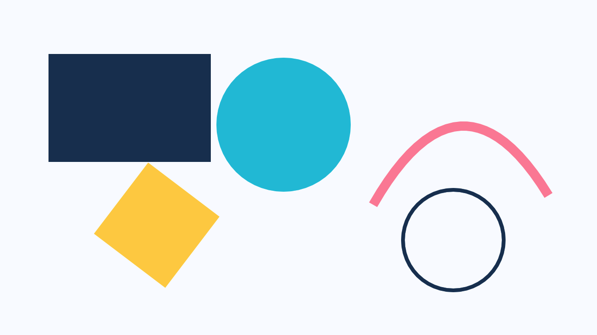

# Canvas drawing

> **In this chapter, you will:**
> - Draw shapes, paths, text, and images on a GPU-accelerated 2D canvas
> - Use gradients, transforms, clipping, and shadows
> - Drive redraws from reactive signals instead of rebuilding the view
> - Build a custom visualization like a clock face

`Canvas` is WaterUI's 2D vector drawing view, powered by [Vello](https://github.com/linebender/vello). You hand it a closure that receives a `DrawingContext`; WaterUI runs the closure to build a Vello scene, and that scene renders on the GPU through wgpu.

`waterui-canvas` is a separate crate that the top-level `waterui` facade does not re-export, so add it explicitly:

```toml
[dependencies]
waterui-canvas = "0.1"
```

Every snippet below is marked `rust,ignore` because the book's example crate does not pull that dependency in.



*A WaterUI Canvas preview showing vector drawing primitives. [Example source](https://github.com/water-rs/book/tree/main/examples/book-visuals).*

```rust,ignore
use waterui::prelude::*;
use waterui::graphics::color::Srgb;
use waterui::layout::{Rect, Size};
use waterui_canvas::{Canvas, DrawingContext};

fn my_canvas() -> impl View {
    Canvas::new(|ctx: &mut DrawingContext| {
        ctx.set_fill_style(Srgb::new(0.2, 0.5, 1.0));
        ctx.fill_rect(Rect::from_size(Size::new(200.0, 100.0)));
    })
}
```

`Canvas::new` takes any `FnMut(&mut DrawingContext) + 'static`. The view stretches to fill its parent on both axes; use `.size(w, h)` (from `ViewExt`) to give it a fixed footprint.

## Drawing context

`DrawingContext` carries the current surface dimensions as public fields and exposes every drawing method.

```rust,ignore
Canvas::new(|ctx: &mut DrawingContext| {
    let width = ctx.width;      // f32
    let height = ctx.height;    // f32
    let center = ctx.center();  // Point
    let size = ctx.size();      // Size
})
```

Most setters and geometry arguments accept signals, not just plain values: `fill_rect` takes `impl IntoSignal<Rect>`, `set_line_width` takes `impl IntoSignalF32`, and so on. Passing a `Binding` registers it, which is what makes the reactive redraws in the last section work.

## Shapes

Set a fill or stroke style, then call the matching draw method.

```rust,ignore
Canvas::new(|ctx: &mut DrawingContext| {
    let rect = Rect::new(Point::new(10.0, 10.0), Size::new(200.0, 100.0));

    ctx.set_fill_style(Srgb::new(0.2, 0.6, 1.0));
    ctx.fill_rect(rect);

    ctx.set_stroke_style(Srgb::new(1.0, 0.0, 0.0));
    ctx.set_line_width(3.0);
    ctx.stroke_rect(rect);

    // Clear a region back to transparent
    ctx.clear_rect(Rect::new(Point::new(50.0, 30.0), Size::new(40.0, 40.0)));

    ctx.set_fill_style(Srgb::new_u8(242, 140, 168));
    ctx.fill_circle(Point::new(300.0, 60.0), 50.0);
    ctx.stroke_circle(Point::new(300.0, 60.0), 50.0);

    ctx.stroke_line(Point::new(10.0, 150.0), Point::new(200.0, 190.0));
})
```

## Paths

`ctx.begin_path()` returns a `Path` builder that mirrors the HTML5 Canvas path API.

```rust,ignore
Canvas::new(|ctx: &mut DrawingContext| {
    let mut path = ctx.begin_path();
    path.move_to(Point::new(100.0, 10.0));
    path.line_to(Point::new(190.0, 170.0));
    path.line_to(Point::new(10.0, 170.0));
    path.close();

    ctx.set_fill_style(Srgb::new(0.0, 0.8, 0.4));
    ctx.fill_path(&path);
})
```

`quadratic_to(control, end)` and `bezier_to(control1, control2, end)` add curves:

```rust,ignore
let mut path = ctx.begin_path();
path.move_to(Point::new(10.0, 100.0));
path.quadratic_to(Point::new(100.0, 10.0), Point::new(200.0, 100.0));
path.bezier_to(
    Point::new(250.0, 10.0),
    Point::new(350.0, 190.0),
    Point::new(400.0, 100.0),
);

ctx.set_stroke_style(Srgb::new(1.0, 0.5, 0.0));
ctx.stroke_path(&path);
```

Arcs and ellipses take a center, radius (or radii), start and end angles in radians, and a direction flag. `Path::arc_to(p1, p2, radius)` is the equivalent of the HTML5 `arcTo()`, and `Path::rect(rect)` appends a closed rectangle.

```rust,ignore
let mut path = ctx.begin_path();

// center, radius, start_angle, end_angle, anticlockwise
path.arc(Point::new(100.0, 100.0), 50.0, 0.0, core::f32::consts::PI, false);

// center, radii, rotation, start_angle, end_angle, anticlockwise
path.ellipse(
    Point::new(250.0, 100.0),
    Size::new(80.0, 40.0),
    0.3,
    0.0,
    core::f32::consts::TAU,
    false,
);

ctx.set_stroke_style(Srgb::new(0.8, 0.2, 0.8));
ctx.stroke_path(&path);
```

`ctx.set_fill_rule(FillRule::EvenOdd)` switches self-intersecting paths from the default `NonZero` winding rule to even-odd.

## Gradients

`DrawingContext` builds three gradient types. Each returns a builder; add stops, then pass it to `set_fill_style` (or `set_stroke_style`).

```rust,ignore
Canvas::new(|ctx: &mut DrawingContext| {
    // (x0, y0, x1, y1)
    let mut linear = ctx.create_linear_gradient(0.0, 0.0, 200.0, 200.0);
    linear.add_color_stop(0.0, Srgb::new(1.0, 0.0, 0.0));
    linear.add_color_stop(1.0, Srgb::new(0.0, 0.0, 1.0));
    ctx.set_fill_style(linear);
    ctx.fill_rect(Rect::from_size(Size::new(200.0, 200.0)));

    // Interpolates between two circles: (x0, y0, r0, x1, y1, r1)
    let mut radial = ctx.create_radial_gradient(300.0, 100.0, 10.0, 300.0, 100.0, 80.0);
    radial.add_color_stop(0.0, Srgb::new(1.0, 1.0, 1.0));
    radial.add_color_stop(1.0, Srgb::new(0.0, 0.0, 0.4));
    ctx.set_fill_style(radial);
    ctx.fill_circle(Point::new(300.0, 100.0), 80.0);

    // (start_angle, center_x, center_y)
    let mut conic = ctx.create_conic_gradient(0.0, 500.0, 100.0);
    conic.add_color_stop(0.0, Srgb::new(1.0, 0.0, 0.0));
    conic.add_color_stop(0.5, Srgb::new(0.0, 1.0, 0.0));
    conic.add_color_stop(1.0, Srgb::new(1.0, 0.0, 0.0));
    ctx.set_fill_style(conic);
    ctx.fill_circle(Point::new(500.0, 100.0), 80.0);
})
```

## Images

`CanvasImage` decodes PNG, JPEG, AVIF, and TIFF, or wraps raw RGBA pixels.

```rust,ignore
use waterui_canvas::CanvasImage;

let image = CanvasImage::from_bytes(include_bytes!("assets/photo.png"))
    .expect("photo.png is a valid image");

// or from raw pixels
let image = CanvasImage::from_rgba_pixels(width, height, &pixel_data)?;

let (w, h) = (image.width(), image.height()); // image.size() returns a Size
```

Build the `CanvasImage` once outside the closure and move it in; decoding inside the draw callback stalls the render thread.

```rust,ignore
Canvas::new(move |ctx: &mut DrawingContext| {
    ctx.draw_image(&image, Point::new(10.0, 10.0));

    // scaled into a destination rectangle
    ctx.draw_image_scaled(&image, Rect::new(Point::zero(), Size::new(300.0, 200.0)));

    // sub-region, for sprite sheets
    ctx.draw_image_sub(
        &image,
        Rect::new(Point::zero(), Size::new(32.0, 32.0)),
        Rect::new(Point::new(50.0, 50.0), Size::new(64.0, 64.0)),
    );
})
```

## Transforms

The context keeps a transform stack. Everything drawn after a transform is affected until you `restore()`.

```rust,ignore
Canvas::new(|ctx: &mut DrawingContext| {
    ctx.save();
    ctx.translate(ctx.width / 2.0, ctx.height / 2.0);
    ctx.rotate(core::f32::consts::FRAC_PI_4);
    ctx.scale(2.0, 2.0);

    ctx.set_fill_style(Srgb::new(0.4, 0.8, 0.2));
    ctx.fill_rect(Rect::new(Point::new(-25.0, -25.0), Size::new(50.0, 50.0)));

    ctx.restore();
})
```

| Method | Description |
|--------|-------------|
| `translate(x, y)` | Shift the origin |
| `rotate(radians)` | Rotate clockwise |
| `scale(x, y)` | Scale both axes independently |
| `transform(affine)` | Concatenate an arbitrary `Affine2` |
| `set_transform(affine)` | Replace the current transform |
| `reset_transform()` | Reset to identity |

`save()`/`restore()` clone the drawing state, so wrapping a transform-heavy section is cheaper and safer than undoing each setting by hand.

## Strokes

```rust,ignore
ctx.set_line_width(4.0);
ctx.set_line_cap(LineCap::Round);   // Butt, Round, Square
ctx.set_line_join(LineJoin::Round); // Miter, Round, Bevel
ctx.set_miter_limit(10.0);
ctx.set_line_dash(vec![10.0, 5.0, 2.0, 5.0]);
ctx.set_line_dash_offset(3.0);
```

## Clipping, layers, and shadows

Clip and alpha layers are pushed onto a stack and popped with `pop_layer()`.

```rust,ignore
Canvas::new(|ctx: &mut DrawingContext| {
    ctx.push_clip_rect(Rect::new(Point::new(20.0, 20.0), Size::new(160.0, 160.0)));
    ctx.set_fill_style(Srgb::new(1.0, 0.0, 0.0));
    ctx.fill_circle(Point::new(100.0, 100.0), 120.0); // clipped to the rectangle
    ctx.pop_layer();

    ctx.push_alpha_rect(0.5, Rect::from_size(ctx.size()));
    ctx.set_fill_style(Srgb::new(0.0, 0.0, 1.0));
    ctx.fill_rect(Rect::from_size(ctx.size()));
    ctx.pop_layer();
})
```

`push_clip_path` and `push_alpha_path` take an arbitrary `Path` instead of a rectangle.

Shadows are drawing state, not a layer:

```rust,ignore
ctx.set_shadow_color(Srgb::new(0.0, 0.0, 0.0));
ctx.set_shadow_blur(10.0);
ctx.set_shadow_offset(4.0, 4.0);
```

`ctx.set_global_alpha(0.5)` applies an opacity multiplier to everything drawn afterwards.

## Text

`DrawingContext` lays text out with [Parley](https://github.com/linebender/parley) and rasterizes the glyphs through Vello. For body content and anything that needs localization, use the `text()` / `text!` views instead — canvas text is for chart labels, annotations, and freeform graphics.

```rust,ignore
use waterui_canvas::{FontSpec, FontWeight, TextMetrics};

Canvas::new(|ctx: &mut DrawingContext| {
    ctx.set_font(FontSpec::new("Arial", 24.0).with_weight(FontWeight::Bold));

    let metrics: TextMetrics = ctx.measure_text("Hello World");

    ctx.set_fill_style(Srgb::new(1.0, 1.0, 1.0));
    ctx.fill_text("Hello World", Point::new(50.0, 50.0));
    ctx.stroke_text("Hello World", Point::new(50.0, 100.0));
})
```

`draw_text_in_rect(text, rect)` width-constrains the layout and clips the overflow.

## Reactive redraws

`Canvas` does not repaint every frame. It repaints when the surface resizes or when a signal it tracked during the last pass changes. `Canvas::with_signal` is the direct way to say what to track: it hands the current value to your closure and keeps the `Canvas` view itself alive across updates.

```rust,ignore
use waterui::prelude::*;
use waterui::graphics::color::Srgb;
use waterui::layout::Point;
use waterui_canvas::{Canvas, DrawingContext};

fn pulsing_dot(angle: Binding<f32>) -> impl View {
    Canvas::with_signal(angle, |ctx: &mut DrawingContext, angle: f32| {
        let r = 20.0 + 10.0 * angle.sin();
        ctx.set_fill_style(Srgb::new(0.4, 0.8, 1.0));
        ctx.fill_circle(ctx.center(), r);
    })
}
```

Inside a plain `Canvas::new`, any signal you pass to a setter is tracked the same way. Pass bindings directly; never call `.get()` to feed one in.

For an animation that no signal drives, call `ctx.request_next_frame()` to schedule exactly one more redraw after the current one.

## Performance notes

- The closure runs on every tracked-signal change and on every resize. Keep its cost proportional to what actually changed.
- Build `CanvasImage` handles once and reuse them.
- `save()`/`restore()` is cheap; hand-unwinding state is what gets expensive and wrong.

## A clock face

Hour markers radiating from the center, with the second hand driven by a `Binding<f32>` so only the canvas repaints:

```rust,ignore
use core::f32::consts::{FRAC_PI_2, TAU};

fn clock(seconds: Binding<f32>) -> impl View {
    Canvas::with_signal(seconds, |ctx: &mut DrawingContext, seconds: f32| {
        let center = ctx.center();
        let radius = ctx.width.min(ctx.height) / 2.0 - 20.0;

        ctx.set_fill_style(Srgb::new(0.1, 0.1, 0.15));
        ctx.fill_circle(center, radius);
        ctx.set_stroke_style(Srgb::new(0.8, 0.8, 0.8));
        ctx.set_line_width(2.0);
        ctx.stroke_circle(center, radius);

        for i in 0..12 {
            let angle = (i as f32) * TAU / 12.0 - FRAC_PI_2;
            let (cos, sin) = (angle.cos(), angle.sin());
            ctx.stroke_line(
                Point::new(center.x + radius * 0.85 * cos, center.y + radius * 0.85 * sin),
                Point::new(center.x + radius * 0.95 * cos, center.y + radius * 0.95 * sin),
            );
        }

        let hand = seconds / 60.0 * TAU - FRAC_PI_2;
        ctx.set_stroke_style(Srgb::new(1.0, 0.3, 0.3));
        ctx.stroke_line(
            center,
            Point::new(
                center.x + radius * 0.8 * hand.cos(),
                center.y + radius * 0.8 * hand.sin(),
            ),
        );
    })
}
```

## Next

Canvas covers most 2D drawing needs. When you want full wgpu access — custom render pipelines, compute shaders, instanced draws — continue to [GPU rendering with GpuSurface](02-gpu-surface.md).
