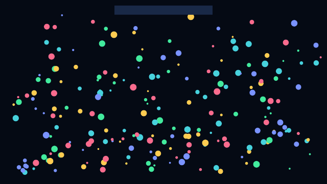

# Particle Systems

> **In this chapter, you will:**
> - Build GPU-accelerated particle effects with the `ParticleSystem` view
> - Configure emitters, motion, collisions, and blend modes from a single chain
> - Use built-in shapes for fireworks, rain, snow, and ambient effects
> - Apply collision and particle-particle interaction without writing shaders
> - Render particle systems offscreen for visual testing

Picture confetti bursting across the screen when a user completes a purchase, or snowflakes drifting gently behind a winter-themed card. Particle effects bring delight and motion to an app -- and with WaterUI's `ParticleSystem` view, you describe the effect declaratively and the GPU does the rest.

> **Feature flag:** Particles live behind the `particle` feature on `waterui`. Enable it in `Cargo.toml` (`waterui = { version = "...", features = ["particle"] }`) before importing `waterui::particle`.

## Quick Start

```rust,ignore
use waterui::prelude::*;
use waterui::particle::ParticleSystem;
use core::f32::consts::PI;

fn rain() -> impl View {
    ParticleSystem::new(5_000)
        .emit_from_rect(1.5, 0.0)
        .at(0.5, -0.05)
        .rate(800.0)
        .life(0.8..1.3)
        .speed(1.8..2.2)
        .angle(PI * 0.49..PI * 0.51)
        .size(0.002..0.004)
        .color(
            Color::srgb(255, 255, 255).with_opacity(0.5),
            Color::transparent(),
        )
        .stretch_with_velocity()
        .gravity(0.0, 2.5)
}
```

`ParticleSystem` is itself a `View`, so it composes with `vstack`, `zstack`, frames, and any other layout primitive in the framework.



*A WaterUI preview image illustrating a confetti particle emitter. [Example source](https://github.com/water-rs/book/tree/main/examples/book-visuals).*

## How It Works

`ParticleSystem` builds an internal `ParticleConfig` through a flat modifier chain. When the view is rendered, it materializes a GPU surface that:

1. Allocates a particle storage buffer sized to `max_particles`.
2. Runs a compute shader each frame to emit, advance, and recycle particles.
3. Renders all live particles in a single instanced draw call.
4. Returns `needs_redraw() = true` while at least one particle is alive.

Coordinates are normalized: `[0.0, 0.0]` is the top-left of the system's frame and `[1.0, 1.0]` is the bottom-right. Sizes, gravity, and emitter offsets all use the same normalized space, which means an effect looks identical at any output resolution.

## Configuring the Emitter

The emitter controls *where* particles spawn and *how often*.

| Modifier | Description |
|---|---|
| `at(x, y)` | Position the emitter (normalized coordinates) |
| `rate(per_second)` | Particles per second |
| `emit_from_point()` | Spawn from a single point (default) |
| `emit_from_rect(width, height)` | Spawn anywhere inside a rectangle |
| `emit_from_circle(radius)` | Spawn anywhere inside a disk |

```rust,ignore
use waterui::particle::ParticleSystem;

ParticleSystem::new(2_000)
    .emit_from_circle(0.05)
    .at(0.5, 0.5)
    .rate(400.0);
```

## Particle Properties

Each particle is randomized within the ranges you provide.

| Modifier | Description |
|---|---|
| `life(range)` | Lifetime in seconds |
| `speed(range)` | Initial speed magnitude |
| `angle(range)` | Initial direction in radians |
| `size(range)` | Particle size in normalized units |
| `spin(range)` | Rotation speed in radians/second |
| `color(start, end)` | Tint at birth and at death |
| `softness(value)` | Edge softness (`0.0` hard, `1.0` soft) |
| `shape(ParticleShape)` | `Circle` or `Rect` SDF sprite |
| `stretch_with_velocity()` | Stretch the sprite along its velocity vector |

```rust,ignore
use waterui::particle::{ParticleShape, ParticleSystem};
use core::f32::consts::TAU;

ParticleSystem::new(1_500)
    .emit_from_point()
    .at(0.5, 0.8)
    .rate(120.0)
    .life(0.6..1.4)
    .speed(0.4..0.9)
    .angle(0.0..TAU)
    .size(0.01..0.03)
    .shape(ParticleShape::Circle)
    .softness(0.6);
```

## Environment Forces

Once particles spawn, world-space forces shape their motion.

| Modifier | Description |
|---|---|
| `gravity(x, y)` | Constant acceleration vector |
| `wind(x, y)` | Constant velocity offset |
| `turbulence(value)` | Perlin-style noise jitter |
| `drag(factor)` | Velocity damping per 60 fps frame (`1.0` = no damping) |

```rust,ignore
ParticleSystem::new(3_000)
    .emit_from_rect(1.0, 0.05)
    .at(0.5, 0.0)
    .rate(900.0)
    .life(1.0..2.0)
    .speed(0.0..0.2)
    .gravity(0.0, 0.4)
    .wind(0.05, 0.0)
    .turbulence(0.6)
    .drag(0.98);
```

## Blending and Compositing

Use `additive()` for fire, sparks, and glow effects where overlapping particles should brighten:

```rust,ignore
use waterui::particle::ParticleSystem;
use core::f32::consts::PI;

fn embers() -> impl View {
    ParticleSystem::new(2_000)
        .emit_from_point()
        .at(0.5, 0.95)
        .rate(300.0)
        .life(0.7..1.4)
        .speed(0.4..0.8)
        .angle(-PI * 0.6..-PI * 0.4)
        .size(0.005..0.012)
        .color(
            Color::srgb(255, 196, 96),
            Color::srgb(255, 64, 16).with_opacity(0.0),
        )
        .gravity(0.0, -0.4)
        .additive()
}
```

The default is `BlendMode::Alpha` (standard premultiplied alpha blending).

## Collisions and Interaction

`ParticleSystem` includes a pure-GPU broadphase for both static obstacles and particle-particle forces.

| Modifier | Description |
|---|---|
| `collide_with_viewport()` | Bounce off the normalized `[0,0]..[1,1]` rectangle |
| `collide_with_rect(x, y, w, h)` | Bounce off an arbitrary axis-aligned rectangle |
| `collide_with_circle_obstacle(x, y, radius)` | Bounce off a static disk |
| `bounce(restitution)` | Fraction of normal velocity preserved on impact |
| `surface_friction(value)` | Fraction of tangential velocity preserved on impact |
| `collide_with_particles(radius, strength)` | Soft particle-particle repulsion within `radius` |

```rust,ignore
ParticleSystem::new(1_200)
    .emit_from_circle(0.05)
    .at(0.5, 0.2)
    .rate(180.0)
    .life(2.0..3.0)
    .speed(0.4..0.7)
    .gravity(0.0, 0.6)
    .collide_with_viewport()
    .collide_with_circle_obstacle(0.5, 0.7, 0.12)
    .bounce(0.6)
    .surface_friction(0.85);
```

## Using a Particle System as a View

Because `ParticleSystem` implements `View`, you can place it anywhere -- as a full-screen background, layered behind UI, or inside a card:

```rust,ignore
fn celebration_card() -> impl View {
    zstack((
        ParticleSystem::new(2_000)
            .emit_from_rect(1.0, 0.0)
            .at(0.5, -0.05)
            .rate(400.0)
            .life(1.4..2.4)
            .speed(0.3..0.6)
            .size(0.005..0.012)
            .gravity(0.0, 0.6),
        vstack((
            text("Order placed"),
            text("Thanks for shopping with us."),
        ))
        .padding(),
    ))
}
```

`ParticleSystem` stretches in both axes by default (it inherits `GpuSurface`'s layout behavior). Use `.size(width, height)` if you need a fixed size.

## Offscreen Testing

Use the offscreen render APIs to render a fixed number of frames without a window. This is ideal for visual regression tests:

```rust,ignore
use core::num::NonZeroU32;
use waterui::graphics::{OffscreenRenderConfig, OffscreenSize};
use waterui::particle::ParticleSystem;

#[test]
fn fireworks_renders() {
    let mut env = waterui::Environment::new();
    let size = OffscreenSize::try_from_pixels(512, 512).unwrap();
    let config = OffscreenRenderConfig::new(size);

    let output = ParticleSystem::new(1_000)
        .emit_from_point()
        .at(0.5, 0.5)
        .rate(2_000.0)
        .life(0.4..1.0)
        .render_offscreen_frames(config, &mut env, NonZeroU32::new(8).unwrap())
        .expect("offscreen render should succeed");

    output.save_png("fireworks.png").unwrap();
}
```

## Performance Tips

- **Pre-size the buffer**: `ParticleSystem::new(max_particles)` allocates once. Pick a value that fits your peak particle count.
- **Watch the rate**: emission `rate * average_life` should not exceed `max_particles`, or new particles will be dropped.
- **Use additive blending** for fire and glow to keep alpha sorting cheap.
- **Disable particle-particle interaction** when you do not need it -- the neighbor grid pass adds work proportional to particle count.

## What's Next

You have particles flying across the screen. The final chapter in this section, [Animated Gradients](06-gradients.md), shows you how to build flowing, animated gradient backgrounds -- from simple linear fills to self-animating mesh gradients that run entirely on the GPU.
