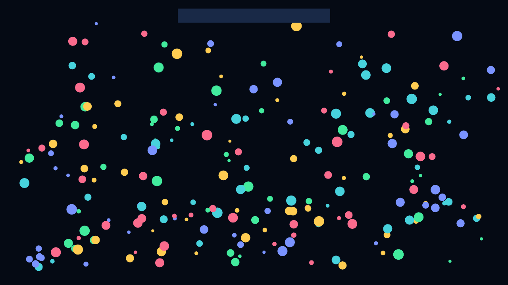

# Particle systems

> **In this chapter, you will:**
> - Describe a GPU particle effect as a single builder chain
> - Aim emitters, motion, and collisions in normalized coordinates
> - Drive live parameters from bindings so an effect follows app state
> - Render frames offscreen for visual review

No platform ships a particle primitive, so `ParticleSystem` is one of WaterUI's self-drawn components: a compute shader simulates every particle and one instanced draw call renders them, the same way on every backend.

> **Feature flag:** particles live behind the `particle` feature. Add `waterui = { version = "...", features = ["particle"] }` to `Cargo.toml` — the `waterui::particle` module does not exist without it.

## Quick start

```rust,ignore
use waterui::prelude::*;
use waterui::particle::ParticleSystem;
use core::f32::consts::PI;

fn rain() -> impl View {
    ParticleSystem::new(8_000)
        .emit_from_rect(1.4, 0.08)
        .at(0.5, -0.04)
        .rate(480_000.0)
        .life(0.6, 0.8)
        .speed(2.4, 4.2)
        .angle(PI * 0.49, PI * 0.51)
        .size(0.0008, 0.0015)
        .color(
            Color::srgb_hex("#D5E8FF").with_opacity(0.45),
            Color::srgb_hex("#E8F5FF").with_opacity(0.0),
        )
        .gravity(0.0, 5.0)
        .stretch_with_velocity()
}
```

Ranges take two arguments, not a Rust range: `life(0.6, 0.8)` means "somewhere between 0.6 and 0.8 seconds", drawn per particle when it spawns. `particles(8_000)` is the free-function equivalent of `ParticleSystem::new(8_000)`.



*A confetti emitter rendered by WaterUI's preview pipeline. [Example source](https://github.com/water-rs/book/tree/main/examples/book-visuals).*

## Coordinates and units

Every spatial value is normalized to the system's own frame: `[0.0, 0.0]` is the top-left corner and `[1.0, 1.0]` the bottom-right. Positions, particle sizes, emitter extents, gravity, and collider bounds all share that space, so one configuration looks the same at any output resolution. Emitting slightly outside the frame (`at(0.5, -0.04)`) is how you get particles that drift in from off-screen.

Angles are radians from the +x axis with y pointing **down**: `0.0` aims right, `PI * 0.5` down, `PI` left, `PI * 1.5` up. Durations are seconds.

## The emitter

| Modifier | Meaning |
|---|---|
| `at(x, y)` | Emitter center |
| `rate(per_second)` | Emission rate (see below) |
| `emit_from_point()` | Spawn from a single point (default) |
| `emit_from_rect(width, height)` | Spawn anywhere inside a rectangle |
| `emit_from_circle(radius)` | Spawn anywhere inside a disk |

`ParticleSystem::new(max_particles)` allocates a fixed pool of slots once, and particles only ever recycle dead slots. Each frame, every free slot independently has a `rate * dt / max_particles` chance of respawning, so emission throttles itself as the pool fills: with the pool empty the system emits about `rate` particles per second, and at 90% occupancy roughly a tenth of that. Saturated effects therefore ask for far more than `max_particles / average_life` — the rain above requests 480,000/s from an 8,000-slot pool purely to keep it full. Tune `rate` by eye against the pool size rather than treating it as an exact count.

## Particle properties

| Modifier | Meaning |
|---|---|
| `life(min, max)` | Lifetime in seconds |
| `speed(min, max)` | Initial speed magnitude |
| `angle(min, max)` | Initial direction in radians |
| `size(min, max)` | Sprite size in normalized units |
| `spin(min, max)` | Rotation speed in radians per second |
| `color(start, end)` | Tint at birth and at death |
| `softness(value)` | Edge falloff, `0.0` hard to `1.0` soft |
| `shape(ParticleShape)` | `Circle` (default) or `Rect` SDF sprite |
| `stretch_with_velocity()` | Stretch the sprite along its velocity vector |

```rust,ignore
use waterui::prelude::*;
use waterui::particle::{ParticleShape, ParticleSystem};
use core::f32::consts::{PI, TAU};

fn confetti() -> impl View {
    ParticleSystem::new(20_000)
        .emit_from_circle(0.05)
        .at(0.5, 0.5)
        .rate(1_200_000.0)
        .life(0.8, 1.5)
        .speed(0.5, 3.0)
        .angle(0.0, TAU)
        .size(0.003, 0.008)
        .spin(-PI, PI)
        .shape(ParticleShape::Rect)
        .softness(0.0)
        .gravity(0.0, 3.0)
}
```

## Forces

`life`, `speed`, `angle`, `size`, and `spin` are fixed per particle at birth. Forces then act on every live particle each frame.

| Modifier | Meaning |
|---|---|
| `gravity(x, y)` | Constant acceleration |
| `wind(x, y)` | Constant acceleration added alongside gravity |
| `turbulence(value)` | Random horizontal jitter |
| `drag(factor)` | Velocity retained per 60 fps frame (`1.0` = none) |

```rust,ignore
ParticleSystem::new(2_000)
    .emit_from_rect(1.5, 0.2)
    .at(0.5, 1.1)
    .rate(40_000.0)
    .life(8.0, 12.0)
    .speed(0.02, 0.08)
    .gravity(0.0, -0.01)
    .wind(0.02, 0.0)
    .turbulence(0.2)
    .drag(0.98);
```

## Blending

`additive()` makes overlapping particles brighten each other, which is what fire, sparks, and glow need. The default is `BlendMode::Alpha`.

```rust,ignore
use waterui::prelude::*;
use waterui::particle::ParticleSystem;
use core::f32::consts::PI;

fn flame() -> impl View {
    ParticleSystem::new(3_000)
        .emit_from_rect(0.05, 0.0)
        .at(0.5, 0.82)
        .rate(180_000.0)
        .life(0.4, 0.8)
        .speed(0.5, 1.2)
        .angle(PI * 1.4, PI * 1.6)
        .size(0.03, 0.06)
        .color(
            Color::srgb_hex("#FFB433").with_opacity(0.6),
            Color::srgb_hex("#FF2A0D").with_opacity(0.0),
        )
        .gravity(0.0, -1.0)
        .softness(0.6)
        .additive()
}
```

## Collisions and interaction

| Modifier | Meaning |
|---|---|
| `collide_with_viewport()` | Bounce inside the normalized `[0,0]..[1,1]` rectangle |
| `collide_with_rect(x, y, width, height)` | Bounce inside an arbitrary rectangle |
| `collide_with_circle_obstacle(x, y, radius)` | Bounce off a static disk |
| `bounce(restitution)` | Normal velocity retained on impact |
| `surface_friction(value)` | Tangential velocity retained on impact |
| `collide_with_particles(radius, strength)` | Soft particle-to-particle repulsion |

```rust,ignore
ParticleSystem::new(6_000)
    .emit_from_circle(0.02)
    .at(0.5, 0.18)
    .rate(90_000.0)
    .life(4.0, 6.0)
    .speed(0.5, 1.4)
    .gravity(0.0, 1.4)
    .collide_with_rect(0.08, 0.08, 0.84, 0.84)
    .collide_with_circle_obstacle(0.5, 0.36, 0.08)
    .bounce(0.82)
    .surface_friction(0.9)
    .collide_with_particles(0.01, 16.0);
```

Bounds and obstacles are the last thing applied to a particle's new position each frame, so a fast particle can still tunnel through a thin collider — keep obstacles chunky relative to `speed * dt`. `collide_with_particles` adds a neighbor-grid build and lookup pass over the whole pool, so leave it off unless the clumping is visible.

## Live parameters

Every builder argument is a signal. Literals become constants; a `Binding` or `Computed` stays live. The renderer samples each signal once per frame and requests a redraw whenever one changes, so the surrounding view is never rebuilt and particles already in flight keep their trajectories.

```rust,ignore
use waterui::prelude::*;
use waterui::component::slider;
use waterui::particle::ParticleSystem;
use core::f32::consts::PI;

fn snowfall() -> impl View {
    let density = Binding::container(0.25_f64);
    let drift = Binding::container(0.0_f64);

    vstack((
        ParticleSystem::new(4_000)
            .emit_from_rect(1.4, 0.05)
            .at(0.5, -0.03)
            .rate(density.map(|value| value * 400_000.0))
            .life(4.0, 7.0)
            .speed(0.05, 0.12)
            .angle(PI * 0.45, PI * 0.55)
            .size(0.004, 0.01)
            .gravity(0.0, 0.05)
            .wind(drift.clone(), 0.0)
            .softness(0.8),
        slider("Snowfall density", &density),
        slider("Wind drift", &drift).range(-0.3..=0.3),
    ))
}
```

`density.map(...)` derives the emission rate without reading the binding, which is what keeps the dependency visible to the renderer. Numeric signals convert freely, so a `Binding<f64>` from a slider feeds an `f32` parameter directly.

Which parameters respond, and when:

- **Immediately, for all live particles:** `at`, `rate`, emitter shape, `gravity`, `wind`, `turbulence`, `drag`, collider bounds and obstacle positions, `bounce`, `surface_friction`, interaction `radius`/`strength`, `color`, `softness`.
- **At the next spawn only:** `life`, `speed`, `angle`, `size`, `spin` — particles already alive keep the values they were born with.
- **Fixed when the system is built:** `max_particles`, `shape`, `additive`, `stretch_with_velocity`, the *number* of circle obstacles, and whether collision or particle interaction is switched on at all. Changing one of these means constructing a new `ParticleSystem`.

Earlier versions accepted the same signals but sampled them once while the builder chain ran, so a bound parameter froze after the first frame. The builder signatures did not change — code written against them now animates.

## Placing a system in a layout

`ParticleSystem` is a `View` built on [`GpuSurface`](02-gpu-surface.md), so it stretches to fill whatever it is given and composes like any other view:

```rust,ignore
use waterui::prelude::*;
use waterui::particle::ParticleSystem;

fn celebration_card() -> impl View {
    zstack((
        ParticleSystem::new(2_000)
            .emit_from_rect(1.0, 0.0)
            .at(0.5, -0.05)
            .rate(120_000.0)
            .life(1.4, 2.4)
            .speed(0.3, 0.6)
            .size(0.005, 0.012)
            .gravity(0.0, 0.6),
        vstack((
            text("Order placed"),
            text("Thanks for shopping with us."),
        ))
        .padding(),
    ))
}
```

Because it takes the size it is offered, a parent that proposes nothing measures it as zero. Wrap it in a `Frame` to pin dimensions — `ParticleSystem::size` sets the particle sprite size range, not the view's bounds:

```rust,ignore
use waterui::layout::frame::Frame;

Frame::new(celebration_card()).width(320.0).height(180.0)
```

## Rendering offscreen

All four `render_offscreen*` methods are `async` and take a `&GpuRuntime`. Create the runtime once — it owns the GPU device and queue — and reuse it across renders.

```rust,ignore
use core::f32::consts::TAU;
use core::num::NonZeroU32;
use waterui::Environment;
use waterui::graphics::{GpuRuntime, OffscreenRenderConfig, OffscreenSize};
use waterui::particle::ParticleSystem;

async fn export_burst(path: &str) {
    let runtime = GpuRuntime::new().await.expect("GPU runtime should initialize");
    let size = OffscreenSize::try_from_pixels(600, 600).expect("size must be non-zero");
    let frames = NonZeroU32::new(8).expect("frame count must be non-zero");
    let mut env = Environment::new();

    let output = ParticleSystem::new(20_000)
        .emit_from_circle(0.05)
        .at(0.5, 0.5)
        .rate(1_200_000.0)
        .life(0.8, 1.5)
        .speed(0.5, 3.0)
        .angle(0.0, TAU)
        .size(0.003, 0.008)
        .render_offscreen_frames(&runtime, OffscreenRenderConfig::new(size), &mut env, frames)
        .await
        .expect("offscreen render should succeed");

    output.save_png(path).expect("png write should succeed");
}
```

Offscreen frames advance at a fixed 1/60 s step, so `frames` maps directly to simulated time — 8 frames is roughly 133 ms in. One frame shows almost nothing, because a pool that starts empty needs several frames to fill. `render_offscreen_hdr` and `render_offscreen_hdr_frames` read back 16-bit float pixels for additive effects that clip in 8-bit; they reject any `OffscreenRenderConfig` whose `format` is not `Rgba16Float`, so set it with `OffscreenRenderConfig::format` before calling them.

Emission is seeded randomly each frame, so two runs of the same configuration produce visibly similar but not identical images. Review these snapshots by eye rather than comparing hashes.

## Next

[Animated gradients](06-gradients.md) covers the other end of the GPU component range: full-surface color fields that animate without any per-element simulation.
