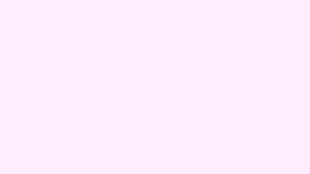

# Animated gradients

> **In this chapter, you will:**
> - Tell the two gradient layers apart and know which one is a `View`
> - Draw linear, radial, angular, and mesh gradients on the GPU
> - Drive mesh gradient colors from a reactive signal
> - Drop in the self-animating `AnimatedMeshGradient` and `FlowingGradient`

WaterUI ships two gradient layers with overlapping names, and picking the wrong one is the most common way to get stuck.

- **`waterui::gradient`** holds semantic gradient *descriptions*: `LinearGradient`, `RadialGradient`, `AngularGradient`, `MeshGradient`, `ColorStop`, `MeshVertex`, `UnitPoint`. They carry reactive `Computed<Color>` stops, and the unified `Gradient` enum wraps any of them. At the pinned revision **none of these types implement `View`**, so they cannot be handed to `.background(...)` or placed in a stack.
- **`waterui::graphics`** holds the GPU views: `Gradient` (backed by `GradientConfig`), the reactive `MeshGradient<C>`, and the two self-animating views. These are what you put in the view tree.

The prelude re-exports the *descriptive* `Gradient` and `MeshGradient`, so import the GPU ones explicitly — the explicit `use` shadows the glob:

```rust,ignore
use waterui::prelude::*;
use waterui::graphics::Gradient; // shadows the prelude's gradient::Gradient enum
```



*A mesh gradient rendered with waterui::graphics::Gradient. [Example source](https://github.com/water-rs/book/tree/main/examples/book-visuals).*

## The Gradient view

`waterui::graphics::Gradient` takes `Vec<(f32, ResolvedColor)>` color stops. Linear, radial, and angular variants resolve to backend-native gradient rendering; mesh variants go through a dedicated GPU shader.

`ResolvedColor` stores *linear* components, so build stops with `ResolvedColor::from_srgb(...)` rather than writing struct literals — the literal path skips gamma correction and gives you colors you did not intend.

```rust,ignore
use waterui::prelude::*;
use waterui::graphics::Gradient;
use waterui::graphics::color::{ResolvedColor, Srgb};

fn linear_bg() -> impl View {
    Gradient::linear(
        vec![
            (0.0, ResolvedColor::from_srgb(Srgb::new_u8(255, 0, 128))),
            (1.0, ResolvedColor::from_srgb(Srgb::new_u8(0, 76, 255))),
        ],
        [0.5, 0.0], // start point, normalized to the view bounds
        [0.5, 1.0], // end point
    )
}
```

Radial takes a center plus a start and end radius:

```rust,ignore
fn radial_bg() -> impl View {
    Gradient::radial(
        vec![
            (0.0, ResolvedColor::from_srgb(Srgb::new(1.0, 1.0, 1.0))),
            (1.0, ResolvedColor::from_srgb(Srgb::new(0.0, 0.0, 0.2))),
        ],
        [0.5, 0.5], // center
        0.0,        // start radius
        0.7,        // end radius
    )
}
```

Angular (conic) takes a center plus a start and end angle in radians:

```rust,ignore
use core::f32::consts::TAU;

fn conic_bg() -> impl View {
    Gradient::angular(
        vec![
            (0.0,  ResolvedColor::from_srgb(Srgb::new(1.0, 0.0, 0.0))),
            (0.33, ResolvedColor::from_srgb(Srgb::new(0.0, 1.0, 0.0))),
            (0.66, ResolvedColor::from_srgb(Srgb::new(0.0, 0.0, 1.0))),
            (1.0,  ResolvedColor::from_srgb(Srgb::new(1.0, 0.0, 0.0))),
        ],
        [0.5, 0.5],
        0.0,
        TAU,
    )
}
```

A gradient stretches to fill its parent, so `zstack` it under your content or constrain it with `.size(w, h)`.

### Mesh gradients

A mesh gradient interpolates across a vertex grid. Supply exactly `width * height` vertices in row-major order — `Gradient::mesh` asserts on any other count rather than silently rendering garbage.

```rust,ignore
fn mesh_bg() -> impl View {
    let red    = ResolvedColor::from_srgb(Srgb::new(1.0, 0.0, 0.0));
    let blue   = ResolvedColor::from_srgb(Srgb::new(0.0, 0.0, 1.0));
    let green  = ResolvedColor::from_srgb(Srgb::new(0.0, 1.0, 0.0));
    let yellow = ResolvedColor::from_srgb(Srgb::new(1.0, 1.0, 0.0));

    Gradient::mesh(
        2, 2,
        vec![
            ([0.0, 0.0], red),
            ([1.0, 0.0], blue),
            ([0.0, 1.0], green),
            ([1.0, 1.0], yellow),
        ],
        true, // smooth (cubic) color interpolation
    )
}
```

### Building the config directly

`Gradient::new(GradientConfig)` takes the whole configuration when you want to compute it rather than pick a named constructor. Every field is public and `GradientConfig` implements `Default`:

```rust,ignore
use waterui::graphics::{Gradient, GradientConfig, GradientType};

let config = GradientConfig {
    gradient_type: GradientType::Linear,
    stops: vec![(0.0, color_a), (0.5, color_b), (1.0, color_c)],
    start_point: [0.0, 0.0],
    end_point: [1.0, 1.0],
    ..GradientConfig::default()
};

let view = Gradient::new(config);
```

`GradientConfig::linear / radial / angular / mesh` mirror the `Gradient` constructors when you want the config without the view.

## Reactive mesh gradients

`waterui::graphics::MeshGradient<C>` accepts any signal whose output iterates `ResolvedColor` values — a `Binding<Vec<ResolvedColor>>` is the usual choice. Positions come from the grid dimensions, so you only supply colors, again in row-major order. The renderer compares the incoming colors with the previous frame's and skips the GPU upload when nothing changed.

```rust,ignore
use waterui::prelude::*;
use waterui::graphics::MeshGradient;
use waterui::graphics::color::ResolvedColor;

fn reactive_mesh(colors: Binding<Vec<ResolvedColor>>) -> impl View {
    MeshGradient::new(3, 3, colors).smooths_colors(true)
}
```

Updating the binding repaints the existing surface; the view is never rebuilt. `into_surface()` returns the underlying `GpuSurface` if you need to configure MSAA or the HDR preference.

## Self-animating gradients

Two views animate on their own, with no host-side ticking.

### AnimatedMeshGradient

A 4×4 color palette warped by GPU noise:

```rust,ignore
use waterui::graphics::AnimatedMeshGradient;

fn animated_background() -> impl View {
    AnimatedMeshGradient::default()
}
```

`AnimatedMeshGradientConfig` carries the speed, the warp amount, and the palette. Four palettes ship built in — `aqua_bloom`, `pastel_lagoon`, `soft_blush`, `deep_blue`:

```rust,ignore
use waterui::graphics::{AnimatedMeshGradient, AnimatedMeshGradientConfig};

fn bespoke_background() -> impl View {
    AnimatedMeshGradient::new(
        AnimatedMeshGradientConfig::aqua_bloom()
            .speed(0.8)
            .warp(0.3),
    )
}
```

`.palette([...])` takes your own `[ResolvedColor; ANIMATED_MESH_PALETTE_LEN]`, where that constant is 16 (a 4×4 grid). `.speed(...)` and `.warp(...)` both assert on negative values. `speed(0.0)` freezes the animation, which also stops the per-frame redraw request — the right move when the surface is offscreen or the app is backgrounded.

### FlowingGradient

A procedural fBm-noise shader producing a slow, ocean-like flow. It has no configuration at all:

```rust,ignore
use waterui::graphics::flowing_gradient::FlowingGradient;

fn ambient_bg() -> impl View {
    FlowingGradient::default()
}
```

## Composing with other views

```rust,ignore
use waterui::prelude::*;
use waterui::graphics::{AnimatedMeshGradient, AnimatedMeshGradientConfig};

fn welcome_card() -> impl View {
    zstack((
        AnimatedMeshGradient::default(),
        vstack((
            text("Welcome"),
            text("Gradient backgrounds"),
        ))
        .padding(),
    ))
}

fn banner() -> impl View {
    AnimatedMeshGradient::new(AnimatedMeshGradientConfig::deep_blue())
        .size(400.0, 200.0)
}
```

## Performance notes

- Linear, radial, and angular gradients resolve to native gradient primitives. Mesh and animated-mesh gradients each run a single full-screen quad through their own shader.
- `MeshGradient<C>` re-uploads its vertex colors only when they actually differ from the previous frame.
- `AnimatedMeshGradient` requests a redraw every frame while `speed > 0.0`, and `FlowingGradient` is built on `ShaderSurface`, which always animates. Neither one idles — do not leave one running behind an invisible screen.

## Next

That completes the graphics part. The gradient views here, the filters from [chapter 4](04-filters.md), and a `GpuSurface` of your own compose like any other view, so the next part puts them into complete screens.
