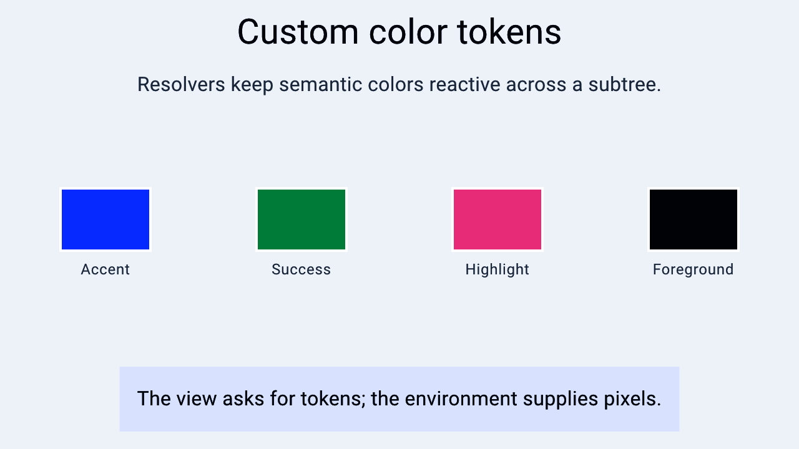

# Resolvers and hooks

> **In this chapter, you will:**
> - Understand how a design token like `theme_color::Accent` becomes a reactive signal
> - Implement `Resolvable` for your own token and install its signal
> - Erase and transform resolvables with `AnyResolvable<T>` and `Map`
> - Intercept a component before it renders with `Hook<C>`
> - Know when a signal still needs `Dynamic` — and when it does not

When you write `.foreground(theme_color::Accent)`, nothing in that expression holds a color. `Accent` is a *token*: a zero-sized value that knows how to find its color in the `Environment` and hand back a **signal**. When the system switches to dark mode the signal fires and the affected views update — no rebuild, no diff.



*A Hydrolysis preview of custom color tokens resolved through the environment. [Example source](https://github.com/water-rs/book/tree/main/examples/book-visuals).*

> **Crate note:** `Resolvable`, `AnyResolvable`, and `Map` live in `waterui-core` and are not re-exported through the `waterui` facade. A crate that implements its own tokens needs `waterui-core = "0.2"` as a direct dependency. Everything else in this chapter is reachable through `waterui`.

## The Resolvable trait

```rust,ignore
pub trait Resolvable: Debug + Clone {
    type Resolved;

    fn resolve(&self, env: &Environment) -> impl Signal<Output = Self::Resolved>;
}
```

The return type is the whole design. `resolve` does not produce a value, it produces a signal, so three things follow:

1. A native backend can inject a `Computed<ResolvedColor>` that tracks the system appearance.
2. Every view that read the token subscribes to that signal and updates on its own.
3. There is no rebuild step, so a theme change costs one signal emission per affected leaf.

```text
Native backend            Environment                 View
     |                        |                        |
     | 1. Computed signal     |                        |
     |----------------------->|                        |
     | 2. Theme::install      |                        |
     |----------------------->|                        |
     |                        | 3. Accent.resolve(env) |
     |                        |<-----------------------|
     |                        | 4. signal              |
     |                        |----------------------->|
     | 5. dark mode toggled   |                        |
     |----------------------->| 6. signal fires        |
     |                        |----------------------->|
```

## The built-in color tokens

`waterui::theme::color` defines eleven tokens, each a unit struct implementing `Resolvable<Resolved = ResolvedColor>`: `Background`, `Surface`, `SurfaceVariant`, `Border`, `Foreground`, `MutedForeground`, `Accent`, `AccentContainer`, `AccentForeground`, `Tertiary`, and `TertiaryContainer`. The prelude imports the module as `theme_color`.

`Theme::install` — `Theme` is a `Plugin` — stores a signal per slot through `theme::install_color_signal::<Token>`, which also mirrors the signal into the matching `waterui_graphics` slot so GPU-drawn primitives track the same value.

Resolution **fast-fails**: a token whose slot was never installed panics with

```text
WaterUI color token `waterui::theme::color::Accent` is not installed in the environment
```

rather than silently resolving transparent. The same applies to `current_color_scheme(env)`. When you need to ask without committing, use the non-panicking companions `theme::installed_color_signal::<Token>(env)` and `theme::installed_color_scheme(env)`.

Practical consequence: a bare `Environment::new()` cannot render themed views. Install a backend or a `Theme` first.

## Implementing your own token

A token is a unit struct plus a lookup. Because `install_color_signal` and `installed_color_signal` are generic over the slot type, your token uses exactly the mechanism the built-in ones do:

```rust,ignore
use waterui::color::ResolvedColor;
use waterui::prelude::*;
use waterui::theme;
use waterui_core::{Environment, Signal, resolve::Resolvable};

#[derive(Debug, Clone, Copy)]
pub struct BrandColor;

impl Resolvable for BrandColor {
    type Resolved = ResolvedColor;

    fn resolve(&self, env: &Environment) -> impl Signal<Output = Self::Resolved> {
        theme::installed_color_signal::<Self>(env)
            .expect("BrandColor is not installed in the environment")
    }
}
```

Install the signal in a plugin, alongside the rest of your app chrome:

```rust,ignore
use waterui::color::{ResolvedColor, Srgb};
use waterui::prelude::*;
use waterui::{Environment, Plugin, theme};

pub struct BrandPlugin;

impl Plugin for BrandPlugin {
    fn install(self, env: &mut Environment) {
        let signal = Computed::constant(ResolvedColor::from_srgb(Srgb::new_u8(0, 122, 255)));
        theme::install_color_signal::<BrandColor>(env, signal);
    }
}
```

A constant signal is the simplest case. Feed it a `Computed` derived from the installed color scheme instead and the brand color follows dark mode with no further work.

Any `Resolvable<Resolved = ResolvedColor>` converts into `Color`, and every modifier that takes a color takes `impl Into<Color>`, so the token drops straight into view code:

```rust,ignore
text("Water").foreground(BrandColor)
```

### Fonts use a public keyed slot

Font slots are stored as `Store<Token, Computed<ResolvedFont>>`, so they are readable with the generic keyed lookup:

```rust,ignore
use waterui::text::font::ResolvedFont;

env.query::<MyFontToken, Computed<ResolvedFont>>()   // Option<&Computed<ResolvedFont>>
```

That is the same `store` / `query` mechanism the [Plugins](07-plugins.md) chapter uses for phantom keys — useful whenever your own resolvable needs a slot the theme system does not already define.

## AnyResolvable\<T\>

Many types resolve to the same output. A color can come from an sRGB literal, a theme token, or a derived expression; `AnyResolvable<T>` erases the difference:

```rust,ignore
use waterui::color::Srgb;
use waterui::prelude::*;
use waterui_core::resolve::AnyResolvable;

let from_srgb = AnyResolvable::new(Srgb::new_u8(255, 0, 0));
let from_token = AnyResolvable::new(theme_color::Accent);
```

`AnyResolvable<T>` implements `Resolvable<Resolved = T>` itself, so it composes anywhere a resolvable is expected, and its `resolve` returns a concrete `Computed<T>` rather than `impl Signal` — the type you can store, clone, and pass on. `Color` is built exactly this way: it is a newtype over `AnyResolvable<ResolvedColor>`.

## The Map combinator

`Map<R, F>` derives a variation of a token without losing reactivity:

```rust,ignore
use waterui::color::ResolvedColor;
use waterui::prelude::*;
use waterui_core::resolve::Map;

let translucent_accent = Map::new(theme_color::Accent, |color: ResolvedColor| {
    color.with_opacity(0.5)
});
```

The closure runs on each emission, so when `Accent` changes the derived value changes with it. `Map` implements `Resolvable` — its `resolve` is `self.resolvable.resolve(env).map(func)` — which is how `Color::lighten`, `Color::darken`, and `Color::saturate` are built. Reach for `Map` when you want a derived token; reach for those methods when you just want a lighter color.

Note that the closure receives `ResolvedColor`, the concrete linear-sRGB struct, not a `Color`. Its API is `to_oklch`, `to_srgb`, `with_opacity`, `with_headroom`, and friends.

## Hooks: intercepting a component

Resolvers handle values. Hooks handle views.

A view that implements `ConfigurableView` splits into a configuration and a renderer:

```rust,ignore
pub trait ConfigurableView: View {
    type Config: ViewConfiguration;
    fn config(self) -> Self::Config;
}

pub trait ViewConfiguration: 'static {
    type View: View;
    fn render(self) -> Self::View;
}
```

When such a view's body runs, it looks for a `Hook<Config>` in the environment. If one is present, the hook receives the configuration and an environment **with that hook removed**, and returns a view; otherwise the configuration renders normally through `config.render()`. Removing the hook is what lets your closure end with `config.render()` without recursing forever.

### Installing one

```rust,ignore
use waterui::component::button::{ButtonConfig, ButtonStyle};
use waterui::prelude::*;
use waterui::view::ViewConfiguration;
use waterui::{Environment, Plugin};

pub struct BorderedButtonsPlugin;

impl Plugin for BorderedButtonsPlugin {
    fn install(self, env: &mut Environment) {
        env.insert_hook(|env, mut config: ButtonConfig| {
            config.style = ButtonStyle::Bordered;
            config.render()
        });
    }
}
```

Install it with `env.install(BorderedButtonsPlugin)` for the app or `.install(BorderedButtonsPlugin)` on a subtree, and every button underneath changes style without a single call site changing.

`ButtonConfig` exposes `label: Label`, `action`, `style`, and `disabled: Computed<bool>` — the last already resolved against any enclosing `.disabled(...)` scope, so a hook sees the effective state rather than the literal one. The `Label` stays typed, so a hook can restyle or wrap the label but cannot strip the semantic text that assistive technology reads.

Hooks are the right tool for consistent styling, experiment flags, and instrumentation. They are the wrong tool for anything a modifier or a theme token already expresses.

## When a signal still needs Dynamic

Most of the time a resolved signal never touches `Dynamic`. A `Computed<T>` feeds directly into a signal-taking input, and `text!` maps over any signal in scope:

```rust,ignore
use waterui::env::use_env;
use waterui::prelude::*;
use waterui_core::{Environment, Signal, resolve::Resolvable};

#[derive(Debug, Clone, Copy)]
struct AppTitle;

impl Resolvable for AppTitle {
    type Resolved = Str;

    fn resolve(&self, env: &Environment) -> impl Signal<Output = Self::Resolved> {
        env.query::<Self, Computed<Str>>()
            .cloned()
            .expect("AppTitle is not installed in the environment")
    }
}

fn title_bar() -> impl View {
    use_env(|env: Environment| {
        let title = AppTitle.resolve(&env).computed();   // Computed<Str>
        text!("{title}").headline()
    })
}
```

Install it with `env = env.store::<AppTitle, _>(Computed::constant(Str::from("WaterUI")));`.

That is a precise update: the text node re-renders, nothing else does.

`Dynamic` is for the remaining case, where the *shape* of the subtree depends on the value. `Dynamic::new()` gives you a handler and a view to drive manually; `watch` (in the prelude) wraps a signal:

```rust,ignore
use waterui::prelude::*;

let (handler, view) = Dynamic::new();
handler.set(text("Initial content"));
handler.set(text("Updated content"));   // replaces the subtree
```

Every replacement discards the state the previous subtree owned. A `Computed<V>` is *not* itself a view even when `V: View` — if you really do have a signal of views, hand it to `watch(signal, |view| view)` deliberately. A changing set of rows is a different problem and belongs in `ForEach` / `List`, which diffs by id instead of replacing everything.

---

That is the bottom of the stack: tokens resolve to signals, hooks rewrite configurations, and everything above is built from those two ideas. Good next steps are implementing a token set for your own design system, or reading [Plugins](07-plugins.md) again now that you know what `install` can register.
